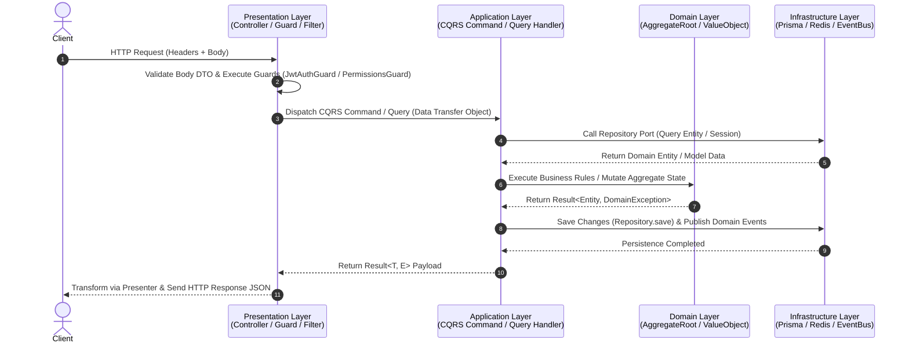

# 🚀 Turborepo Advanced Starter Kit Enterprise

Dự án này là một **Enterprise Monorepo Starter Kit** chuẩn mực và hoàn chỉnh, sử dụng **Turborepo** & **PNPM Workspace** để quản lý đa ứng dụng và đa gói dùng chung (Shared Packages). Hệ thống áp dụng các chuẩn kiến trúc hiện đại nhất hiện nay: **Clean Architecture**, **Domain-Driven Design (DDD)**, **CQRS**, **Event-Driven Architecture (EDA)**, **Hybrid JWT Auth (Stateless Access + Stateful Refresh)**.

---

## 📐 1. Cấu Trúc Tổng Quan Monorepo (Workspace Architecture)

Monorepo được phân chia làm 2 khu vực chính: **`apps/`** (các ứng dụng đầu cuối) và **`packages/`** (các thư viện/config dùng chung).

```text
turborepo-advanced-starter/
├── apps/
│   ├── server/                 # Backend API Server (NestJS, Clean Architecture, DDD, CQRS)
│   ├── admin/                  # Admin Dashboard Web Portal (Vite + React / TypeScript)
│   └── client/                 # Client Web Application (Next.js App Router)
│
├── packages/
│   ├── contracts/              # Shared DTOs, Permissions, API Specs & Permission Utils
│   ├── database/               # Prisma Schema, Database Migrations, Client Export
│   ├── types/                  # Shared TypeScript Core Type Definitions
│   ├── eslint-config/          # Standardized Shared ESLint Rules
│   └── typescript-config/      # Base tsconfig.json Configurations
│
├── docker-compose.yml          # Local Infrastructure (PostgreSQL 16 & Redis Stack 7)
├── turbo.json                  # Turborepo Build & Task Pipeline Config
├── pnpm-workspace.yaml         # PNPM Monorepo Workspace Definition
└── README.md                   # Tài liệu hướng dẫn cấp cao Monorepo
```

---

## 🏛️ 2. Kiến Trúc Backend (`apps/server`)

Máy chủ Backend NestJS (`apps/server`) được tổ chức theo mô hình **Modular Monolith** kết hợp **Clean Architecture** & **DDD**. Ranh giới mã nguồn được chia làm 4 lớp rõ ràng:

```text
apps/server/src/
├── contexts/                   # 1. BOUNDED CONTEXTS (Tập trung logic nghiệp vụ)
│   ├── iam/                    # Identity & Access Management (Auth, Users, Roles)
│   ├── audit/                  # Audit Log Compliance Engine (Độc lập với IAM)
│   ├── analytics/              # Dashboard & Business Analytics
│   ├── storage/                # File Upload & Media Asset Management
│   ├── menu/                   # Dynamic Navigation Management
│   └── notifications/          # Realtime & System Notifications
│
├── infrastructure/             # 2. TECHNICAL INFRASTRUCTURE DRIVERS & ADAPTERS
│   ├── database/               # PrismaModule & PrismaService Connection
│   ├── cache/                  # RedisModule, RedisService & Cache Interceptors
│   ├── queue/                  # QueueModule & BullMQ Job Adapters
│   ├── realtime/               # RealtimeModule & Socket.io WebSockets Gateway
│   └── event-bus/              # Domain Event Dispatcher & Infrastructure Bridges
│
├── presentation/               # 3. HTTP FRAMEWORK BUILDING BLOCKS
│   ├── common/                 # Common DTOs (PaginationQueryDto) & Presenters
│   ├── decorators/             # Custom Decorators (@GetUser, @ClientInfo, @AuditLog)
│   ├── guards/                 # HTTP Guards (JwtAuthGuard, JwtRefreshAuthGuard, PermissionsGuard)
│   ├── filters/                # DomainExceptionFilter
│   └── interceptors/           # AuditLogInterceptor
│
└── shared/                     # 4. PURE SHARED KERNEL (Zero Framework Dependency)
    ├── domain/                 # Base AggregateRoot, Result<T,E>, DomainException & Ports
    └── constants/              # System Domain Constants
```

---

## 🔄 3. Luồng Xử Lý Request (Request Execution Lifecycle)

Mỗi Request gửi tới Server sẽ đi qua các lớp kiến trúc một cách chặt chẽ theo luồng 1 chiều:



---

## 🔐 4. Cơ Chế Báo Mật Hybrid Auth Architecture

Hệ thống kết hợp mô hình bảo mật chuẩn Enterprise:
1. **Access Token (Short-lived 15m)**: **Stateless Access Token Validation**. `JwtStrategy` kiểm tra chữ ký Token & nhả trực tiếp `JwtPayload` (**0 DB Query**).
2. **Refresh Token (Long-lived 7d)**: **Stateful Session Storage**. Được lưu trữ trong Redis (`ISessionStore` / `RedisSessionStore`) phục vụ Revoke Token, Logout, Đăng xuất khỏi mọi thiết bị & Quản lý danh sách phiên đang hoạt động.

---

## 🛠️ 5. Hướng Dẫn Khởi Chạy Nhanh (Quick Start)

### 5.1. Cài đặt Phụ thuộc & Môi trường
```bash
# Cài đặt toàn bộ node_modules trong Monorepo
pnpm install

# Tạo file .env từ template
cp .env.example .env
```

### 5.2. Khởi động Infrastructure (Database & Cache)
```bash
# Khởi chạy Postgres (Port 5432) & Redis (Port 6380) qua Docker
docker-compose up -d

# Sync Prisma Schema và sinh Prisma Client
pnpm db:generate
pnpm db:push
```

### 5.3. Khởi chạy Môi trường Phát triển (Development)
```bash
# Run tất cả apps (Server, Client, Admin) đồng thời qua Turborepo
pnpm dev
```
* **API Server**: [http://localhost:3001](http://localhost:3001)
* **Swagger API Docs**: [http://localhost:3001/api](http://localhost:3001/api)
* **Admin Dashboard**: [http://localhost:3000](http://localhost:3000)
* **Client App**: [http://localhost:3002](http://localhost:3002)

---

## 📚 6. Chi Tiết Tài Liệu Các Bounded Contexts

Dưới đây là các tài liệu thiết kế & luồng code chi tiết từng Bounded Context:
- 🛡️ **[Auth Bounded Context README](apps/server/src/contexts/iam/auth/README.md)**: Chi tiết Login, Register, Refresh Token, Logout & Session Management.
- 👤 **[Users Bounded Context README](apps/server/src/contexts/iam/users/README.md)**: Chi tiết User Entity, CRUD, Caching Invalidation & BullMQ Queue Processor.
- 🔑 **[Roles Bounded Context README](apps/server/src/contexts/iam/roles/README.md)**: Chi tiết RBAC System, Roles & Permissions Mapping.
- 📋 **[Audit Bounded Context README](apps/server/src/contexts/audit/README.md)**: Chi tiết Audit Logging Engine & Interceptors.
