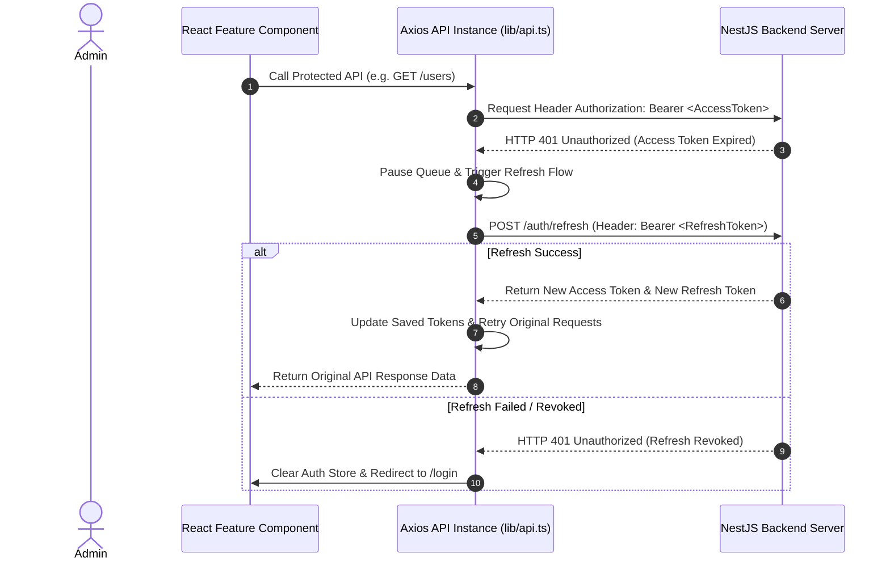

# 🖥️ Admin Dashboard Portal Documentation (`apps/admin`)

Ứng dụng Admin Dashboard Portal được phát triển bằng **React 19**, **Vite**, **TypeScript**, **TailwindCSS**, và **Shadcn UI**. Frontend áp dụng mô hình kiến trúc **Feature-Based Modular Architecture** kết hợp với **TanStack Query (React Query)** và **Zustand**.

---

## 📐 1. Cấu Trúc Thư Mục Admin Portal (`apps/admin/src`)

```text
apps/admin/src/
├── features/                           # FEATURE-BASED MODULES (Mỗi feature chứa UI, API, Hooks)
│   ├── auth/                           # Login Flow, Auth Store, Protected Routes
│   ├── users/                          # User Management, Datatable, Modals
│   ├── roles/                          # Role & Permissions RBAC Editor
│   ├── audit/                          # Audit Log Viewer & Trace Filters
│   ├── sessions/                       # Session Manager (Active Sessions & Revoke Device)
│   ├── notifications/                  # Realtime Socket.io Notifications Dropdown
│   ├── dashboard/                      # Analytics Charts & Business Stats
│   └── system/                         # System Diagnostics & Health Status
│
├── components/                         # REUSABLE UI COMPONENTS
│   ├── ui/                             # Shadcn UI Primitives (Button, Dialog, Table, Input...)
│   └── layout/                         # Sidebar, Header, AdminLayout Shell
│
├── lib/                                # INFRASTRUCTURE UTILITIES & CLIENTS
│   ├── api.ts                          # Axios Instance (Interceptors, Token Refresh, Error Mapping)
│   ├── socket.ts                       # Socket.io Client Connection & Event Handlers
│   └── utils.ts                        # Styling Helper (clsx, tailwind-merge)
│
├── hooks/                              # SHARED CUSTOM HOOKS
│   ├── use-permissions.ts              # RBAC Hook using @repo/contracts utilities
│   └── use-toast.ts                    # Notification Toast Handler
│
├── i18n/                               # MULTI-LANGUAGE TRANSLATIONS
├── routes/                             # TANSTACK ROUTER / REACT ROUTER CONFIG
├── App.tsx
└── main.tsx
```

---

## 🔄 2. Cơ Chế Xử Lý Token & Tự Động Refresh (Auth Interceptor Flow)

Admin Portal lưu trữ Access Token và Refresh Token an toàn. Khi Access Token hết hạn (HTTP 401), Axios Interceptor sẽ tự động thực hiện **Token Refresh Rotation**:



---

## 🛡️ 3. Phân Quyền Giao Diện Frontend (Frontend RBAC Integration)

Frontend sử dụng trực tiếp bộ thư viện tiện ích phân quyền từ gói Monorepo Contract **`@repo/contracts`**:

```typescript
import { hasPermission, hasAllPermissions, PERMISSIONS } from '@repo/contracts';
import { useAuthStore } from '@/features/auth/stores/auth.store';

export function DeleteUserButton({ userId }: { userId: string }) {
    const permissions = useAuthStore((state) => state.user?.permissions || []);
    
    // Kiểm tra quyền xóa user tính bằng Microsecond từ JWT Payload
    const canDelete = hasPermission(permissions, PERMISSIONS.USER_DELETE);

    if (!canDelete) return null; // Invisible if missing permission

    return <Button variant="destructive">Xóa User</Button>;
}
```

---

## ⚡ 4. Realtime Socket.io Integration

Admin Portal kết nối trực tiếp với NestJS `RealtimeGateway` qua Socket.io Client (`src/lib/socket.ts`):
- Tự động nhận sự kiện thông báo thời gian thực (`notification:created`).
- Cập nhật danh sách Notification Badge ngầm mà không cần Reload trang.

---

## 🛠️ 5. Khởi Chạy Nhanh (Development)

Chạy độc lập ứng dụng Admin:
```bash
# Tại thư mục gốc Monorepo
pnpm --filter=admin dev
```
Ứng dụng sẽ chạy tại địa chỉ: **`http://localhost:3000`**.
