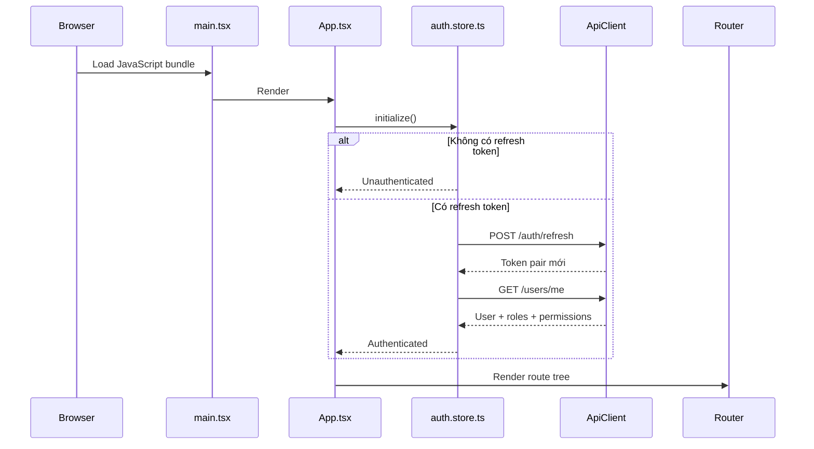
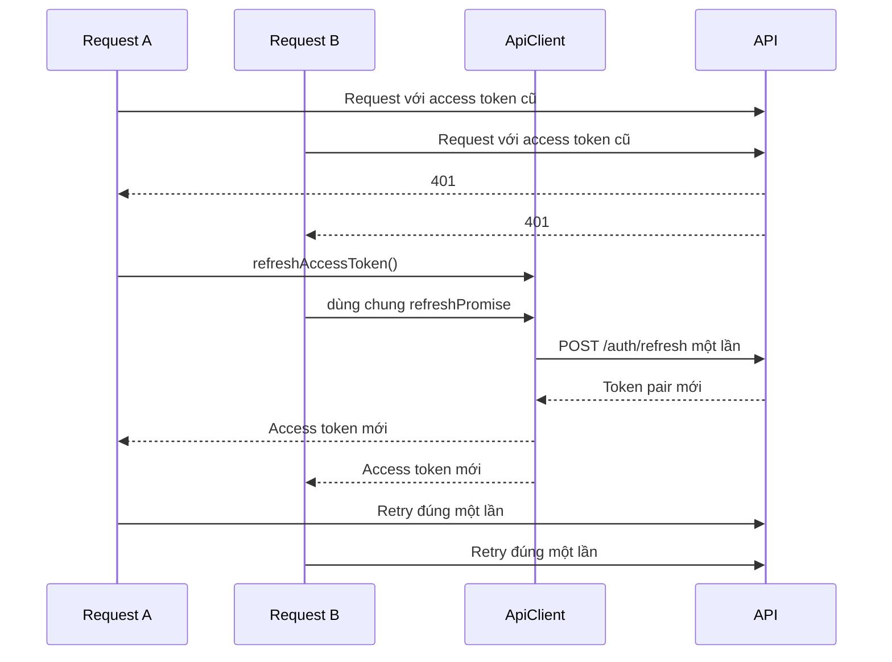

# Admin Portal

Admin Portal là ứng dụng quản trị chạy trên trình duyệt của monorepo. Ứng dụng được xây bằng React 19, TypeScript, Vite, React Router, TanStack Query, Zustand, Tailwind CSS và các UI primitive dựa trên Radix.

Tài liệu này mô tả code đang tồn tại trong `apps/admin`, không mô tả một kiến trúc giả định. Mục tiêu là giúp một thành viên mới hiểu ứng dụng khởi động thế nào, request đi qua đâu, state thuộc về lớp nào, quyền được kiểm tra ở đâu và cần đặt code mới vào vị trí nào.

## 1. Vai trò của Admin Portal trong hệ thống

Admin Portal là một adapter phía client của backend. Nó không sở hữu business rule cuối cùng. Frontend có trách nhiệm trình bày dữ liệu, quản lý interaction state, gọi API, phản hồi lỗi và ẩn những thao tác người dùng không được phép thực hiện. Backend vẫn phải xác thực và phân quyền lại mọi request.

Ứng dụng dùng hai package chung của monorepo:

- `@repo/contracts` cung cấp tên permission chuẩn như `PERMISSIONS.USER.READ`.
- `@repo/types` cung cấp các kiểu dữ liệu trao đổi như `User`, `Role`, `Permission`, `AuditLog` và `PaginatedResult`.

Nhờ vậy frontend không tự phát minh permission string hoặc tạo lại các response model đã được chia sẻ.

```mermaid
flowchart LR
    Browser[Admin Portal] -->|HTTP + Bearer token| API[NestJS API]
    Browser <-->|Socket.IO + access token| Realtime[Realtime Gateway]
    Browser --> Contracts[@repo/contracts]
    Browser --> Types[@repo/types]
    API --> Contracts
    API --> Types
```

## 2. Kiến trúc tổng thể

Code được tổ chức theo feature ở lớp nghiệp vụ và theo layer ở phần dùng chung.

`features` chứa các vertical slice như users, roles và sessions. Mỗi feature đặt component màn hình cạnh hook truy cập dữ liệu của chính nó. `components` chứa UI dùng lại giữa nhiều feature. `lib` chứa client hạ tầng không phụ thuộc một màn hình cụ thể. `routes` là composition root của navigation và route authorization. `hooks` chứa hành vi dùng chung gắn với React như permission evaluation, responsive state và WebSocket lifecycle.

```text
src/
├── components/
│   ├── layout/                 # Shell sau đăng nhập
│   ├── ui/                     # UI primitive, không chứa nghiệp vụ
│   └── *.tsx                   # Pattern dùng chung: page, error, pagination...
├── features/
│   ├── auth/                   # Đăng nhập, khôi phục phiên, auth state
│   ├── dashboard/              # Chỉ số tổng quan
│   ├── users/                  # Quản lý tài khoản
│   ├── roles/                  # Ma trận vai trò và quyền
│   ├── sessions/               # Phiên đăng nhập và thu hồi
│   ├── audit/                  # Nhật ký quản trị
│   └── notifications/          # Query và mutation thông báo
├── hooks/                      # Permission, WebSocket, responsive hooks
├── i18n/                       # Translation resource cho lỗi
├── lib/                        # API client, error mapping, utilities
├── routes/                     # Route tree và protected route
├── App.tsx                     # Provider composition và auth bootstrap
└── main.tsx                    # Browser entry point
```

Đây là kiến trúc feature-based modular frontend, không phải Clean Architecture đầy đủ. UI component gọi feature hook; feature hook gọi `ApiClient`; shared contracts/types tạo biên với backend. Cách chia này phù hợp với quy mô hiện tại vì flow của một nghiệp vụ có thể được đọc trong một thư mục mà không cần đi qua nhiều layer hình thức.

## 3. Flow khởi động ứng dụng

Entry point là `src/main.tsx`. File này nạp CSS, khởi tạo i18n rồi render `App` trong React `StrictMode`.

`App.tsx` là composition root phía client. Nó tạo một `QueryClient`, gắn theme provider, query provider, router và toaster. Ngay khi mount, `App` gọi `authStore.initialize()` để khôi phục phiên trước khi render route tree.


```mermaid
sequenceDiagram
    participant Browser
    participant Main as main.tsx
    participant App as App.tsx
    participant Auth as auth.store.ts
    participant API as ApiClient
    participant Router

    Browser->>Main: Load JavaScript bundle
    Main->>App: Render
    App->>Auth: initialize()
    alt Không có refresh token
        Auth-->>App: Unauthenticated
    else Có refresh token
        Auth->>API: POST /auth/refresh
        API-->>Auth: Token pair mới
        Auth->>API: GET /users/me
        API-->>Auth: User + roles + permissions
        Auth-->>App: Authenticated
    end
    App->>Router: Render route tree
```

Trong thời gian bootstrap, `App` hiển thị loading toàn màn hình. Điều này ngăn router chuyển nhầm người dùng sang `/login` trước khi quá trình khôi phục phiên hoàn thành.

## 4. Routing, layout và code splitting

`src/routes/index.tsx` là nơi duy nhất khai báo page route. Các màn hình được lazy import, vì vậy trình duyệt chỉ tải code của feature khi route tương ứng được mở.

Route công khai gồm `/login` và `/403`. Tất cả route quản trị nằm bên dưới `ProtectedRoute`, sau đó dùng `MainLayout`. Mỗi route có thể khai báo một permission và được bọc bởi `PermissionGuard`.

Flow quyết định truy cập là:

```text
URL
  → ProtectedRoute: người dùng đã đăng nhập chưa?
  → MainLayout: render navigation và Outlet
  → PermissionGuard: có permission của route không?
  → Feature page
```

`ProtectedRoute` đồng thời là lifecycle boundary của realtime connection. Khi nhánh route bảo vệ được mount, `useWebSocket` tạo kết nối; khi đăng xuất hoặc rời lifecycle này, socket được disconnect.

Khi thêm page mới, cần tạo feature component, lazy import component đó và thêm một entry vào `adminRoutes`. Permission của route phải lấy từ `@repo/contracts`, không viết string trực tiếp.

## 5. Authentication và token lifecycle

Authentication state thuộc `features/auth/store/auth.store.ts`. Zustand store giữ `user`, `isAuthenticated` và trạng thái bootstrap. Access token chỉ nằm trong memory của `ApiClient`; refresh token hiện được lưu trong `localStorage`.

### Đăng nhập

`LoginForm` gọi `authStore.login()`. Store gửi credentials tới `/auth/login`, lưu token pair, sau đó gọi `/users/me`. Chỉ khi lấy được user thành công store mới chuyển sang authenticated.

### Khôi phục phiên sau reload

Access token biến mất khi reload vì nó chỉ nằm trong memory. `initialize()` đọc refresh token, rotate token qua `/auth/refresh`, rồi tải `/users/me`. Nếu bất kỳ bước nào thất bại, local token bị xóa và ứng dụng trở về trạng thái chưa đăng nhập.

### Refresh tự động khi API trả 401

Mọi feature dùng `lib/api-client.ts`. Nếu protected request trả `401`, client tạo một singleton `refreshPromise`. Những request 401 đồng thời cùng chờ promise này thay vì mỗi request gửi một refresh riêng.


```mermaid
sequenceDiagram
    participant A as Request A
    participant B as Request B
    participant Client as ApiClient
    participant API

    A->>API: Request với access token cũ
    B->>API: Request với access token cũ
    API-->>A: 401
    API-->>B: 401
    A->>Client: refreshAccessToken()
    B->>Client: dùng chung refreshPromise
    Client->>API: POST /auth/refresh một lần
    API-->>Client: Token pair mới
    Client-->>A: Access token mới
    Client-->>B: Access token mới
    A->>API: Retry đúng một lần
    B->>API: Retry đúng một lần
```

Request retry được đánh dấu `skipRefresh`, do đó một response 401 tiếp theo sẽ trở thành `ApiError` thay vì tạo vòng lặp vô hạn.

Nếu refresh thất bại, `ApiClient` xóa token và phát event `auth:logout`. `App` nhận event, dọn auth store và điều hướng về `/login`. Nếu refresh thành công, client phát `auth:token-refreshed`; `useWebSocket` cập nhật token dùng cho lần reconnect tiếp theo.

### Giới hạn bảo mật hiện tại

Refresh token trong `localStorage` có thể bị đọc nếu ứng dụng có lỗ hổng XSS. Nền tảng có yêu cầu bảo mật cao nên chuyển refresh token sang cookie `HttpOnly`, `Secure`, `SameSite` bằng một thay đổi đồng bộ backend/frontend. Không nên sửa riêng frontend vì sẽ làm vỡ authentication contract.

## 6. Server state và UI state

TanStack Query sở hữu dữ liệu đến từ server: users, roles, permissions, sessions, audit logs, dashboard stats và notifications. Zustand chỉ sở hữu authentication state có phạm vi toàn ứng dụng. State ngắn hạn như modal đang mở, search input và current page nằm trong component.

Quy tắc ownership:

| Loại state         | Công cụ        | Ví dụ                       |
| ------------------ | -------------- | --------------------------- |
| Server state       | TanStack Query | danh sách users, roles      |
| Session toàn cục   | Zustand        | current user, authenticated |
| URL/navigation     | React Router   | route hiện tại              |
| Interaction cục bộ | `useState`     | modal, page, search         |
| Theme              | Theme provider | light/dark/system           |

Mỗi feature có query-key factory, ví dụ `userKeys.list({ page, limit, search })`. Factory giữ cache identity nhất quán và cung cấp root key như `userKeys.all` để mutation invalidation bao phủ mọi biến thể pagination mà không lặp string.

Query screen phải phân biệt bốn trạng thái: loading, error có retry, empty và success. `components/query-error-state.tsx` là pattern dùng chung để lỗi mạng không bị hiển thị nhầm thành dữ liệu rỗng.

## 7. Permission model

Permission được kiểm tra ở ba cấp:

1. Route-level guard quyết định người dùng có được mở màn hình.
2. Capability map quyết định một nhóm hành vi có được hiển thị.
3. Component `Can` bảo vệ thao tác cụ thể như tạo, sửa hoặc xóa.

Ví dụ semantic capability map:

```tsx
const access = usePermissions({
  canCreateUser: PERMISSIONS.USER.CREATE,
  canManageUsers: [PERMISSIONS.USER.UPDATE, PERMISSIONS.USER.DELETE],
});
```

Array trong semantic map mang nghĩa `any`: có ít nhất một quyền là capability đúng. Nếu cần tất cả quyền, dùng `{ all: [...] }`. Nếu cần bất kỳ quyền nào một cách tường minh, dùng `{ any: [...] }`.

Frontend permission chỉ phục vụ UX. Nó không phải security boundary; backend vẫn phải reject request trái quyền.

## 8. Realtime flow

`hooks/useWebSocket.ts` tạo một Socket.IO client sau khi authenticated. Access token được gửi trong `auth` và query để tương thích gateway hiện tại.

Client xử lý ba nhóm event:

- `force_logout`: hiển thị cảnh báo và chạy logout.
- `notification_received`: hiển thị toast và invalidate query `["notifications"]`.
- `notification`: hiển thị toast realtime tổng quát.

Hook chịu trách nhiệm đăng ký và hủy toàn bộ listener trong cùng một effect. Feature component không nên tự tạo socket mới; nếu có domain event mới, mở rộng hook hoặc tách một realtime adapter dùng chung.

## 9. Trách nhiệm của các file chính

| File hoặc thư mục                       | Trách nhiệm                                               |
| --------------------------------------- | --------------------------------------------------------- |
| `src/main.tsx`                          | Browser entry, CSS và i18n bootstrap                      |
| `src/App.tsx`                           | Provider composition, auth initialization, global logout  |
| `src/routes/index.tsx`                  | Route registry, lazy loading và route permission          |
| `src/routes/protected-route.tsx`        | Authentication boundary và realtime lifecycle             |
| `src/lib/api-client.ts`                 | HTTP headers, JSON, error mapping, token refresh và retry |
| `src/lib/error-handler.ts`              | Chuyển lỗi kỹ thuật thành message thân thiện              |
| `src/features/auth/store/auth.store.ts` | Login, logout, restore session và current user            |
| `src/hooks/usePermission.tsx`           | Permission evaluator, `Can`, `PermissionGuard`            |
| `src/hooks/useWebSocket.ts`             | Socket lifecycle và realtime event handling               |
| `src/components/ui`                     | UI primitive; không gọi API và không chứa business rule   |
| `src/components/*.tsx`                  | Pattern trình bày dùng lại giữa các feature               |
| `src/features/*/api/*.api.ts`           | Endpoint adapter và DTO input/output của feature          |
| `src/features/*/api/*.keys.ts`          | Query-key factory và cache identity                       |
| `src/features/*/hooks`                  | Query/mutation và cache invalidation của feature          |
| `src/features/*/components`             | Interaction state và render nghiệp vụ                     |
| `src/features/*/index.ts`               | Public API cho code bên ngoài feature                     |

## 10. Cách thêm một feature chuẩn

Giả sử cần thêm feature `projects`.

Tạo `features/projects/api/project.api.ts` cho endpoint adapter và `project.keys.ts` cho cache identity. `hooks/useProjects.ts` dùng hai module đó để orchestration query, mutation, invalidation và feedback. `components/ProjectsManagement.tsx` quản lý filter, pagination, dialog và bốn trạng thái query. Không đặt raw `fetch` hoặc endpoint string trong component/hook.

Sau đó thêm `PROJECT.*` vào shared contracts nếu permission chưa tồn tại, lazy import page trong route registry và khai báo route permission. Navigation phải dùng cùng permission để tránh hiển thị link mà người dùng không thể mở.

Một feature đúng chuẩn phải đảm bảo:

- Không import trực tiếp code nội bộ của feature khác; chia sẻ qua `components`, `hooks`, `lib` hoặc package chung.
- Feature khác chỉ được import qua `features/<name>/index.ts`; ESLint chặn deep import giữa các feature.
- UI primitive không được phụ thuộc feature nghiệp vụ.
- Không duplicate response type nếu kiểu đó là contract giữa backend và nhiều app.
- Không dùng `any` để vượt qua type boundary.
- Mutation có pending state, success feedback, friendly error và cache invalidation.
- Query có loading, retryable error, empty và success state.
- Icon-only control có accessible name.
- Business action nhạy cảm có xác nhận và backend authorization.

## 11. Testing

Vitest chạy trong jsdom. Test hiện tại ở `src/lib/api-client.test.ts` khóa ba invariant quan trọng:

1. Hai protected request trả 401 đồng thời chỉ tạo một refresh request.
2. Refresh thất bại phải xóa local session và phát logout.
3. Request retry vẫn 401 không được refresh lặp vô hạn.

Test mới nên đặt cạnh source khi test một unit hoặc module nhỏ. Integration test của một feature có thể đặt trong thư mục feature. Ưu tiên test behavior nhìn thấy từ public API thay vì private implementation.

## 12. Lệnh phát triển và quality gate

Chạy từ thư mục gốc monorepo:

```bash
pnpm --filter=admin dev
pnpm --filter=admin lint
pnpm --filter=admin check:types
pnpm --filter=admin test
pnpm --filter=admin build
pnpm --filter=admin verify
```

Dev server mặc định chạy ở `http://localhost:5173`. Backend URL lấy từ `VITE_API_URL`, fallback về `http://localhost:3001`.

`verify` là quality gate cục bộ: lint, test, TypeScript build và Vite production build đều phải pass trước khi commit.

## 13. Những điểm cần tiếp tục cải thiện

Dashboard đang chứa chart library lớn và một số nội dung infrastructure mang tính trình bày; nên tách chart thành lazy subcomponent và nối trạng thái health với endpoint backend thay vì hard-code `Online`.

Main shared bundle vẫn còn lớn. Route-level splitting đã giảm đáng kể initial payload, nhưng cần đo bằng bundle analyzer trước khi tạo manual vendor chunk để tránh cache strategy dựa trên phỏng đoán.

Authentication nên được nâng cấp sang HttpOnly refresh cookie như đã nêu. Khi thực hiện, cần viết migration note và test cả CSRF/CORS/cookie behavior.

Test suite hiện bảo vệ API client, permission evaluator và cache-key identity nhưng chưa bao phủ route guard, permission rendering và feature mutation. Đây là ba nhóm integration test nên được bổ sung tiếp theo.
