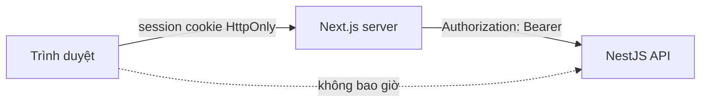
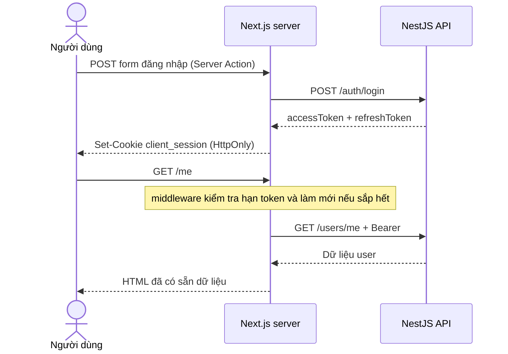

# Client Web Application

Ứng dụng dành cho người dùng cuối, xây bằng Next.js App Router. Client tồn tại trong repo này để làm hai việc mà Admin SPA không làm được: **render nội dung ở phía server cho máy tìm kiếm đọc được**, và **giữ token hoàn toàn ngoài tầm với của JavaScript trình duyệt**.

> Gặp từ lạ? Tra [Bảng thuật ngữ](../../docs/glossary.md).

## 1. Mô hình BFF: vì sao khác Admin

Admin là SPA: trình duyệt giữ access token trong bộ nhớ và gọi thẳng API. Client đi hướng ngược lại — **Backend-for-Frontend**: trình duyệt chỉ nói chuyện với Next.js, và chỉ server Next.js nói chuyện với NestJS API.



Hệ quả cụ thể:

|                                       | Admin (SPA + bearer) | Client (BFF)             |
| ------------------------------------- | -------------------- | ------------------------ |
| Nơi giữ access token                  | Bộ nhớ JavaScript    | Cookie HttpOnly của Next |
| Ai gọi API                            | Trình duyệt          | Server Next.js           |
| Có cần CORS không                     | Có                   | Không                    |
| Render nội dung đã đăng nhập ở server | Không                | Có                       |
| XSS lấy được token không              | Có thể               | Không                    |

Đây không phải "cách đúng hơn" một cách tuyệt đối — đó là đánh đổi. **Chọn SPA + bearer** khi làm màn hình nội bộ sau đăng nhập, tương tác nhiều, không quan tâm SEO. **Chọn BFF** khi có trang công khai cần SEO, hoặc khi muốn token không bao giờ chạm trình duyệt.

## 2. Vòng đời một phiên đăng nhập



Điểm mấu chốt về việc làm mới token: **Next.js chỉ cho ghi cookie ở middleware, Server Action và Route Handler — không cho ghi trong lúc render trang**. Vì vậy việc làm mới nằm ở [`middleware.ts`](middleware.ts): nó đọc trường `exp` của access token (không xác minh chữ ký — việc đó là của API), và nếu còn dưới 60 giây thì gọi `/auth/refresh` rồi gắn cookie mới vào response. Nhờ vậy mọi lần render trang đều chắc chắn có token còn hạn.

## 3. Cấu trúc

```text
apps/client/
├── app/
│   ├── page.tsx              # Trang công khai — có metadata cho SEO
│   ├── login/
│   │   ├── page.tsx          # Server Component
│   │   └── login-form.tsx    # Client Component: chỉ lo lỗi + trạng thái gửi
│   ├── me/page.tsx           # Server Component: fetch dữ liệu phía server
│   └── actions/auth.ts       # Server Action: login, logout
├── lib/
│   ├── session.ts            # Đọc/ghi cookie phiên (server-only)
│   └── api.ts                # Gọi API kèm bearer token (server-only)
└── middleware.ts             # Chặn route riêng tư + làm mới token
```

`lib/*` đánh dấu `import "server-only"`: nếu ai lỡ import chúng vào Client Component thì build fail ngay, thay vì âm thầm gửi token xuống trình duyệt.

## 4. Chạy ở local

Cần API chạy sẵn (`pnpm dev:server`) và một file `.env.local`:

```dotenv
API_URL=http://localhost:3001
SESSION_SECRET=chuỗi-ngẫu-nhiên-tối-thiểu-32-ký-tự
```

Sinh secret ngẫu nhiên bằng:

```powershell
node -e "console.log(require('crypto').randomBytes(32).toString('base64url'))"
```

Cả hai biến **không có tiền tố `NEXT_PUBLIC_`** — chỉ server đọc được. Ở dev, thiếu `SESSION_SECRET` thì app vẫn chạy bằng khóa mặc định (kèm cảnh báo trong log); ở production thiếu là app từ chối chạy — cố ý như vậy để không ai vô tình deploy với khóa ai cũng biết.

```powershell
pnpm dev:client            # http://localhost:3005
pnpm --filter=client test  # test cho middleware, session, api (vitest)
```

Phần được test kỹ nhất chính là phần dễ sai nhất: [`middleware.test.ts`](middleware.test.ts) dựng request giả với token sắp hết hạn để kiểm tra đủ nhánh làm mới (thành công, API từ chối, API sập), còn [`lib/session.test.ts`](lib/session.test.ts) ném dữ liệu rác vào `decodeSession` để chắc chắn cookie bị sửa tay không làm crash trang.

Kiểm chứng nhanh rằng mô hình đang hoạt động đúng:

```bash
# Nội dung nằm sẵn trong HTML (SEO) chứ không phải do JavaScript vẽ ra
curl -s http://localhost:3005/ | grep "<title>"

# Trang riêng tư khi chưa đăng nhập bị chặn ngay từ middleware
curl -s -o /dev/null -w "%{http_code}\n" http://localhost:3005/me   # 307 → /login
```

## 5. Ghi chú về bảo mật của session cookie

Cookie `client_session` chứa cả access token lẫn refresh token, được **mã hóa** theo chuẩn JWE (thuật toán `dir` + `A256GCM`, thư viện `jose`) bằng khóa sinh từ `SESSION_SECRET`. Nghĩa là:

- Ai xem trộm được giá trị cookie (log, proxy, backup…) cũng **không đọc được token bên trong**.
- Sửa dù một byte là giải mã thất bại — người dùng chỉ đơn giản bị coi như chưa đăng nhập, không có cách "chế" cookie giả.
- Đổi `SESSION_SECRET` là toàn bộ phiên cũ mất hiệu lực ngay (mọi người phải đăng nhập lại) — đây cũng chính là nút "đăng xuất tất cả" khẩn cấp.

Giới hạn còn lại đúng bằng bản chất của mọi session cookie: kẻ trộm được **nguyên vẹn** cookie thì vẫn dùng được phiên. Chống chuyện đó là việc của `HttpOnly` (XSS không đọc được), `Secure` (không đi qua HTTP thường) và `SameSite=Lax`. Nếu cần thu hồi từng phiên một, hướng nâng cấp là session store phía server (Redis) và chỉ đặt session id vào cookie.

Một giới hạn nữa: khi nhiều tab cùng làm mới token gần như đồng thời, cơ chế rotation có thể khiến một tab dùng phải token vừa bị thu hồi và bị đăng xuất. Ngưỡng làm mới sớm 60 giây khiến tình huống này hiếm, nhưng chưa loại bỏ hoàn toàn.

## 6. Mở rộng tiếp theo

- Thêm trang công khai (danh sách sản phẩm, bài viết…) dùng `generateMetadata` và ISR để tận dụng SEO.
- Mutation cần đăng nhập: viết thêm Server Action gọi `apiFetch`, không mở endpoint proxy chung chung.
- Cần dữ liệu cập nhật liên tục ở phía client: cân nhắc TanStack Query cho riêng phần đó — nhưng khi ấy phải đi qua Route Handler của Next.js, không gọi thẳng API.
