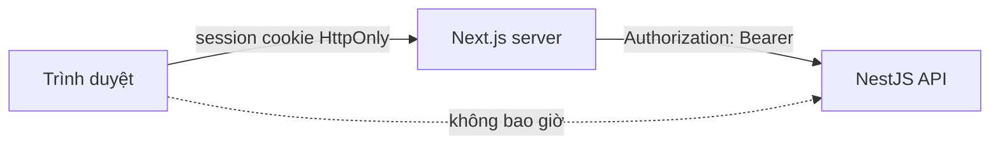
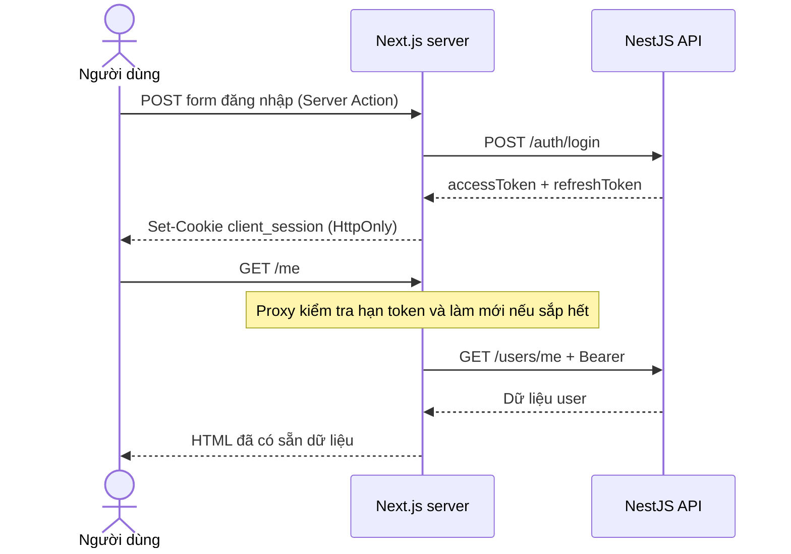

# Client Web Application

> **Phần II · Chương 8 — Client Web và ranh giới server/browser**
>
> Chương trước: [Admin Portal](../admin/README.md) · [Mục lục handbook](../../docs/README.md) · Chương sau: [Auth context](../server/src/contexts/iam/auth/README.md)

Admin và Client cùng dùng dữ liệu từ một backend nhưng phục vụ hai hoàn cảnh khác nhau. Admin là công cụ nội bộ chạy trong trình duyệt. Client có trang công khai cần máy tìm kiếm đọc được và có những trang được dựng sẵn ở server. Vì vậy không thể sao chép nguyên kiến trúc của Admin sang Next.js.

Client hiện chỉ là một ví dụ nhỏ để chứng minh cách chia trách nhiệm, chưa phải sản phẩm hoàn chỉnh. Trình duyệt không giữ access token. Thay vào đó, trình duyệt gọi Next.js; Next.js giữ phiên và gọi NestJS API thay cho trình duyệt. Một server đứng giữa và phục vụ riêng nhu cầu của frontend như vậy được gọi là **Backend for Frontend (BFF)**.

Ứng dụng dành cho người dùng cuối, xây bằng Next.js App Router. Client tồn tại trong repo này để làm hai việc mà Admin SPA không làm được: **render nội dung ở phía server cho máy tìm kiếm đọc được**, và **giữ token hoàn toàn ngoài tầm với của JavaScript trình duyệt**.

> Gặp từ lạ? Tra [Bảng thuật ngữ](../../docs/glossary.md).

## 1. Mô hình BFF: vì sao khác Admin

Admin là SPA: trình duyệt giữ access token trong bộ nhớ và gọi thẳng API. Client đi hướng ngược lại — **Backend-for-Frontend**: trình duyệt chỉ nói chuyện với Next.js, và chỉ server Next.js nói chuyện với NestJS API.



Hệ quả cụ thể:

|                                       | Admin (SPA + bearer) | Client (BFF)             |
| ------------------------------------- | -------------------- | ------------------------ |
| Nơi giữ access token                  | Bộ nhớ JavaScript    | Cookie HttpOnly của Next |
| Ai gọi API                            | Trình duyệt          | Server Next.js           |
| Có cần CORS không                     | Có                   | Không                    |
| Render nội dung đã đăng nhập ở server | Không                | Có                       |
| XSS lấy được token không              | Có thể               | Không                    |

Đây không phải "cách đúng hơn" một cách tuyệt đối — đó là đánh đổi. **Chọn SPA + bearer** khi làm màn hình nội bộ sau đăng nhập, tương tác nhiều, không quan tâm SEO. **Chọn BFF** khi có trang công khai cần SEO, hoặc khi muốn token không bao giờ chạm trình duyệt.

## 2. Vòng đời một phiên đăng nhập



Next.js không cho code ghi cookie trong lúc render trang. Cookie chỉ được thay đổi ở Proxy, Server Action hoặc Route Handler. Vì vậy [`proxy.ts`](proxy.ts) chịu trách nhiệm làm mới phiên.

Proxy đọc thời điểm hết hạn (`exp`) của access token. Nó chỉ dùng thông tin này để biết khi nào cần gọi `/auth/refresh`; API vẫn là nơi xác minh token có thật sự hợp lệ hay không. Nếu token còn dưới 60 giây, Proxy xin token mới và gắn cookie mới vào response.

Nhiều request có thể cùng phát hiện token sắp hết hạn. `lib/refresh-session.ts` gom các request trong cùng một Next.js instance vào chung một Promise, nên chỉ có một HTTP refresh được gửi. Cách gom việc trùng nhau này gọi là **single-flight**.

Nếu hệ thống chạy nhiều Next.js instance, mỗi instance vẫn có thể gửi một refresh. Redis ở backend dùng một thao tác nguyên tử để bảo đảm refresh token cũ chỉ được dùng thành công đúng một lần. Single-flight giúp giảm request thừa; Redis mới là chốt bảo mật.

## 3. Cấu trúc

```text
apps/client/
├── app/
│   ├── page.tsx              # Trang công khai — có metadata cho SEO
│   ├── login/
│   │   ├── page.tsx          # Server Component
│   │   └── login-form.tsx    # Client Component: chỉ lo lỗi + trạng thái gửi
│   ├── me/page.tsx           # Server Component: fetch dữ liệu phía server
│   └── actions/auth.ts       # Server Action: login, logout
├── lib/
│   ├── session.ts            # Đọc/ghi cookie phiên (server-only)
│   ├── refresh-session.ts    # Single-flight refresh trong một Next instance
│   ├── safe-redirect.ts      # Chỉ cho phép redirect tới path nội bộ
│   └── api.ts                # Gọi API kèm bearer token (server-only)
└── proxy.ts                  # Chặn route riêng tư + làm mới token
```

`lib/*` đánh dấu `import "server-only"`: nếu ai lỡ import chúng vào Client Component thì build fail ngay, thay vì âm thầm gửi token xuống trình duyệt.

## 4. Chạy ở local

Cần API chạy sẵn (`pnpm dev:server`) và một file `.env.local`:

```dotenv
API_URL=http://localhost:3001
SESSION_SECRET=chuỗi-ngẫu-nhiên-tối-thiểu-32-ký-tự
```

Sinh secret ngẫu nhiên bằng:

```powershell
node -e "console.log(require('crypto').randomBytes(32).toString('base64url'))"
```

Cả hai biến **không có tiền tố `NEXT_PUBLIC_`** — chỉ server đọc được. Development được phép fallback về API local và khóa session cố định; production thiếu biến, secret ngắn hơn 32 ký tự, URL sai định dạng hoặc trỏ localhost đều làm build/startup thất bại. Preview và Production trên Vercel phải có `API_URL` và `SESSION_SECRET` scope riêng; không dùng secret production cho Preview.

`next.config.ts` áp CSP, frame deny, nosniff, referrer policy, permissions policy, COOP và HSTS cho mọi route. CSP production chỉ cho resource cùng origin, không có wildcard hoặc `unsafe-eval`; development thêm `unsafe-eval` cho Next.js tooling. Client dùng `next/font`, nên font Google được self-host trong artifact thay vì browser gọi CDN.

```powershell
pnpm dev:client            # http://localhost:3005
pnpm --filter=client test  # test cho Proxy, session, api (vitest)
```

Phần được test kỹ nhất chính là phần dễ sai nhất: [`proxy.test.ts`](proxy.test.ts) dựng request giả với token sắp hết hạn để kiểm tra đủ nhánh làm mới (thành công, API từ chối, API sập), còn [`lib/session.test.ts`](lib/session.test.ts) ném dữ liệu rác vào `decodeSession` để chắc chắn cookie bị sửa tay không làm crash trang.

Kiểm chứng nhanh rằng mô hình đang hoạt động đúng:

```bash
# Nội dung nằm sẵn trong HTML (SEO) chứ không phải do JavaScript vẽ ra
curl -s http://localhost:3005/ | grep "<title>"

# Trang riêng tư khi chưa đăng nhập bị chặn ngay từ Proxy
curl -s -o /dev/null -w "%{http_code}\n" http://localhost:3005/me   # 307 → /login
```

## 5. Ghi chú về bảo mật của session cookie

Cookie `client_session` chứa cả access token lẫn refresh token, được **mã hóa** theo chuẩn JWE (thuật toán `dir` + `A256GCM`, thư viện `jose`) bằng khóa sinh từ `SESSION_SECRET`. Nghĩa là:

- Ai xem trộm được giá trị cookie (log, proxy, backup…) cũng **không đọc được token bên trong**.
- Sửa dù một byte là giải mã thất bại — người dùng chỉ đơn giản bị coi như chưa đăng nhập, không có cách "chế" cookie giả.
- Đổi `SESSION_SECRET` là toàn bộ phiên cũ mất hiệu lực ngay (mọi người phải đăng nhập lại) — đây cũng chính là nút "đăng xuất tất cả" khẩn cấp.

Giới hạn còn lại đúng bằng bản chất của mọi session cookie: kẻ trộm được **nguyên vẹn** cookie thì vẫn dùng được phiên. Chống chuyện đó là việc của `HttpOnly` (XSS không đọc được), `Secure` (không đi qua HTTP thường) và `SameSite=Lax`. Nếu cần thu hồi từng phiên một, hướng nâng cấp là session store phía server (Redis) và chỉ đặt session id vào cookie.

Khi nhiều tab cùng làm mới token trong một Next.js instance, single-flight gom chúng thành một request. Nếu hệ thống chạy nhiều instance, hai request vẫn có thể đi tới hai server khác nhau. Redis chỉ cho một request dùng refresh token cũ thành công; request còn lại nhận `401`.

Request thua chưa chắc phải đăng xuất người dùng. Nếu access token cũ của nó vẫn còn hạn, Proxy để request tiếp tục và không ghi đè cookie mới từ response thắng. Chỉ khi access token đã hết hạn và refresh cũng thất bại, Proxy mới xóa session và chuyển về trang login.

Muốn mọi Next.js instance dùng chung chính xác một kết quả refresh cần thêm cơ chế phối hợp phân tán. Đây là cải tiến hiệu năng và trải nghiệm; quy tắc bảo mật “refresh token cũ chỉ dùng một lần” đã được Redis bảo vệ.

Logout không chỉ xóa cookie BFF. Server Action đọc refresh token trong session, gọi `POST /auth/logout` để revoke JTI trong Redis, rồi luôn xóa cookie trong `finally`. Nếu API tạm thời không truy cập được, cookie phía trình duyệt vẫn bị xóa để người dùng thoát khỏi thiết bị hiện tại; session Redis sẽ hết TTL hoặc được operator/user thu hồi sau.

Tham số `next` sau login chỉ được nhận khi là path nội bộ bắt đầu bằng đúng một dấu `/`. URL tuyệt đối, URL dạng protocol-relative `//host` và giá trị encode thành `//host` đều bị đưa về `/me`; invariant này ngăn open redirect/phishing.

## 6. Resilience boundary của App Router

Client dùng bốn file convention ở root `app`: `loading.tsx` hiển thị trạng thái chuyển route; `error.tsx` chặn lỗi
render trong route và cho phép retry bằng `reset()`; `global-error.tsx` thay cả root layout khi layout không thể render;
`not-found.tsx` cung cấp trang 404 có đường quay về. Error UI không hiển thị raw `Error.message`, token, endpoint hoặc
stack trace cho người dùng. `error.tsx` và `global-error.tsx` là Client Component vì nút retry cần event handler;
loading và not-found vẫn là Server Component.

## 7. Mở rộng tiếp theo

- Thêm trang công khai (danh sách sản phẩm, bài viết…) dùng `generateMetadata` và ISR để tận dụng SEO.
- Mutation cần đăng nhập: viết thêm Server Action gọi `apiFetch`, không mở endpoint proxy chung chung.
- Cần dữ liệu cập nhật liên tục ở phía client: cân nhắc TanStack Query cho riêng phần đó — nhưng khi ấy phải đi qua Route Handler của Next.js, không gọi thẳng API.

## Tự kiểm tra trước khi sửa Client

Bạn đã hiểu boundary của Client khi có thể giải thích nơi session cookie được đọc, nơi access token tồn tại, vì sao Server Component gọi API khác SPA và lúc nào mới cần Client Component. Hãy thử lần flow chưa đăng nhập vào `/me`: Proxy phải chặn trước khi trang riêng tư render.
