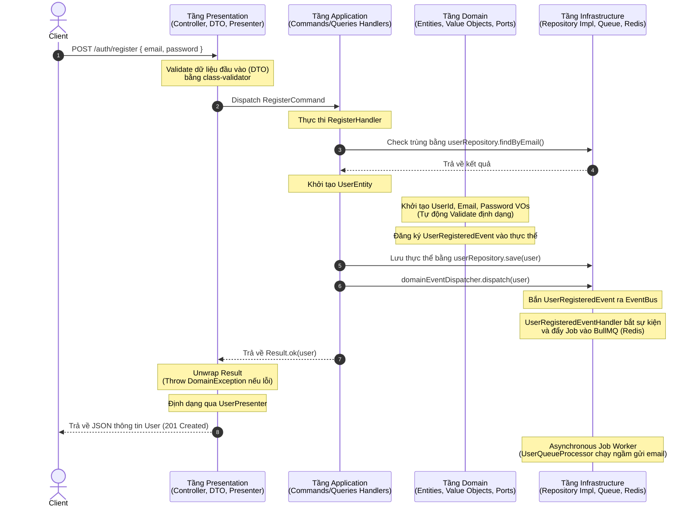

# Turborepo Advanced Starter - API Server

Dịch vụ Backend API Server được xây dựng trên nền tảng **NestJS**, áp dụng triết lý thiết kế **Clean Architecture (Hexagonal Architecture)** kết hợp với các mẫu thiết kế cao cấp: **DDD (Domain-Driven Design)**, **CQRS (Command Query Responsibility Segregation)**, **EDA (Event-Driven Architecture)**, **Redis Caching**, và hàng đợi **BullMQ Worker**.

---

## 1. Luồng Giao Tiếp Hệ Thống (Request & Event Flow)

Sự kết hợp giữa Clean Architecture, CQRS và EDA giúp hệ thống phân tách rạch ròi trách nhiệm của từng Layer:



---

## 2. Cấu Trúc Thư Mục và Trách Nhiệm File

Mã nguồn được phân bổ trong thư mục `src/` theo cấu trúc Modular Contexts:

```text
src/
├── app.module.ts                         # Module khởi chạy ứng dụng
├── main.ts                               # Điểm bắt đầu (Bootstrap), cấu hình Swagger và Exception Filters
├── shared/                               # Các thành phần dùng chung toàn cục
│   ├── domain/
│   │   ├── aggregate-root.ts             # Lớp cơ sở AggregateRoot quản lý Domain Events
│   │   ├── result.ts                     # Wrapper Result Pattern xử lý lỗi nghiệp vụ an toàn
│   │   └── events/domain-event.ts        # Lớp cơ sở Type-safe Domain Event
│   ├── application/
│   │   └── events/domain-event-dispatcher.ts # Trích xuất và phát Domain Events toàn cục
│   └── infrastructure/
│       ├── cache/                        # Cấu hình Redis Caching & Cache Interceptor
│       ├── queue/                        # Cấu hình BullMQ Queue Module
│       └── filters/                      # DomainExceptionFilter ánh xạ lỗi Domain thành lỗi HTTP (400, 401, 403, 409)
└── contexts/                             # Ranh giới ngữ cảnh nghiệp vụ (Bounded Contexts)
    └── iam/                              # Ngữ cảnh Quản lý Định danh & Quyền hạn (Identity & Access Management)
        ├── auth/                         # Nghiệp vụ xác thực (Đăng ký, Đăng nhập, Refresh Token)
        │   ├── application/              # Use Cases (Commands, Queries)
        │   └── presentation/             # HTTP boundary (Controllers, DTOs)
        └── users/                        # Nghiệp vụ quản lý tài khoản người dùng
            ├── domain/                   # Lõi nghiệp vụ (Entities, Value Objects, Ports)
            │   ├── user.entity.ts        # Aggregate Root của User
            │   ├── value-objects/        # UserId, Email, Password Value Objects
            │   ├── ports/                # Cổng giao tiếp UserRepository (Interface)
            │   └── exceptions/           # Lỗi nghiệp vụ chuyên biệt (UserAlreadyExists, InvalidEmail,...)
            ├── application/              # Hàng đợi (Queues) và Event Handlers
            └── infrastructure/           # Database adapter (PrismaUserRepository, PrismaUserMapper)
```

---

## 3. Triết Lý Thiết Kế Chính

### 3.1. Persistence Ignorance & Ports
Tầng **Domain** không biết cơ sở dữ liệu phía sau là gì. Nó chỉ định nghĩa cổng **`UserRepository`** (interface). Tầng **Infrastructure** sẽ dùng Prisma để hiện thực cổng này qua **`PrismaUserRepository`**.
Tầng Application sử dụng **`nextIdentity()`** của Repository để sinh ID, loại bỏ sự phụ thuộc vào các thư viện bên ngoài như UUID hay Crypto trong tầng nghiệp vụ chính.

### 3.2. Value Objects
Các trường dữ liệu quan trọng như Email, Password, UserId không lưu dưới dạng `string` thô mà được đóng gói trong các **Value Object** chuyên biệt để tự validate tính hợp lệ ngay khi khởi tạo.

### 3.3. Advanced Result Pattern
Thay vì ném lỗi (`throw Error`) bừa bãi trong tầng nghiệp vụ, các Handler trả về một Wrapper dạng **`Result<T, E>`**. 
Ở Controller, ta chỉ cần gọi `.unwrap()`. Nếu Use Case thất bại, nó sẽ tự động ném ra lỗi `DomainException` và được bộ lọc toàn cục **`DomainExceptionFilter`** ánh xạ trực tiếp sang mã HTTP thích hợp (ví dụ: `InvalidEmailException` ➔ `400 Bad Request`, `UserAlreadyExistsException` ➔ `409 Conflict`).

### 3.4. Decoupled Event-Driven Architecture (EDA)
Khi đăng ký thành công, `RegisterHandler` chỉ phát ra sự kiện `UserRegisteredEvent` được gắn trên chính thực thể User.
Hệ thống bắn sự kiện này ra EventBus. Một listener độc lập **`UserRegisteredEventHandler`** bắt sự kiện này và đẩy job gửi email vào hàng đợi BullMQ. Việc này giúp tách rời hoàn toàn nghiệp vụ Đăng ký khỏi dịch vụ Gửi mail nền.

---

## 4. Hướng Dẫn Phát Triển (Developer Guide)

### Khởi chạy môi trường Dev (với Docker Compose cho Postgres/Redis)
1. Đảm bảo Docker đang chạy, sau đó chạy lệnh để khởi động DB & Redis:
   ```bash
   pnpm db:up
   ```
2. Khởi chạy server và các dự án vệ tinh ở chế độ watch mode:
   ```bash
   pnpm dev
   ```

### Chạy kiểm thử tự động (E2E Tests)
Kiểm thử toàn bộ luồng đăng ký, đăng nhập, phân quyền, cache hit/miss và hàng đợi BullMQ:
```bash
pnpm --filter=server test:e2e
```

### Xem tài liệu API (Swagger UI)
Truy cập trực tiếp tại: **`http://localhost:3001/api`** (hỗ trợ nhập Bearer Token để chạy thử trực tiếp các API cần bảo mật).
