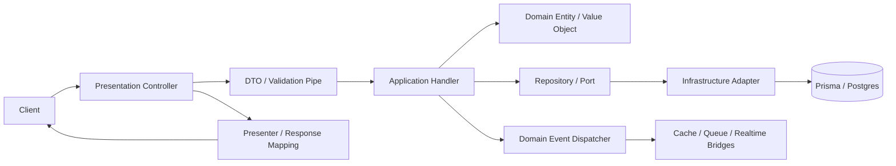

# Backend Architecture Guide

Tài liệu này mô tả kiến trúc backend trong `apps/server` theo đúng trạng thái code hiện tại sau refactor.

Mục tiêu của nó là để một người mới nhìn vào có thể hiểu:

- dự án được chia thành những khối nào
- mỗi khối có trách nhiệm gì
- luồng request đi qua các lớp ra sao
- `shared/` đang đóng vai trò gì trong kiến trúc mới
- nên đọc file nào trước để học code nhanh nhất

## 1. Kiến trúc tổng quan

Backend này là một NestJS application được tổ chức theo kiểu modular monolith.
Bên trong app, kiến trúc đi theo hướng:

- Clean Architecture / Hexagonal Architecture
- Domain-Driven Design
- CQRS
- domain events
- Redis-backed session/cache
- BullMQ jobs
- Prisma persistence
- realtime and audit as cross-cutting concerns

Nếu tóm gọn trong một câu:

> HTTP đi vào `presentation`, use case chạy ở `application`, luật nghiệp vụ nằm ở `domain`, còn tích hợp kỹ thuật nằm ở `infrastructure`.

## 2. Cây thư mục cấp cao

```text
apps/server/src
├── main.ts
├── app.module.ts
├── app.controller.ts
├── app.service.ts
├── shared/
├── infrastructure/
├── presentation/
└── contexts/
```

### `main.ts`

Điểm bootstrap của ứng dụng.
Nó cài đặt:

- static assets
- CORS
- validation toàn cục
- domain exception mapping
- Swagger
- start server

### `app.module.ts`

Root module của application.
Nó lắp các foundation module và bounded context vào runtime.

### `shared/`

Shared kernel của backend.
Đây là nơi chứa các abstraction, base classes, contracts, và model dùng chung.

### `infrastructure/`

Các adapter kỹ thuật cấp toàn app:

- database
- cache
- event bus
- queue
- realtime

### `presentation/`

Các thành phần HTTP boundary dùng chung cấp toàn app:

- decorators
- guards
- filters
- interceptors
- DTO base
- presenters

### `contexts/`

Các bounded context nghiệp vụ:

- `iam`
- `analytics`
- `audit`
- `menu`
- `notifications`
- `storage`

## 3. Hướng phụ thuộc

Một nguyên tắc quan trọng của repo này là dependency direction đi từ ngoài vào trong.

```text
presentation -> application -> domain
infrastructure -> domain/application ports
shared -> cung cấp nền tảng chung cho các tầng khác
```

### Điều đó có nghĩa là

- controller không nên tự query DB nếu đã có use case rõ ràng
- application nên làm việc qua port / abstraction thay vì concrete class
- infrastructure được quyền implement interface của domain
- domain không nên biết Prisma, Redis, HTTP hay NestJS controller là gì

### Tại sao cách này tốt

- dễ test
- dễ thay implementation
- giảm coupling giữa feature và framework
- business rule nằm tập trung

## 4. Request lifecycle

Luồng request điển hình:



### Happy path

1. Client gửi request.
2. Controller nhận request.
3. DTO và validation pipe kiểm tra input.
4. Application handler chạy use case.
5. Domain entity và value object enforce rule.
6. Repository port đọc hoặc ghi dữ liệu.
7. Infrastructure adapter chạm DB hoặc service ngoài.
8. Domain events được phát nếu có side effect.
9. Controller trả response JSON.

### Side effects

Không phải mọi hậu quả nghiệp vụ đều xử lý trong request chính.
Một số thứ đi qua đường phụ trợ:

- notification
- cache invalidation
- realtime update
- background jobs
- audit logging

### Error path

Có 2 nhóm lỗi chính:

- lỗi nghiệp vụ: invalid input, not found, conflict, forbidden
- lỗi kỹ thuật: DB, Redis, queue, runtime

Lỗi nghiệp vụ được map sang HTTP qua `DomainExceptionFilter`.

## 5. Application bootstrap

### `main.ts`

File này là nơi runtime được thiết lập.

Nó đang làm các việc sau:

- tạo Nest application
- serve `public/` dưới prefix `/public`
- bật CORS
- gắn `ValidationPipe` toàn cục
- gắn `DomainExceptionFilter`
- tạo Swagger document và mount tại `/api`
- listen port

Ý nghĩa kiến trúc:

- đây là lớp platform
- không đặt business logic ở đây

### `app.module.ts`

File này cho thấy app được ghép từ những khối nào.

Nó import:

- `ConfigModule`
- `PrismaModule`
- `RedisModule`
- `QueueModule`
- `EventDispatcherModule`
- `IamModule`
- `AnalyticsModule`
- `StorageModule`
- `MenuModule`
- `RealtimeModule`
- `NotificationModule`
- `AuditLogModule`

Nó cũng đăng ký `AuditLogInterceptor` ở cấp global.

Ý nghĩa:

- audit log là concern xuyên suốt request lifecycle
- đây không phải logic cục bộ của một feature

## 6. Shared kernel

`shared/` là điểm thay đổi đáng chú ý sau refactor.
Nó hiện rõ vai trò là shared kernel, không phải chỗ nhét tạm file dùng chung.

### 6.1 `shared/domain`

Đây là lớp nền tảng cho các model nghiệp vụ dùng chung.

Hiện tại có:

- `base/aggregate-root.ts`
- `base/result.ts`
- `events/`
- `exceptions/`
- `ports/`
- plus các file compatibility ở root như `aggregate-root.ts`, `result.ts`

### `base/aggregate-root.ts`

Base class cho aggregate root.

Nó giữ một danh sách domain events nội bộ và cho phép:

- `addDomainEvent(event)`
- `pullDomainEvents()`

Ý nghĩa:

- entity có thể ghi nhận sự kiện phát sinh trong lúc thay đổi state
- sau đó application layer hoặc dispatcher sẽ lấy các event này ra để phát tiếp

### `base/result.ts`

Wrapper cho kết quả xử lý nghiệp vụ.

Nó cung cấp các trạng thái:

- thành công
- thất bại

và các helper như:

- `ok`
- `fail`
- `unwrap`

Ý nghĩa:

- handler có thể trả về outcome rõ ràng
- controller hoặc layer ngoài có thể unwrap và để filter xử lý lỗi

### compatibility exports

File `shared/domain/index.ts` đang export cả:

- `./base/aggregate-root`
- `./base/result`
- `./aggregate-root`
- `./result`

Điều này cho thấy repo đang giữ một lớp tương thích giữa đường dẫn cũ và cấu trúc mới.

### 6.2 `shared/domain/events`

Các contract của event được đặt ở đây.

#### `domain-event.ts`

Base class cho domain event.
Hiện nó chỉ giữ `occurredOn`.

Điều đó có nghĩa:

- mọi event đều có timestamp chuẩn
- event trở thành một object nghiệp vụ có vòng đời rõ ràng

#### `queue-event.interface.ts`

Contract cho event có thể được chuyển sang queue.

#### `cache-invalidation-event.interface.ts`

Contract cho event có thể dẫn tới invalidation cache.

#### `realtime-event.interface.ts`

Contract cho event có thể được phát qua realtime channel.

### 6.3 `shared/domain/ports`

Đây là các abstraction cấp nền tảng cho các integration kỹ thuật.

#### `cache.port.ts`

Định nghĩa `ICachePort` với các hành vi:

- `get`
- `set`
- `del`
- `invalidatePattern`
- `keys`

#### `job-queue.port.ts`

Định nghĩa `IJobQueuePort` cho việc enqueue job nền.

#### `realtime.port.ts`

Định nghĩa `IRealtimePort` cho việc:

- gửi event cho một user
- broadcast cho nhiều client

### 6.4 `shared/domain/exceptions`

`DomainException` là base cho lỗi nghiệp vụ.

Ý nghĩa:

- domain có thể phát lỗi có ngữ nghĩa
- presentation layer map lỗi đó sang HTTP response phù hợp

### 6.5 `shared/domain/result.ts` và `shared/domain/aggregate-root.ts`

Ngoài `base/`, repo vẫn giữ các file ở root để tương thích import cũ.
Khi đọc code mới, ưu tiên coi `base/` là nơi định nghĩa chính.

## 7. Infrastructure layer

`infrastructure/` là nơi hiện thực các abstraction của toàn app.
Sau refactor, layer này nằm tách riêng ở root thay vì nằm rải trong `shared/infrastructure`.

### 7.1 `infrastructure/database`

Chứa Prisma module và service.

Đây là nơi nối app với database thật.

### 7.2 `infrastructure/cache`

Chứa:

- `redis.module.ts`
- `redis.service.ts`
- cache interceptors

Vai trò:

- kết nối Redis
- làm cache backend
- hỗ trợ invalidation

### 7.3 `infrastructure/event-bus`

Đây là layer quan trọng của shared side effects.

Gồm:

- `event-dispatcher.module.ts`
- `domain-event-dispatcher.ts`
- `bridges/cache.bridge.ts`
- `bridges/queue.bridge.ts`
- `bridges/realtime.bridge.ts`

Ý nghĩa:

- domain/app phát event
- dispatcher đẩy event cho các bridge
- mỗi bridge xử lý theo một concern riêng

Ví dụ:

- cache bridge invalidates cache
- queue bridge enqueue job
- realtime bridge push data ra client

### 7.4 `infrastructure/queue`

Chứa BullMQ adapter và module.

Nó hiện thực `IJobQueuePort`.

### 7.5 `infrastructure/realtime`

Chứa gateway và service realtime.

Nó hiện thực `IRealtimePort` hoặc các behavior tương tự.

## 8. Presentation layer

`presentation/` là lớp HTTP boundary dùng chung.

Nó chứa:

- `decorators`
- `guards`
- `filters`
- `interceptors`
- `presenters`
- base DTO

Ý nghĩa:

- tách các concern liên quan HTTP ra khỏi business code
- cho phép các context dùng cùng một bộ guard/filter/interceptor chuẩn

### So với code cũ

Sau refactor, các helper này không còn nằm trong `shared/infrastructure/...` mà được đẩy ra `src/presentation/...`.
Điều này làm ranh giới rõ hơn:

- `presentation` là lớp tiếp xúc HTTP
- `infrastructure` là lớp hiện thực kỹ thuật hậu trường

## 9. Bounded contexts

### 9.1 `iam`

Khối Identity & Access Management.

Nó bao gồm:

- `auth`
- `users`
- `roles`

#### `auth`

Xử lý:

- register
- login
- refresh token
- logout
- revoke session
- active sessions

Auth phụ thuộc nhiều vào:

- `users`
- `roles`
- session store
- JWT strategy / guards

#### `users`

Xử lý:

- create/update/deactivate/delete user
- query user
- emit user lifecycle events

Đây là nơi đi qua:

- entity
- value object
- repository
- password hasher
- queue processor
- notification / realtime / cache side effects thông qua events

#### `roles`

Xử lý:

- create role
- update permissions
- delete role
- list roles
- list permissions

Đây là nguồn sự thật cho RBAC catalog.

### 9.2 `audit`

Khối đọc lịch sử hoạt động.

Ghi log được gắn ở tầng interceptor toàn cục, còn audit context chủ yếu phục vụ query/reading.

### 9.3 `analytics`

Khối query cho dashboard và số liệu tổng hợp.

### 9.4 `menu`

Khối dựng menu cho frontend, thường dựa trên permission hoặc cấu hình hiển thị.

### 9.5 `notifications`

Khối nhận event từ các context khác và chuyển thành notification.

### 9.6 `storage`

Khối trừu tượng hóa việc lưu file.

Có local adapter và S3 adapter.

## 10. Cách đọc một context

Mỗi bounded context thường có dạng:

```text
context/
├── *.module.ts
├── application/
├── domain/
├── infrastructure/
├── presentation/
└── README.md
```

### `*.module.ts`

Nên đọc đầu tiên để biết module đó được gắn vào app thế nào.

### `presentation/`

Để hiểu endpoint, DTO, guard, decorator, output shape.

### `application/`

Để hiểu use case chạy ra sao.

### `domain/`

Để hiểu luật nghiệp vụ thật.

### `infrastructure/`

Để hiểu adapter, mapper, repository, service, gateway.

## 11. Cross-cutting concerns

### 11.1 Authentication

Auth không chỉ là login.
Nó bao gồm:

- JWT access token
- refresh token
- session store
- strategy
- guards

### 11.2 Authorization

Authorization dùng permission/role model.

Các mảnh thường tham gia:

- permission decorator
- permissions guard
- role repository
- user-role mapping

### 11.3 Audit

Audit là concern xuyên suốt.
Nó được gắn global để ghi trace theo request.

### 11.4 Cache

Cache là một phần của data flow, không chỉ là tối ưu phụ.

### 11.5 Queue

Queue dùng cho work không cần trả lời ngay:

- notification fan-out
- background processing
- retryable tasks

### 11.6 Realtime

Realtime là đường đẩy trạng thái ra client ngay khi cần.

## 12. Data flow theo concern

### 12.1 Write flow

1. Controller nhận request.
2. DTO validate input.
3. Handler chạy command.
4. Domain entity enforce rule.
5. Repository ghi dữ liệu.
6. Domain event được phát.
7. Cache / queue / realtime / audit phản ứng.
8. Response trả về client.

### 12.2 Read flow

1. Controller nhận request.
2. Query handler xử lý.
3. Repository đọc dữ liệu.
4. Presenter format response.
5. Response trả về client.

### 12.3 Session flow

1. Login tạo access token và refresh token.
2. Session info được lưu ở Redis.
3. Refresh endpoint kiểm tra session.
4. Logout/revoke xóa session.

### 12.4 Event flow

1. Aggregate root thu thập event.
2. Dispatcher lấy event ra.
3. Bridge/handler phản ứng theo concern riêng.
4. Side effects được xử lý độc lập với core use case.

## 13. Cách hiểu phần `shared` sau refactor

Đây là điểm quan trọng nhất nếu bạn vừa refactor.

`shared/` bây giờ nên được hiểu là:

- nền tảng domain dùng chung
- không phải nơi chứa logic ứng dụng
- không phải nơi chứa adapter kỹ thuật cụ thể

### Nên để trong `shared`

- base aggregate / result
- domain event base
- common ports
- common exception base
- model hoặc contract thật sự dùng xuyên nhiều context

### Không nên để trong `shared`

- business rule chỉ thuộc một context
- repository implementation cụ thể
- controller logic
- các helper chỉ dùng cho một feature nhỏ

### Vì sao điều này quan trọng

Nếu `shared` phình ra thành nơi chứa mọi thứ:

- dependency sẽ mờ đi
- domain dễ bị trộn với infrastructure
- tài liệu sẽ khó đọc
- refactor sau này sẽ đau hơn

## 14. File đọc trước

Nếu mới vào codebase, nên đọc theo thứ tự:

1. [main.ts](/D:/Workspaces/Repo/turborepo-advanced-starter/apps/server/src/main.ts)
2. [app.module.ts](/D:/Workspaces/Repo/turborepo-advanced-starter/apps/server/src/app.module.ts)
3. [shared/domain/base/aggregate-root.ts](/D:/Workspaces/Repo/turborepo-advanced-starter/apps/server/src/shared/domain/base/aggregate-root.ts)
4. [shared/domain/base/result.ts](/D:/Workspaces/Repo/turborepo-advanced-starter/apps/server/src/shared/domain/base/result.ts)
5. [shared/domain/events/domain-event.ts](/D:/Workspaces/Repo/turborepo-advanced-starter/apps/server/src/shared/domain/events/domain-event.ts)
6. [infrastructure/event-bus/domain-event-dispatcher.ts](/D:/Workspaces/Repo/turborepo-advanced-starter/apps/server/src/infrastructure/event-bus/domain-event-dispatcher.ts)
7. [presentation/filters/domain-exception.filter.ts](/D:/Workspaces/Repo/turborepo-advanced-starter/apps/server/src/presentation/filters/domain-exception.filter.ts)
8. [IAM / Auth README](/D:/Workspaces/Repo/turborepo-advanced-starter/apps/server/src/contexts/iam/auth/README.md)
9. [IAM / Users README](/D:/Workspaces/Repo/turborepo-advanced-starter/apps/server/src/contexts/iam/users/README.md)
10. [IAM / Roles README](/D:/Workspaces/Repo/turborepo-advanced-starter/apps/server/src/contexts/iam/roles/README.md)
11. [Audit README](/D:/Workspaces/Repo/turborepo-advanced-starter/apps/server/src/contexts/audit/README.md)

## 15. Mental model

Chỉ cần giữ mấy câu này trong đầu:

- `presentation` là cửa vào
- `application` là nơi chạy use case
- `domain` là nơi giữ luật
- `infrastructure` là nơi gắn công nghệ
- `shared` là nền tảng dùng chung, không phải bãi chứa logic

Nếu phải nhớ thêm một câu:

> Một thay đổi nghiệp vụ nên bắt đầu từ domain/application, không phải từ database hay controller.
