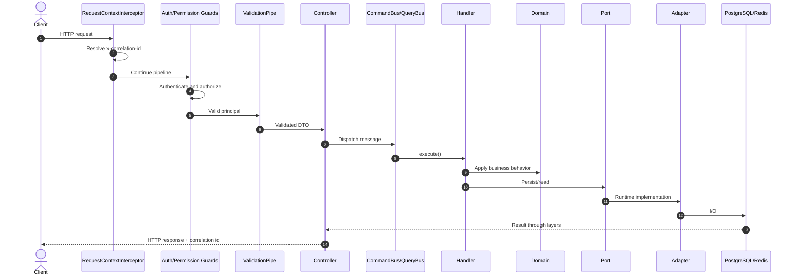
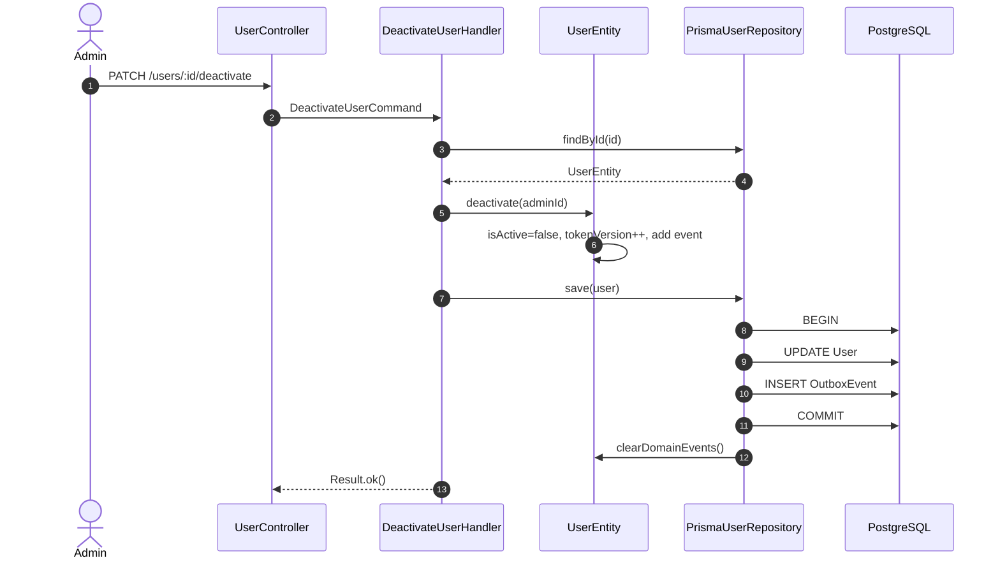

# Backend Architecture Handbook

Tài liệu này là bản đồ kiến trúc chính thức của backend trong `apps/server`. Mục tiêu không chỉ là cho biết dự án có những thư mục nào, mà giúp một thành viên mới hiểu được hệ thống đang giải quyết vấn đề gì, vì sao code được chia như hiện tại, một request đi qua những lớp nào và phải mở rộng code theo cách nào để không phá vỡ kiến trúc.

Các README bên trong từng bounded context đi sâu vào nghiệp vụ cụ thể:

- [Auth](./src/contexts/iam/auth/README.md): đăng ký, đăng nhập, refresh token và quản lý session.
- [Users](./src/contexts/iam/users/README.md): User aggregate, trạng thái tài khoản và domain events.
- [Roles](./src/contexts/iam/roles/README.md): RBAC, role và permission.
- [Audit](./src/contexts/audit/README.md): audit trail và cơ chế ghi log xuyên suốt request.

## 1. Mental model: nên hình dung backend này như thế nào?

Backend là một **modular monolith** viết bằng NestJS. Toàn bộ hệ thống được deploy như một application, dùng chung process và database, nhưng code không được tổ chức như một khối lớn. Nó được chia thành các bounded context theo năng lực nghiệp vụ: IAM, Notifications, Audit, Analytics, Menu và Storage.

“Monolith” ở đây nói về đơn vị triển khai. “Modular” nói về ranh giới trong code. Một context sở hữu model và use case của chính nó; context khác không được tùy tiện truy cập sâu vào repository hoặc entity nội bộ. Cách tổ chức này giữ chi phí vận hành thấp như monolith, đồng thời tạo ranh giới đủ rõ để hệ thống có thể phát triển lâu dài.

Bên trong mỗi context, dependency đi từ ngoài vào trong:

```text
HTTP / WebSocket / Worker
          │
          ▼
    Presentation
          │
          ▼
     Application
          │
          ▼
        Domain

Infrastructure ──implements──> Port do Domain/Application định nghĩa
```

Domain là lõi ổn định nhất. Presentation và infrastructure là chi tiết có thể thay đổi. Vì vậy domain không được biết NestJS controller, Prisma, Redis, BullMQ, Socket.IO hay HTTP status.

## 2. Các phong cách kiến trúc đang được áp dụng

### 2.1 Domain-Driven Design

DDD trong dự án thể hiện ở việc code được chia theo bounded context và hành vi nghiệp vụ được đặt trong aggregate/entity thay vì controller hoặc repository.

Ví dụ, vô hiệu hóa user không phải là câu lệnh Prisma `isActive = false` nằm trong controller. `UserEntity.deactivate()` chịu trách nhiệm đổi trạng thái, tăng `tokenVersion`, cập nhật audit fields và ghi nhận `UserDeactivatedEvent`. Nhờ vậy mọi đường gọi đều phải đi qua cùng một luật nghiệp vụ.

### 2.2 Clean/Hexagonal Architecture

Lõi hệ thống định nghĩa các port như `UserRepository`, `PasswordHasher`, `ISessionStore`, `ICachePort` hoặc `AuditWriter`. Adapter kỹ thuật hiện thực các port này bằng Prisma, bcrypt hoặc Redis.

Hướng phụ thuộc là điểm quan trọng nhất:

```text
Application/Domain biết interface
Infrastructure biết interface và implementation
Interface không biết implementation
```

Nếu thay Redis bằng một session store khác, application use case không cần đổi. Nếu thay Prisma, domain entity vẫn giữ nguyên.

### 2.3 CQRS

Write use case được biểu diễn bằng Command; read use case được biểu diễn bằng Query. Nest `CommandBus` và `QueryBus` tìm handler tương ứng.

CQRS ở đây không đồng nghĩa với hai database riêng. Mục tiêu hiện tại là tách ý định:

- Command diễn tả một thay đổi trạng thái, chẳng hạn `DeactivateUserCommand`.
- Query diễn tả nhu cầu đọc, chẳng hạn `GetUsersQuery`.
- Handler là nơi orchestration use case.
- Entity là nơi giữ invariant và state transition.

### 2.4 Transactional Outbox

Domain event không được phát thẳng ra Redis, queue hoặc WebSocket trong transaction nghiệp vụ. Repository ghi thay đổi aggregate và bản ghi outbox trong cùng một database transaction. Một publisher độc lập xử lý delivery sau đó.

Thiết kế này giải quyết “dual-write problem”: nếu user đã được lưu nhưng process chết trước khi enqueue email hoặc force logout, outbox vẫn còn và có thể retry.

## 3. Bản đồ codebase

```text
apps/server/
├── src/
│   ├── main.ts                    # Bootstrap HTTP application
│   ├── app.module.ts              # Composition root
│   ├── config/                    # Validate và parse environment
│   ├── contexts/                  # Các bounded context
│   │   ├── iam/
│   │   │   ├── auth/
│   │   │   ├── users/
│   │   │   └── roles/
│   │   ├── notifications/
│   │   ├── audit/
│   │   ├── analytics/
│   │   ├── menu/
│   │   └── storage/
│   ├── shared/
│   │   ├── domain/                # Domain primitives dùng chung
│   │   └── application/           # Technical application ports dùng chung
│   ├── infrastructure/            # Adapter cấp toàn application
│   ├── presentation/              # HTTP concerns dùng xuyên context
│   └── architecture/              # Test bảo vệ dependency rules
└── test/                          # E2E tests và test DB setup
```

`app.module.ts` là **composition root**. Đây là nơi module, port và adapter được ghép lại. File này được phép biết nhiều thành phần; business logic không được đặt tại đây.

## 4. Bounded context và quyền sở hữu

### IAM

IAM là nhóm context về identity và access:

- Auth sở hữu token lifecycle và refresh sessions.
- Users sở hữu User aggregate và trạng thái tài khoản.
- Roles sở hữu role/permission mapping.

Ba context liên quan chặt chẽ nhưng không nên gộp thành một folder phẳng. Auth có thể dùng `UserRepository` để xác thực, nhưng luật thay đổi User vẫn thuộc Users.

### Notifications

Notifications sở hữu notification entity, trạng thái read/unread và API lấy notification. Notification có thể được tạo từ event của context khác, nhưng context phát event không tự ghi bảng Notification.

### Audit

Audit sở hữu audit record và read API. Các context khác chỉ gắn metadata `@AuditLog`; việc ghi dữ liệu đi qua `AuditWriter`.

### Analytics, Menu và Storage

Analytics tổng hợp dữ liệu đọc cho dashboard. Menu tạo navigation tree dựa trên permission. Storage định nghĩa port upload/delete và có adapter local/S3. Đây là các context nhỏ hơn nhưng vẫn tuân theo ranh giới presentation/application/domain/infrastructure khi độ phức tạp yêu cầu.

## 5. Request lifecycle

Một HTTP request thông thường đi theo chuỗi sau:


```mermaid
sequenceDiagram
    autonumber
    actor Client
    participant Context as RequestContextInterceptor
    participant Guard as Auth/Permission Guards
    participant Pipe as ValidationPipe
    participant Controller
    participant Bus as CommandBus/QueryBus
    participant Handler
    participant Domain
    participant Port
    participant Adapter
    participant DB as PostgreSQL/Redis

    Client->>Context: HTTP request
    Context->>Context: Resolve x-correlation-id
    Context->>Guard: Continue pipeline
    Guard->>Guard: Authenticate and authorize
    Guard->>Pipe: Valid principal
    Pipe->>Controller: Validated DTO
    Controller->>Bus: Dispatch message
    Bus->>Handler: execute()
    Handler->>Domain: Apply business behavior
    Handler->>Port: Persist/read
    Port->>Adapter: Runtime implementation
    Adapter->>DB: I/O
    DB-->>Controller: Result through layers
    Controller-->>Client: HTTP response + correlation id
```

### Vai trò của từng bước

`RequestContextInterceptor` lấy correlation id do client gửi hoặc sinh UUID mới. Khi request kết thúc, nó ghi method, path, status, duration và user id nếu có.

Guard trả lời hai câu hỏi khác nhau:

1. Request đến từ ai?
2. Principal đó có permission cần thiết không?

Validation pipe chỉ kiểm tra dữ liệu tại HTTP boundary. Nó không thay thế domain invariant. Email có thể được kiểm tra format ở DTO để trả lỗi sớm, nhưng `Email` value object vẫn phải tự bảo vệ tính hợp lệ vì entity có thể được tạo từ worker hoặc test, không chỉ controller.

Controller chuyển HTTP input thành Command/Query và format output. Controller không chứa transaction, Prisma query hoặc business decision.

Handler orchestration các bước của use case. Handler có thể tải aggregate, gọi hành vi domain và lưu qua repository.

## 6. Một read flow hoàn chỉnh

Lấy danh sách users minh họa read path:

1. `GET /users` đi qua JWT và permission guards.
2. `GetUsersQueryDto` validate page, limit, search, sort field và sort order.
3. `UserController` dựng `GetUsersQuery` rồi gọi `QueryBus`.
4. `GetUsersQueryHandler` tính offset và gọi `UserRepository.findAll`.
5. `PrismaUserRepository` dựng `Prisma.UserWhereInput` và typed order input.
6. Repository chạy `findMany` và `count`.
7. Prisma record được map về `UserEntity`.
8. `UserPresenter` tạo response allowlist, không trả password hoặc tokenVersion.
9. Pagination presenter bổ sung metadata.

Read flow không được thay đổi domain state và không tạo domain event.

## 7. Một write flow hoàn chỉnh

Vô hiệu hóa user minh họa write path:


```mermaid
sequenceDiagram
    autonumber
    actor Admin
    participant Controller as UserController
    participant Handler as DeactivateUserHandler
    participant User as UserEntity
    participant Repo as PrismaUserRepository
    participant DB as PostgreSQL

    Admin->>Controller: PATCH /users/:id/deactivate
    Controller->>Handler: DeactivateUserCommand
    Handler->>Repo: findById(id)
    Repo-->>Handler: UserEntity
    Handler->>User: deactivate(adminId)
    User->>User: isActive=false, tokenVersion++, add event
    Handler->>Repo: save(user)
    Repo->>DB: BEGIN
    Repo->>DB: UPDATE User
    Repo->>DB: INSERT OutboxEvent
    Repo->>DB: COMMIT
    Repo->>User: clearDomainEvents()
    Handler-->>Controller: Result.ok()
```

Transaction boundary nằm trong repository vì repository biết cách persistence aggregate và outbox atomically. Domain không biết transaction; controller cũng không điều khiển transaction.

## 8. Domain event và outbox delivery

Sau write transaction, `OutboxPublisherService` poll các event đủ điều kiện. Publisher claim event bằng optimistic update từ `PENDING` sang `PROCESSING`, tăng số lần thử và đặt `lockedAt`.

`OutboxEventRouter` rehydrate event rồi route theo type:

- `UserRegisteredEvent`: enqueue welcome email và tạo notification.
- `UserDeactivatedEvent`: revoke Redis sessions, enqueue email, tạo notification và force logout qua realtime.
- `NotificationCreatedEvent`: push notification qua Socket.IO.

Nếu delivery thành công, event chuyển sang `PUBLISHED`. Nếu thất bại, event trở lại `PENDING` với exponential backoff. Sau ngưỡng tối đa, event chuyển `FAILED` để operator xử lý như dead letter.

Publisher phục hồi claim bị treo. Khi application shutdown, timer dừng và poll đang chạy được chờ hoàn tất trước khi Prisma pool đóng.

At-least-once delivery có nghĩa consumer có thể nhận lại event. Vì vậy:

- BullMQ dùng `eventId` làm `jobId`.
- Notification do event tạo dùng deterministic id.
- Side effect mới phải được thiết kế idempotent.

## 9. Shared kernel: đặt gì và không đặt gì?

`shared/domain` chỉ chứa khái niệm domain thực sự dùng chung:

- `AggregateRoot`: quản lý domain event trong vòng đời aggregate.
- `DomainEvent`: cung cấp `eventId` và `occurredOn`.
- `Result<T, E>`: biểu diễn success/failure của use case.
- `DomainException`: base error có mã nghiệp vụ.

`shared/application/ports` chứa abstraction kỹ thuật dùng cho orchestration ở nhiều context:

- cache;
- job queue;
- realtime.

Port kỹ thuật không nằm trong domain. Redis, BullMQ và Socket.IO càng không nằm trong `shared`.

Trước khi đưa file vào shared, hãy hỏi: “Nếu bỏ context hiện tại đi, khái niệm này còn có ý nghĩa độc lập cho nhiều context khác không?” Nếu câu trả lời là không, file phải ở context sở hữu nó.

## 10. Authentication và token revocation

Access token chứa subject, email, permissions và `tokenVersion`. `JwtStrategy` không chỉ verify chữ ký; nó tải User hiện tại và từ chối request nếu user:

- không tồn tại;
- đã bị soft delete;
- không active;
- có token version khác payload.

Các mutation làm thay đổi quyền truy cập như update role/profile, deactivate, activate, delete hoặc restore đều tăng `tokenVersion`. Do đó access token cũ mất hiệu lực ngay.

Refresh token có JTI và phải có session tương ứng trong Redis. Session key có dạng `refresh_token:{userId}:{jti}`. Refresh thực hiện rotation; logout xóa một session; global logout xóa toàn bộ session của user bằng cursor-based `SCAN`.

## 11. Cross-cutting concerns

### Validation và error mapping

Global `ValidationPipe` bật whitelist, reject field lạ và transform DTO. Domain/application trả `Result` hoặc ném `DomainException`; `DomainExceptionFilter` map lỗi có ngữ nghĩa sang HTTP response.

### Audit

Endpoint cần audit gắn `@AuditLog(action, detailsCallback)`. `AuditLogInterceptor` đọc metadata sau khi handler thành công, tạo audit entry rồi `await` `AuditWriter`. Interceptor phụ thuộc port, còn `PrismaAuditWriter` là adapter.

Không được ghi password, JWT, refresh token hoặc secret vào audit details.

### Cache

Read endpoint có thể dùng `CacheInterceptor`. Mutation dùng `CacheInvalidationInterceptor`, và invalidation chỉ chạy sau response thành công. Pattern deletion sử dụng Redis `SCAN` theo batch để không block server.

### Health và shutdown

- `/health/live` xác nhận process còn sống.
- `/health/ready` kiểm tra PostgreSQL và Redis.
- Nest shutdown hooks đóng resource có trật tự.

Liveness không nên kiểm tra dependency ngoài vì dependency outage không có nghĩa process cần restart. Readiness phải phản ánh application có đủ khả năng nhận traffic hay không.

## 12. Composition root và dependency injection

Các port sử dụng `Symbol` làm DI token, chẳng hạn `USER_REPOSITORY`, `CACHE_PORT` và `AUDIT_WRITER`. Module chịu trách nhiệm bind token với implementation.

Ví dụ:

```text
UserRepository port ──bound to──> PrismaUserRepository
PasswordHasher port ──bound to──> BcryptPasswordHasher
ISessionStore port  ──bound to──> RedisSessionStore
AuditWriter port    ──bound to──> PrismaAuditWriter
```

Không inject concrete adapter vào handler nếu đã có port. Concrete class chỉ nên xuất hiện ở module wiring hoặc code infrastructure.

## 13. Quy tắc phụ thuộc bắt buộc

### Domain được phép

- TypeScript và domain code cùng context.
- Shared domain primitives.
- Contract thuần không mang framework/runtime.

### Domain không được phép

- NestJS decorators/service.
- Prisma types/client.
- Redis, BullMQ, Socket.IO.
- Controller DTO.
- Adapter của context khác.

### Application được phép

- Domain của context.
- Port do domain/application định nghĩa.
- CQRS message/handler primitives.

### Presentation và infrastructure

Presentation được gọi application nhưng không gọi thẳng Prisma. Infrastructure được hiện thực port và phụ thuộc library kỹ thuật, nhưng không quyết định business rule.

`src/architecture/dependency-rules.spec.ts` là executable documentation bảo vệ các hướng phụ thuộc quan trọng.

## 14. Cách thêm một use case mới

Giả sử cần thêm “restore user”:

1. Xác định invariant và đặt state transition trong `UserEntity.restore()`.
2. Xác định mutation có cần tăng tokenVersion hoặc phát event không.
3. Tạo `RestoreUserCommand` diễn tả input của use case.
4. Tạo handler: tải user, gọi entity, lưu qua `UserRepository`.
5. Chỉ mở rộng repository port nếu use case thật sự cần capability mới.
6. Tạo DTO runtime validation và endpoint.
7. Gắn permission, audit và cache invalidation phù hợp.
8. Viết unit test cho domain transition và handler.
9. Viết E2E cho authentication, authorization, persistence và side effect quan trọng.
10. Cập nhật README của Users nếu flow hoặc invariant thay đổi.

Đối với query mới, không tạo state transition hoặc domain event. Query handler nên trả một contract rõ ràng, tránh `any`.

## 15. Anti-pattern cần tránh

### Business logic trong controller

Sai: controller tự đổi `isActive`, tự tăng token version và gọi Prisma.

Đúng: controller dispatch command; entity quyết định state transition; repository persistence.

### Domain event chứa delivery instruction

Sai: event có `queueName`, `cachePattern` hoặc Socket.IO room.

Đúng: event chỉ mô tả fact nghiệp vụ; router infrastructure quyết định delivery.

### Ghi aggregate rồi enqueue riêng lẻ

Sai: `await repository.save(); await queue.add();`.

Đúng: ghi aggregate + outbox atomically, delivery sau commit.

### `shared` thành thư mục tiện ích

Không đưa code vào shared chỉ vì hai file đang import nó. Shared phải có ý nghĩa kiến trúc ổn định và ownership rõ ràng.

### Promise fire-and-forget

Side effect quan trọng phải được await hoặc đưa vào queue/outbox có retry. `tap(async () => ...)` tạo promise không được observable theo dõi và không được dùng cho persistence quan trọng.

## 16. Testing và quality gates

Các lớp kiểm thử có mục đích khác nhau:

- Domain unit test bảo vệ invariant và state transition.
- Application/infrastructure unit test bảo vệ mapper, router, retry và error handling.
- Architecture test bảo vệ dependency direction.
- E2E test dùng PostgreSQL/Redis/BullMQ thật để kiểm tra flow xuyên lớp.

Test database chỉ được reset nếu tên kết thúc bằng `_test`. Global setup dùng Prisma `db push --force-reset` và seed dữ liệu chuẩn.

Quality gate:

```bash
pnpm --filter=server verify
pnpm --filter=server test:e2e
```

`verify` chạy lint, build, typecheck và unit tests. E2E chạy riêng vì cần infrastructure local.

## 17. Lộ trình đọc code cho thành viên mới

Đọc theo một flow thay vì đọc alphabet:

1. `src/main.ts` và `src/app.module.ts` để hiểu bootstrap/composition.
2. `src/shared/domain/base/aggregate-root.ts`, `result.ts` và `events/domain-event.ts`.
3. README Users, sau đó lần theo `UserController → Command → Handler → UserEntity → Repository`.
4. `PrismaUserRepository.save()` để hiểu transaction + outbox.
5. `OutboxPublisherService` và `OutboxEventRouter`.
6. README Auth và hai JWT strategies.
7. README Roles và `PermissionsGuard`.
8. README Audit và global interceptors.
9. E2E test để thấy các flow được chứng minh ở runtime.

## 18. Checklist review kiến trúc

Trước khi merge một thay đổi backend, reviewer nên trả lời được:

- Context nào sở hữu nghiệp vụ này?
- Business invariant nằm trong domain hay đang rò ra controller/repository?
- Hướng dependency có đi từ ngoài vào trong?
- Handler phụ thuộc port hay concrete adapter?
- Mutation aggregate và event có được ghi atomically?
- Side effect có retry/idempotency không?
- Mutation có ảnh hưởng tokenVersion, audit hoặc cache không?
- DTO có runtime validation và reject field lạ không?
- Response có vô tình lộ password, token hoặc internal field không?
- Có unit/E2E test đúng cấp độ không?
- Tài liệu context đã phản ánh flow mới chưa?

Nếu giữ đúng các nguyên tắc này, backend có thể tiếp tục là nền tảng cho nhiều dự án mà không biến thành một monolith khó kiểm soát.
