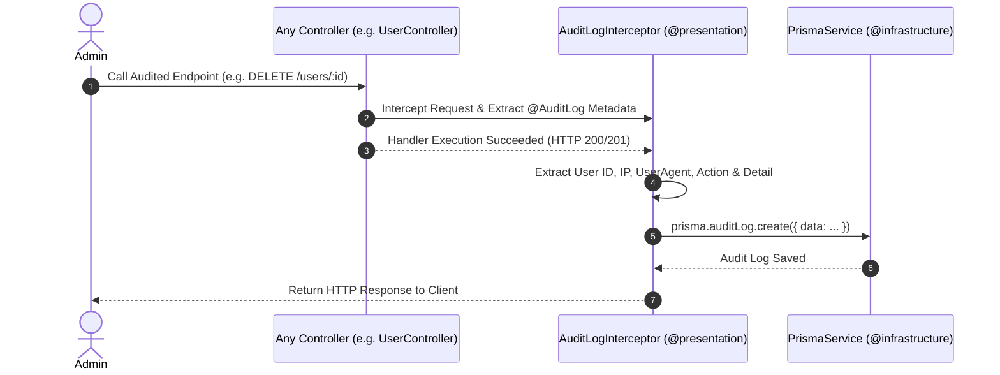

# 📋 Audit Bounded Context Documentation

Bounded Context **Audit** chịu trách nhiệm thu thập, lưu trữ và truy vấn **Nhật ký vết hệ thống (Audit Logs)** phục vụ mục đích tuân thủ (Compliance), bảo mật (Security Audit) và quản lý dấu vết thao tác của người dùng.

---

## 🏛️ 1. Cấu Trúc Thư Mục Clean Architecture

```text
contexts/audit/
├── application/                           ─── [Application Layer]
│   └── queries/
│       ├── get-audit-logs.query.ts        # Query lấy danh sách Audit Logs có phân trang
│       └── handlers/
│           └── get-audit-logs.handler.ts  # Handler truy vấn Prisma AuditLog model
│
└── presentation/                          ─── [Presentation Layer]
    └── controllers/
        └── audit-log.controller.ts        # Endpoint REST API GET /audit-logs
```

---

## 🔄 2. Cơ Chế Ghi Audit Log Tự Động (Automatic Audit Interceptor Flow)

Mọi hành động được đánh dấu `@AuditLog(action, detailCallback)` tại các Controllers trong ứng dụng sẽ được bóc tách và lưu tự động vào Database:



---

## 🔑 3. Các Điểm Nổi Bật Về Thiết Kế

1. **Ghi Log Bất Đồng Bộ (Non-blocking Interceptor)**:
   - `AuditLogInterceptor` lắng nghe phản hồi của Controller qua RxJS `tap()` stream.
   - Quá trình ghi DB diễn ra bất đồng bộ và không làm gián đoạn hay tăng độ trễ (latency) của phản hồi gửi về cho Client.
2. **Loại Bỏ Phụ Thuộc Chéo (Zero Cross-Context Dependency)**:
   - Các Bounded Context khác (như `storage`, `users`, `roles`) chỉ khai báo Decorator `@AuditLog()` thuộc `@presentation/decorators`.
   - Các context không cần `import` bất kỳ module hay service nào từ Audit Context.
