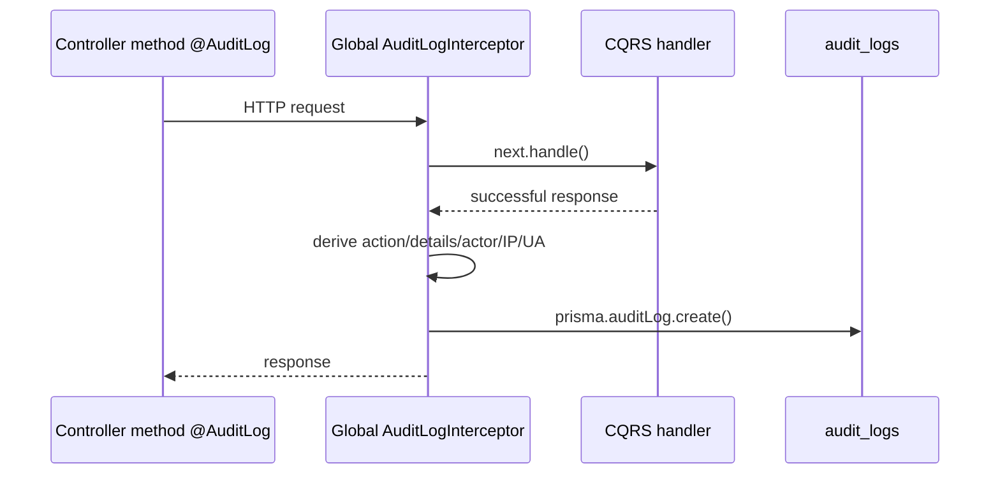

# Audit bounded context

Audit là context **đọc nhật ký**; phần ghi log là hạ tầng shared chạy toàn cục. Context hiện ở `src/contexts/audit` và được `AppModule` import trực tiếp qua `AuditLogModule`.

## 1. Dữ liệu và điểm ghi log

Bảng Prisma `AuditLog`/`audit_logs` có: UUID `id`, `action`, `details`, `userId?`, `userEmail?`, `ip?`, `userAgent?`, `createdAt`. Không có foreign key tới User, chủ ý giữ dấu vết actor kể cả khi user soft-delete/biến đổi.

`AppModule` đăng ký `AuditLogInterceptor` như `APP_INTERCEPTOR`; nhưng interceptor chỉ hoạt động nếu handler có metadata `@AuditLog(action, detailsCallback?)`. Sau Observable thành công, nó lấy `request.user` (nếu guard đã gắn), IP (`req.ip`, `x-forwarded-for`, hoặc socket) và User-Agent, chạy callback details rồi `prisma.auditLog.create`. Lỗi ghi log bị `catch` và chỉ `console.error`, không làm hỏng nghiệp vụ chính. Vì ghi trong `tap` sau response, audit chỉ phản ánh request handler thành công, không phải attempt/thất bại.

Các controller hiện decorate các hành động quản trị user (create/update/toggle/delete), role (create/update-permissions/delete), và session revoke/global revoke. Không có decorator nghĩa là không có row audit, kể cả endpoint nhạy cảm như login/register.

## 2. Cấu trúc context

| File | Vai trò |
| --- | --- |
| `audit-log.module.ts` | Import `CqrsModule`, `PrismaModule`; cung cấp query handler và controller. |
| `application/queries/get-audit-logs.query.ts` | Mang `PaginationQueryDto` vào CQRS. |
| `application/queries/handlers/get-audit-logs.handler.ts` | Dùng Prisma trực tiếp để filter/sort/paginate; bọc lỗi DB trong `GetAuditLogsException`. |
| `presentation/controllers/audit-log.controller.ts` | API danh sách audit logs, JWT + permission `audit:read`, trình bày response phân trang. |
| `@shared/infrastructure/decorators/audit-log.decorator.ts` | Định nghĩa metadata action và callback detail. |
| `@shared/infrastructure/interceptors/audit-log.interceptor.ts` | Writer dùng bởi toàn hệ thống. |

## 3. API đọc logs

`GET /audit-logs?page=1&limit=10&search=...` yêu cầu access JWT hợp lệ và `audit:read`. `PaginationQueryDto` được global ValidationPipe transform; handler mặc định page 1, limit 10. Response từ `PaginatedResponsePresenter` chứa data, tổng số record và metadata pagination.

Nếu có `search`, Prisma tạo OR case-insensitive trên `action`, `details`, `userEmail`. Kết quả luôn `orderBy createdAt desc`. Không có filter date, action/userId riêng hay sort tùy chọn trong implementation hiện tại.

## 4. Quy ước khi ghi audit mới

Gắn decorator ở method controller, ví dụ `@AuditLog('ROLE_DELETE', req => ...)`. Action nên là identifier ổn định (`UPPER_SNAKE_CASE`), callback chỉ mô tả thông tin không nhạy cảm. Không đưa password raw/hash, access/refresh token, header Authorization, hay dữ liệu cá nhân quá mức vào `details`; audit logs có thể được nhiều quản trị viên xem.

Nếu cần audit cho lỗi/attempt, interceptor hiện tại không đáp ứng: cần thiết kế logging ở error path hoặc interceptor/exception filter khác. Nếu cần độ bền audit bắt buộc, không được nuốt lỗi như writer hiện tại; đó là thay đổi yêu cầu reliability và transaction rõ ràng.

## 5. Frontend và bảo mật

Admin SPA route `/audit-logs` yêu cầu `audit:read` ở frontend và `AuditLogsManagement` gọi endpoint phân trang. Đây chỉ là UX guard; `JwtAuthGuard` + shared `PermissionsGuard` phía server mới là kiểm soát bảo mật. Permission list được snapshot trong access JWT, nên thay đổi role của admin có hiệu lực khi có access token mới/refresh.
