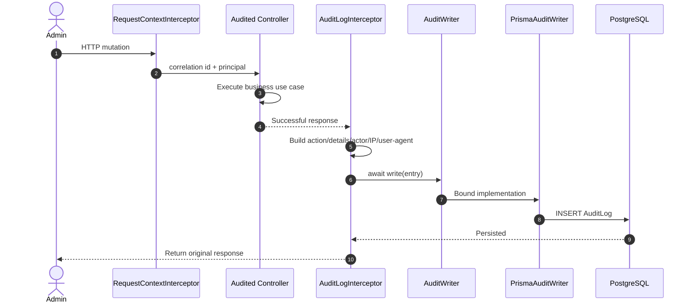

# Audit Bounded Context

Audit cung cấp dấu vết có cấu trúc cho các hành động quan trọng về bảo mật, quản trị và tuân thủ. Audit record trả lời: ai thực hiện hành động gì, lúc nào, từ đâu và với mô tả nào.

Audit không thay thế application log. Application log phục vụ vận hành/debug; audit trail phục vụ truy vết hành động nghiệp vụ và cần schema ổn định hơn.

> Gặp từ lạ (port, adapter, interceptor, correlation id…)? Tra [Bảng thuật ngữ](../../../../../docs/glossary.md).

## 1. Ranh giới và ownership

Audit sở hữu:

- port `AuditWriter` ở tầng application;
- Prisma adapter ghi bản ghi audit xuống database;
- query đọc audit log có phân trang và tìm kiếm;
- HTTP endpoint đọc audit.

Các context khác không import thẳng repository audit của Prisma. Chúng chỉ gắn decorator `@AuditLog` lên endpoint trong controller. Interceptor toàn cục đọc thông tin từ decorator đó rồi gọi port để ghi.

## 2. Cấu trúc code

```text
audit/
├── application/
│   ├── ports/audit-writer.port.ts
│   └── queries/
│       ├── get-audit-logs.query.ts
│       └── handlers/get-audit-logs.handler.ts
├── infrastructure/
│   └── prisma-audit-writer.ts
├── presentation/
│   └── controllers/audit-log.controller.ts
└── audit-log.module.ts
```

Decorator và interceptor dùng chung cho cả ứng dụng nằm ở thư mục `presentation/` gốc; còn port, cấu trúc bản ghi và query thuộc quyền sở hữu của Audit context.

## 3. Write flow


```mermaid
sequenceDiagram
    autonumber
    actor Admin
    participant Context as RequestContextInterceptor
    participant Controller as Audited Controller
    participant Audit as AuditLogInterceptor
    participant Port as AuditWriter
    participant Adapter as PrismaAuditWriter
    participant DB as PostgreSQL

    Admin->>Context: HTTP mutation
    Context->>Controller: correlation id + principal
    Controller->>Controller: Execute business use case
    Controller-->>Audit: Successful response
    Audit->>Audit: Build action/details/actor/IP/user-agent
    Audit->>Port: await write(entry)
    Port->>Adapter: Bound implementation
    Adapter->>DB: INSERT AuditLog
    DB-->>Audit: Persisted
    Audit-->>Admin: Return original response
```

Interceptor dùng `mergeMap` và chờ (`await`) writer ghi xong. Cách này tránh kiểu `tap(async ...)` sinh ra promise chạy lơ lửng không ai chờ — ghi lỗi cũng không ai hay. Bản ghi audit chỉ được tạo sau khi endpoint đã chạy thành công.

Nếu callback dựng details bị lỗi, interceptor dùng một mô tả dự phòng. Nếu ghi audit xuống database bị lỗi, lỗi đó chỉ được ghi vào application log; nghiệp vụ đã thành công thì response vẫn trả về bình thường, không bị đổi thành lỗi HTTP. Đây là lựa chọn ưu tiên hệ thống chạy liên tục; phải cân nhắc lại nếu có yêu cầu tuân thủ kiểu “không ghi được audit thì hủy luôn thao tác” (audit-or-fail).

### Thử bằng tay

Thực hiện một mutation có decorator audit rồi xem record xuất hiện:

```bash
# 1. Toggle trạng thái một user bất kỳ (endpoint này có @AuditLog)
curl -s -X PATCH http://localhost:3001/users/<id>/toggle-status \
  -H "Authorization: Bearer <admin token>"

# 2. Đọc lại qua chính API audit
curl -s "http://localhost:3001/audit-logs?page=1&limit=3" \
  -H "Authorization: Bearer <admin token>"
# → record mới nhất có action, details, userEmail của bạn, ip và userAgent
```

Hoặc nhìn thẳng vào bảng:

```powershell
docker exec starter-postgres psql -U postgres -d starter_db \
  -c "SELECT action, user_email, ip FROM audit_logs ORDER BY created_at DESC LIMIT 3;"
```

> **Tóm lại:**
>
> - Context khác KHÔNG gọi audit trực tiếp — chỉ gắn `@AuditLog('ACTION', callback)` lên endpoint; interceptor toàn cục lo phần còn lại.
> - Chỉ audit khi business ĐÃ thành công; audit ghi lỗi thì response nghiệp vụ vẫn trả bình thường (fail-open — là policy có chủ đích, không phải bug).
> - Writer được `await` thật sự, không fire-and-forget.

## 4. Audit entry

Writer nhận một entry có:

- action identifier;
- human-readable details;
- actor user id/email nếu có;
- IP;
- user-agent.

Database tự thêm id và thời điểm ghi. Tên action nên giữ ổn định để về sau còn tìm kiếm và làm báo cáo; details có thể mô tả ngữ cảnh chi tiết nhưng không được chứa secret.

Correlation id hiện chỉ xuất hiện trong request log, chưa phải một cột của bảng AuditLog. Nếu cần nối trực tiếp một bản ghi audit với các dòng log của cùng request, hãy thêm cột vào schema và sửa port cho tường minh, thay vì nhét id vào cột details.

## 5. Read flow

`GET /audit-logs` yêu cầu authentication và permission phù hợp. Controller dựng `GetAuditLogsQuery`; handler:

1. lấy page, limit và search;
2. dựng `Prisma.AuditLogWhereInput` có kiểu;
3. search action/details/userEmail;
4. chạy `findMany` và `count` song song;
5. trả `Result<AuditLogPage, DomainException>`;
6. controller format pagination response.

Đường đọc hiện gọi Prisma trực tiếp ngay trong handler tầng application. Với context nhỏ thì chấp nhận được, nhưng nếu Audit phức tạp lên hoặc cần đổi nơi lưu trữ, nên thêm một read repository port để tầng application không dính vào chi tiết database.

## 6. Cách gắn audit cho endpoint

```ts
@AuditLog(
  'USER_UPDATE',
  (request) =>
    `Cập nhật tài khoản ${String(request.params.id)}`,
)
```

Tên action nên theo một quy ước đặt tên ổn định, ví dụ `RESOURCE_OPERATION`. Callback chỉ được đọc phần cần thiết của request/response để ghép chuỗi mô tả; không được gọi database/mạng hay chứa logic nghiệp vụ.

Audit chỉ chạy cho endpoint có decorator. Không mặc định audit mọi GET vì điều đó tạo dữ liệu nhiễu, chi phí lớn và có thể ghi thông tin không cần thiết.

## 7. Failure semantics

Ba loại failure cần phân biệt:

1. Use case nghiệp vụ thất bại: không ghi bản ghi audit thành công nào.
2. Callback dựng details thất bại: vẫn ghi audit nhưng dùng mô tả dự phòng.
3. Ghi audit xuống database thất bại: chỉ ghi lỗi vào application log; response nghiệp vụ vẫn giữ nguyên theo chính sách hiện tại.

Nếu cần ghi lại cả những lần thao tác thất bại, hãy thiết kế event/schema riêng có cột kết quả và loại lỗi. Đừng nhồi thêm vào decorator hiện tại (vốn chỉ ghi khi thành công) khiến hành vi trở nên mập mờ.

## 8. Security và privacy

Không được ghi vào audit:

- raw/hashed password;
- access/refresh token;
- JWT secret/API key;
- full authorization header;
- session value;
- dữ liệu cá nhân không cần thiết.

Endpoint đọc audit trả về dữ liệu nhạy cảm nên phải chặn bằng permission. Còn các bài toán giữ dữ liệu bao lâu (retention), xuất dữ liệu, chống sửa trộm bản ghi và che bớt thông tin nhạy cảm (redaction) thuộc về vận hành production, cần chính sách hạ tầng riêng.

> **Tóm lại:**
>
> - Câu hỏi trước khi ghi bất kỳ thứ gì vào details: "nếu bảng audit bị lộ, dòng này có gây hại không?" — secret/token/password tuyệt đối không, PII chỉ khi thực sự cần truy vết.
> - Action identifier là thứ để MÁY tìm kiếm (`USER_UPDATE`), details là thứ để NGƯỜI đọc — đừng trộn vai trò hai cột.

## 9. Ý nghĩa từng file

`audit-writer.port.ts` là interface tách tầng application khỏi database: application chỉ biết “hãy ghi bản ghi này”, không biết ghi vào đâu. `prisma-audit-writer.ts` nhận bản ghi đó và INSERT vào bảng AuditLog qua Prisma. `get-audit-logs.*` là use case đọc. `audit-log.controller.ts` nhận request HTTP và trả response. `audit-log.module.ts` khai báo interface writer sẽ do adapter Prisma đảm nhiệm và đăng ký các provider.

Ở thư mục gốc, `audit-log.decorator.ts` chỉ gắn nhãn metadata lên endpoint; `audit-log.interceptor.ts` mới là nơi làm việc: đọc nhãn đó, dựng bản ghi và gọi writer cho mọi endpoint có gắn nhãn.

## 10. Cách mở rộng

Khi thêm audit storage hoặc sink thứ hai:

1. giữ interface `AuditWriter` ổn định; nếu phải mở rộng thì mở rộng có chủ đích;
2. tạo adapter mới;
3. khai báo adapter mới trong module, hoặc gói nhiều writer vào một writer tổng;
4. định rõ khi ghi lỗi thì thử lại hay bỏ qua;
5. viết test E2E xác nhận bản ghi thật sự nằm trong storage.

Khi thêm một action mới cần audit, hãy chốt trước ba thứ rồi mới gắn decorator: tên action, mức chi tiết tối thiểu của details, và dữ liệu nào được phép xuất hiện trong đó.

## 11. Anti-pattern

- Tiêm thẳng Prisma Audit vào mọi controller.
- Gọi writer kiểu bắn rồi quên (fire-and-forget), không chờ và không biết ghi thành công hay không.
- Ghi token/password vào details.
- Dùng chuỗi mô tả details làm tên action để tìm kiếm.
- Audit mọi request mà không có mục tiêu truy vết cụ thể.
- Tuyên bố audit “chắc chắn được ghi” trong khi chính sách hiện tại là ghi lỗi vẫn cho qua (fail-open).

## 12. Checklist review Audit

- Tên action có ổn định và tìm kiếm được không?
- Details có đủ thông tin nhưng không lộ secret hay dữ liệu cá nhân thừa không?
- Endpoint có permission phù hợp không?
- Trường hợp nào ghi, trường hợp nào không ghi đã rõ chưa?
- Writer có được await không?
- Test E2E có xác nhận bản ghi thật sự được lưu không?
