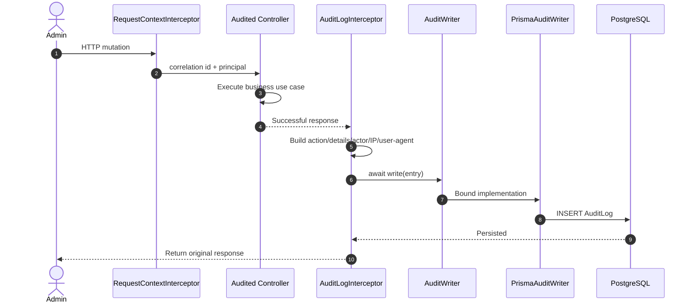

# Audit Bounded Context

Audit cung cấp dấu vết có cấu trúc cho các hành động quan trọng về bảo mật, quản trị và tuân thủ. Audit record trả lời: ai thực hiện hành động gì, lúc nào, từ đâu và với mô tả nào.

Audit không thay thế application log. Application log phục vụ vận hành/debug; audit trail phục vụ truy vết hành động nghiệp vụ và cần schema ổn định hơn.

## 1. Ranh giới và ownership

Audit sở hữu:

- `AuditWriter` application port;
- Prisma adapter ghi audit record;
- query lấy audit logs có pagination/search;
- HTTP endpoint đọc audit.

Các context khác không import Prisma audit repository. Chúng gắn `@AuditLog` metadata ở controller. Global interceptor đọc metadata và gọi port.

## 2. Cấu trúc code

```text
audit/
├── application/
│   ├── ports/audit-writer.port.ts
│   └── queries/
│       ├── get-audit-logs.query.ts
│       └── handlers/get-audit-logs.handler.ts
├── infrastructure/
│   └── prisma-audit-writer.ts
├── presentation/
│   └── controllers/audit-log.controller.ts
└── audit-log.module.ts
```

Decorator và interceptor dùng xuyên application nằm trong root `presentation/`, còn ownership của port/record/query nằm trong Audit context.

## 3. Write flow


```mermaid
sequenceDiagram
    autonumber
    actor Admin
    participant Context as RequestContextInterceptor
    participant Controller as Audited Controller
    participant Audit as AuditLogInterceptor
    participant Port as AuditWriter
    participant Adapter as PrismaAuditWriter
    participant DB as PostgreSQL

    Admin->>Context: HTTP mutation
    Context->>Controller: correlation id + principal
    Controller->>Controller: Execute business use case
    Controller-->>Audit: Successful response
    Audit->>Audit: Build action/details/actor/IP/user-agent
    Audit->>Port: await write(entry)
    Port->>Adapter: Bound implementation
    Adapter->>DB: INSERT AuditLog
    DB-->>Audit: Persisted
    Audit-->>Admin: Return original response
```

Interceptor dùng `mergeMap` và await writer. Điều này tránh promise bị bỏ quên như `tap(async ...)`. Business response chỉ được audit sau khi endpoint thành công.

Nếu detail callback lỗi, interceptor dùng fallback description. Nếu persistence audit lỗi, error được ghi application log; implementation hiện tại không biến business success thành HTTP failure. Đây là policy availability hiện hành và phải được cân nhắc lại nếu có yêu cầu compliance “audit-or-fail”.

## 4. Audit entry

Writer nhận một entry có:

- action identifier;
- human-readable details;
- actor user id/email nếu có;
- IP;
- user-agent.

Database bổ sung identity/timestamp. Action identifier nên ổn định để search/report; details có thể giàu ngữ cảnh nhưng không được chứa secret.

Correlation id hiện nằm trong request log, chưa phải field của AuditLog schema. Nếu cần trace audit-to-log trực tiếp, hãy bổ sung field/schema/port rõ ràng thay vì nhét id vào details.

## 5. Read flow

`GET /audit-logs` yêu cầu authentication và permission phù hợp. Controller dựng `GetAuditLogsQuery`; handler:

1. lấy page, limit và search;
2. dựng `Prisma.AuditLogWhereInput` có kiểu;
3. search action/details/userEmail;
4. chạy `findMany` và `count` song song;
5. trả `Result<AuditLogPage, DomainException>`;
6. controller format pagination response.

Read query hiện dùng Prisma trực tiếp trong application handler. Với context nhỏ đây là implementation hiện tại, nhưng nếu Audit tăng độ phức tạp hoặc cần thay storage, nên thêm read repository port để giữ application độc lập persistence hơn.

## 6. Cách gắn audit cho endpoint

```ts
@AuditLog(
  'USER_UPDATE',
  (request) =>
    `Cập nhật tài khoản ${String(request.params.id)}`,
)
```

Action nên theo naming convention ổn định, ví dụ `RESOURCE_OPERATION`. Callback chỉ đọc request/response cần thiết để dựng details; không thực hiện I/O hoặc business logic.

Audit chỉ chạy cho endpoint có decorator. Không mặc định audit mọi GET vì điều đó tạo dữ liệu nhiễu, chi phí lớn và có thể ghi thông tin không cần thiết.

## 7. Failure semantics

Ba loại failure cần phân biệt:

1. Business use case thất bại: không ghi success audit.
2. Detail callback thất bại: ghi fallback details.
3. Audit adapter thất bại: log operational error; response nghiệp vụ vẫn giữ nguyên theo policy hiện tại.

Nếu cần audit cả attempt thất bại, cần thiết kế event/schema riêng chứa outcome và error category. Không nên biến success decorator hiện tại thành behavior mơ hồ.

## 8. Security và privacy

Không được ghi vào audit:

- raw/hashed password;
- access/refresh token;
- JWT secret/API key;
- full authorization header;
- session value;
- dữ liệu cá nhân không cần thiết.

Audit read endpoint là dữ liệu nhạy cảm và phải được bảo vệ bằng permission. Retention, export, tamper resistance và redaction là concern production cần policy hạ tầng riêng.

## 9. Ý nghĩa từng file

`audit-writer.port.ts` là dependency inversion boundary. `prisma-audit-writer.ts` chuyển entry thành Prisma insert. `get-audit-logs.*` là read use case. `audit-log.controller.ts` là HTTP adapter. `audit-log.module.ts` bind writer token và đăng ký providers.

Root `audit-log.decorator.ts` định nghĩa metadata; `audit-log.interceptor.ts` thực thi cross-cutting workflow.

## 10. Cách mở rộng

Khi thêm audit storage hoặc sink thứ hai:

1. giữ `AuditWriter` contract ổn định hoặc mở rộng có chủ đích;
2. tạo adapter mới;
3. bind trong module/composite writer;
4. xác định retry/failure policy;
5. test persistence thật ở E2E.

Khi thêm audited action, chọn action name, details tối thiểu và privacy classification trước khi gắn decorator.

## 11. Anti-pattern

- Inject Prisma Audit trực tiếp vào mọi controller.
- Gọi writer fire-and-forget.
- Ghi token/password vào details.
- Dùng details text làm action identifier.
- Audit mọi request không có mục tiêu.
- Tuyên bố audit “guaranteed” khi failure policy vẫn fail-open.

## 12. Checklist review Audit

- Action có ổn định và có ý nghĩa truy vấn không?
- Details có đủ nhưng không lộ secret/PII thừa không?
- Endpoint có permission phù hợp không?
- Success/failure semantics có rõ không?
- Writer có được await không?
- E2E có xác nhận record thật sự được lưu không?
