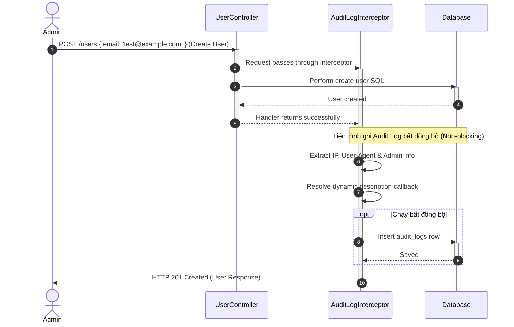

# Tài liệu Kỹ thuật Chi tiết: Module Nhật ký hoạt động (Audit Logs Context)

Module này quản lý và lưu trữ toàn bộ các lịch sử thao tác, thay đổi trạng thái bảo mật hoặc cấu hình hệ thống thực hiện bởi quản trị viên.

---

## 1. Nghiệp vụ & Quy tắc cốt lõi (Domain Rules)

* **Nhật ký bất biến (Immutable Logs)**: Nhật ký hoạt động sau khi đã ghi xuống cơ sở dữ liệu sẽ không thể chỉnh sửa (Update) hoặc xóa (Delete) bởi bất kỳ tác nhân nào để đảm bảo tính minh bạch pháp lý (Compliance).
* **Bắt giữ siêu dữ liệu (Client Metadata)**: Mỗi bản ghi audit log bắt buộc lưu trữ:
  * **Actor**: ID và Email của người dùng thực hiện thao tác.
  * **Action**: Định danh hành động (ví dụ: `USER_TOGGLE_STATUS`).
  * **Details**: Mô tả chi tiết hành động hoặc cấu hình thay đổi.
  * **IP Address**: Địa chỉ IP client gửi request.
  * **User Agent**: Chuỗi thông tin thiết bị/trình duyệt của client.
* **Ghi log không cản trở luồng (Non-blocking Writes)**: Tiến trình lưu log xuống database được bao bọc trong khối `try-catch` riêng biệt và chạy bất đồng bộ để tránh làm chậm hoặc crash luồng nghiệp vụ chính của người dùng nếu DB bị quá tải.

---

## 2. Đặc tả API Endpoints

| Giao thức | Route | Bảo vệ bằng | DTO đầu vào | Trả về |
| :--- | :--- | :--- | :--- | :--- |
| **GET** | `/audit-logs` | `JwtAuthGuard` & `PermissionsGuard` | `PaginationQueryDto` (page, limit, search) | `PaginatedResult<AuditLog>` |

---

## 3. Chi tiết cấu trúc thư mục và Vai trò từng File

```
audit/
├── presentation/                                # LỚP GIAO TIẾP (PRESENTATION LAYER)
│   └── controllers/
│       └── audit-log.controller.ts              # REST Controller tiếp nhận các yêu cầu truy vấn log
│
└── audit-log.module.ts                          # Khai báo NestJS Module đăng ký Controller và Prisma
```

---

## 4. Sơ đồ tuần tự Ghi log tự động qua Interceptor (Mermaid)



---

## 5. Chi tiết hoạt động đi qua các Tầng (Layer Transition)

Dưới đây là hành trình xử lý ghi nhận và đọc dữ liệu Nhật ký:

### Luồng Ghi nhận Log (Khai báo tự động)

#### 1. Khai báo decorator `@AuditLog` (`shared/infrastructure/decorators/audit-log.decorator.ts`)
* Nhà phát triển gắn decorator lên đầu các hàm xử lý trong Controller nghiệp vụ (như `UserController`, `RolesController`).
* Ghi nhận Metadata chứa loại hành động (`action`) và hàm xây dựng nội dung chi tiết động (`descriptionCallback`).

#### 2. Xử lý Interceptor (`shared/infrastructure/interceptors/audit-log.interceptor.ts`)
* Khi client gửi yêu cầu đến route được trang trí:
  1. Request đi qua `AuditLogInterceptor`.
  2. Interceptor lưu giữ context và chuyển tiếp cho route handler thực thi nghiệp vụ chính (ghi xuống DB).
  3. Nếu luồng chính thành công (không ném Exception), Interceptor dùng toán tử `tap` của RxJS để bắt đầu ghi nhận log.
  4. Lấy thông tin user đăng nhập (`req.user`), địa chỉ IP client, và User-Agent thiết bị.
  5. Chạy hàm callback để tạo mô tả chi tiết thao tác.
  6. Lưu bản ghi mới vào bảng `AuditLog` của Postgres bằng Prisma hoàn toàn không đồng bộ. Nếu quá trình lưu log lỗi, interceptor tự bắt lại (`catch`) để không làm ảnh hưởng đến response trả về cho Admin.

---

### Luồng Truy vấn đọc Log (REST API)

#### 3. Đầu vào Controller (`presentation/controllers/audit-log.controller.ts`)
* Cung cấp endpoint `GET /audit-logs`.
* Chỉ cho phép tài khoản có quyền `user:read` được phép xem danh sách log.
* Tiếp nhận các tham số phân trang (`page`, `limit`, `search`).
* Truy vấn trực tiếp Prisma DB để lấy danh sách log sắp xếp giảm dần theo thời gian (`createdAt: 'desc'`) để hiển thị các hoạt động mới nhất lên đầu danh sách.
