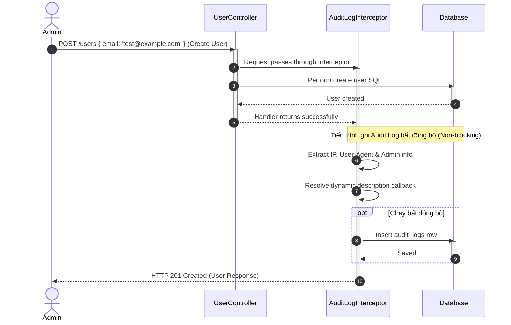

# Tài liệu Kỹ thuật Chi tiết: Module Nhật ký hoạt động (Audit Logs Context)

Module này quản lý và lưu trữ toàn bộ các lịch sử thao tác, thay đổi trạng thái bảo mật hoặc cấu hình hệ thống thực hiện bởi quản trị viên.

---

## 1. Nghiệp vụ & Quy tắc cốt lõi (Domain Rules)

* **Nhật ký bất biến (Immutable Logs)**: Nhật ký hoạt động sau khi đã ghi xuống cơ sở dữ liệu sẽ không thể chỉnh sửa (Update) hoặc xóa (Delete) bởi bất kỳ tác nhân nào để đảm bảo tính minh bạch pháp lý (Compliance).
* **Bắt giữ siêu dữ liệu (Client Metadata)**: Mỗi bản ghi audit log bắt buộc lưu trữ:
  * **Actor**: ID và Email của người dùng thực hiện thao tác.
  * **Action**: Định danh hành động (ví dụ: `USER_TOGGLE_STATUS`).
  * **Details**: Mô tả chi tiết hành động hoặc cấu hình thay đổi.
  * **IP Address**: Địa chỉ IP client gửi request.
  * **User Agent**: Chuỗi thông tin thiết bị/trình duyệt của client.
* **Ghi log không cản trở luồng (Non-blocking Writes)**: Tiến trình lưu log xuống database được bao bọc trong khối `try-catch` riêng biệt và chạy bất đồng bộ để tránh làm chậm hoặc crash luồng nghiệp vụ chính của người dùng nếu DB bị quá tải.

---

## 2. Đặc tả API Endpoints

| Giao thức | Route | Bảo vệ bằng | DTO đầu vào | Trả về |
| :--- | :--- | :--- | :--- | :--- |
| **GET** | `/audit-logs` | `JwtAuthGuard` & `PermissionsGuard` | `PaginationQueryDto` (page, limit, search) | `PaginatedResult<AuditLog>` |

---

## 3. Sơ đồ tuần tự Ghi log tự động qua Interceptor (Mermaid)

---

## 4. Chi tiết cấu trúc hoạt động

* **`audit-log.decorator.ts`**:
  * Định nghĩa decorator `@AuditLog(action, descriptionCallback)` để lập trình viên khai báo trực tiếp trên các endpoint Controller.
* **`audit-log.interceptor.ts`**:
  * Đăng ký hoạt động toàn cục (`APP_INTERCEPTOR` trong `AppModule`).
  * Sử dụng RxJS `tap` operator để chỉ bắt các request thành công (không lưu log nếu API lỗi 400 hoặc 500).
* **`audit-log.controller.ts`**:
  * Cung cấp API truy vấn phân trang danh sách audit log cho màn hình Timeline ở Admin Panel.
