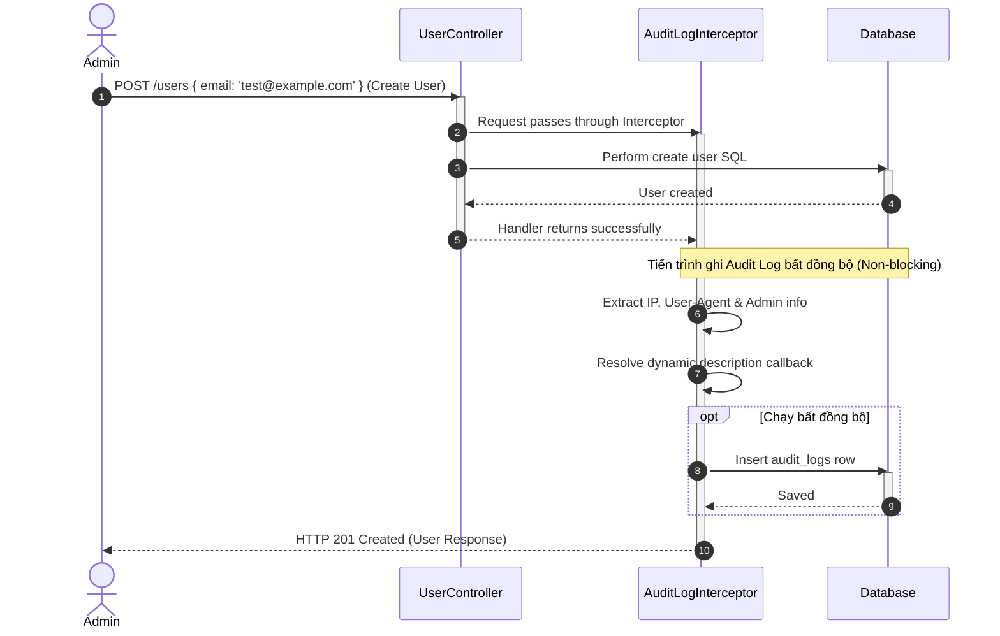

# Tài liệu Kỹ thuật Chi tiết: Module Nhật ký hoạt động (Audit Logs Context)

Module này quản lý và lưu trữ toàn bộ các lịch sử thao tác, thay đổi trạng thái bảo mật hoặc cấu hình hệ thống thực hiện bởi quản trị viên.

---

## 1. Nghiệp vụ & Quy tắc cốt lõi (Domain Rules)

* **Nhật ký bất biến (Immutable Logs)**: Nhật ký hoạt động sau khi đã ghi xuống cơ sở dữ liệu sẽ không thể chỉnh sửa (Update) hoặc xóa (Delete) bởi bất kỳ tác nhân nào để đảm bảo tính minh bạch pháp lý (Compliance).
* **Bắt giữ siêu dữ liệu (Client Metadata)**: Mỗi bản ghi audit log bắt buộc lưu trữ:
  * **Actor**: ID và Email của người dùng thực hiện thao tác.
  * **Action**: Định danh hành động (ví dụ: `USER_TOGGLE_STATUS`).
  * **Details**: Mô tả chi tiết hành động hoặc cấu hình thay đổi.
  * **IP Address**: Địa chỉ IP client gửi request.
  * **User Agent**: Chuỗi thông tin thiết bị/trình duyệt của client.
* **Ghi log không cản trở luồng (Non-blocking Writes)**: Tiến trình lưu log xuống database được bao bọc trong khối `try-catch` riêng biệt và chạy bất đồng bộ để tránh làm chậm hoặc crash luồng nghiệp vụ chính của người dùng nếu DB bị quá tải.

---

## 2. Danh sách Use Cases (CQRS)

### Nhánh Đọc - Truy vấn (Queries)
1. **`GetAuditLogsQuery`**: Truy vấn danh sách nhật ký hoạt động hỗ trợ phân trang Server-side, lọc bản ghi, và tìm kiếm mờ (Search Query).

---

## 3. Đặc tả API Endpoints

| Giao thức | Route | Bảo vệ bằng | Quyền yêu cầu (Constant) | DTO đầu vào | Trả về |
| :--- | :--- | :--- | :--- | :--- | :--- |
| **GET** | `/audit-logs` | `JwtAuthGuard` & `PermissionsGuard` | `PERMISSIONS.AUDIT.READ` (`audit:read`) | `PaginationQueryDto` (page, limit, search) | `PaginatedResult<AuditLog>` |

---

## 4. Chi tiết cấu trúc thư mục và Vai trò từng File

```
audit/
├── application/                                 # LỚP ỨNG DỤNG/ĐIỀU HƯỚNG (APPLICATION LAYER)
│   └── queries/                                 # Các hành động lấy dữ liệu (Đọc)
│       ├── index.ts                             # Barrel export toàn bộ Queries
│       ├── get-audit-logs.query.ts              # Data object chứa bộ lọc phân trang và tìm kiếm log
│       └── handlers/
│           └── get-audit-logs.handler.ts        # Thực hiện truy vấn DB thông qua PrismaService
│
├── presentation/                                # LỚP GIAO TIẾP (PRESENTATION LAYER)
│   └── controllers/
│       └── audit-log.controller.ts              # REST Controller tiếp nhận yêu cầu và dispatch Query với barrel imports
│
└── audit-log.module.ts                          # Đăng ký CqrsModule, Controller và Query Handler
```

---

## 5. Sơ đồ tuần tự Ghi log tự động qua Interceptor (Mermaid)



---

## 6. Sơ đồ tuần tự Truy vấn đọc Nhật ký qua CQRS (Mermaid)

```mermaid
sequenceDiagram
    autonumber
    actor Admin
    participant AuditLogController
    participant QueryBus
    participant GetAuditLogsQueryHandler
    participant Database

    Admin->>AuditLogController: GET /audit-logs?page=1&limit=10
    activate AuditLogController
    AuditLogController->>QueryBus: execute(new GetAuditLogsQuery(query))
    activate QueryBus
    QueryBus->>GetAuditLogsQueryHandler: execute(query)
    activate GetAuditLogsQueryHandler
    GetAuditLogsQueryHandler->>Database: Query audit_logs (findMany & count)
    activate Database
    Database-->>GetAuditLogsQueryHandler: Raw logs & total
    deactivate Database
    GetAuditLogsQueryHandler-->>QueryBus: Result.ok({ logs, total })
    deactivate QueryBus
    QueryBus-->>AuditLogController: Result.ok
    deactivate QueryBus
    AuditLogController->>AuditLogController: PaginatedResponsePresenter.toResponse
    AuditLogController-->>Admin: HTTP 200 OK (JSON Paginated List)
    deactivate AuditLogController
```

---

## 7. Chi tiết hoạt động đi qua các Tầng (Layer Transition)

Dưới đây là hành trình xử lý ghi nhận và đọc dữ liệu Nhật ký:

### Luồng Ghi nhận Log (Khai báo tự động)

#### 1. Khai báo decorator `@AuditLog` (`shared/infrastructure/decorators/audit-log.decorator.ts`)
* Nhà phát triển gắn decorator lên đầu các hàm xử lý trong Controller nghiệp vụ (như `UserController`, `RolesController`).
* Ghi nhận Metadata chứa loại hành động (`action`) và hàm xây dựng nội dung chi tiết động (`descriptionCallback`).

#### 2. Xử lý Interceptor (`shared/infrastructure/interceptors/audit-log.interceptor.ts`)
* Khi client gửi yêu cầu đến route được trang trí:
  1. Request đi qua `AuditLogInterceptor`.
  2. Interceptor lưu giữ context và chuyển tiếp cho route handler thực thi nghiệp vụ chính (ghi xuống DB).
  3. Nếu luồng chính thành công (không ném Exception), Interceptor dùng toán tử `tap` của RxJS để bắt đầu ghi nhận log.
  4. Lấy thông tin user đăng nhập (`req.user`), địa chỉ IP client, và User-Agent thiết bị.
  5. Chạy hàm callback để tạo mô tả chi tiết thao tác.
  6. Lưu bản ghi mới vào bảng `AuditLog` của Postgres bằng Prisma hoàn toàn không đồng bộ. Nếu quá trình lưu log lỗi, interceptor tự bắt lại (`catch`) để không làm ảnh hưởng đến response trả về cho Admin.

---

### Luồng Truy vấn đọc Log (REST API)

#### 3. Đầu vào Controller (`presentation/controllers/audit-log.controller.ts`)
* Cung cấp endpoint `GET /audit-logs`.
* Được bảo vệ bởi `PermissionsGuard` Stateless và yêu cầu quyền `PERMISSIONS.AUDIT.READ`.
* Nhận request và đóng gói thành `GetAuditLogsQuery` rồi chuyển tiếp qua `QueryBus`.

#### 4. Xử lý Query Handler (`application/queries/handlers/get-audit-logs.handler.ts`)
* Được gắn decorator `@QueryHandler(GetAuditLogsQuery)`.
* Trực tiếp thực thi logic phân trang (`skip`, `take`), tìm kiếm mờ (`where.OR` trên các trường `action`, `details`, `userEmail`) thông qua `PrismaService`.
* Trả về kết quả bọc trong `Result.ok({ logs, total })`.
* Định dạng JSON output thông qua `PaginatedResponsePresenter` trước khi phản hồi về cho client.
