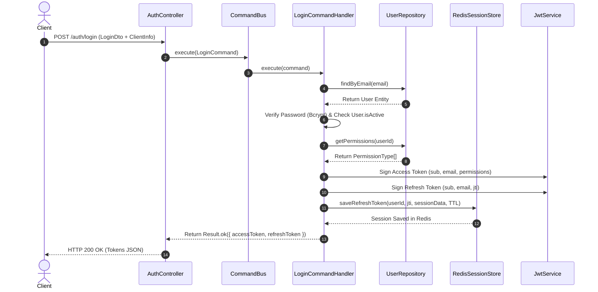
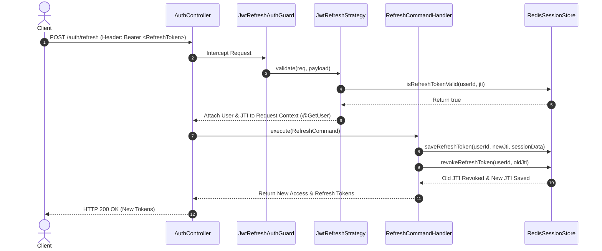

# 🛡️ Auth Bounded Context Documentation

Bounded Context **Auth** chịu trách nhiệm toàn bộ về bài toán **Xác thực (Authentication)**, Quản lý phiên đăng nhập (**Session Management**) và Cấp phát Token trong hệ thống.

---

## 🏛️ 1. Cấu Trúc Thư Mục Chuẩn Clean Architecture

```text
contexts/iam/auth/
├── domain/                                ─── [Domain Layer]
│   └── ports/
│       └── session-store.port.ts          # Interface ISessionStore (Port giao tiếp Session)
│
├── application/                           ─── [Application Layer / CQRS Use Cases]
│   ├── commands/                          # CQRS Commands & Handlers
│   │   ├── register.command.ts & handler
│   │   ├── login.command.ts & handler     # Login Command (Mutation ghi Session)
│   │   ├── refresh.command.ts & handler   # Refresh Command (Token Rotation)
│   │   ├── logout.command.ts & handler
│   │   ├── logout-all.command.ts & handler
│   │   └── revoke-session.command.ts & handler
│   └── queries/                           # CQRS Queries & Handlers
│       └── get-active-sessions.query.ts & handler
│
├── infrastructure/                        ─── [Infrastructure Layer Adapters]
│   ├── stores/
│   │   └── redis-session.store.ts         # Adapter triển khai ISessionStore bằng Redis
│   └── strategies/
│       ├── jwt.strategy.ts                # Stateless Access Token Strategy (0 DB Query)
│       └── jwt-refresh.strategy.ts        # Stateful Refresh Token Strategy
│
└── presentation/                          ─── [Presentation Layer]
    ├── controllers/
    │   └── auth.controller.ts             # Clean HTTP Controller (No @Req)
    └── dtos/
        ├── login.dto.ts
        └── register.dto.ts
```

---

## 🔄 2. Luồng Xử Lý Đăng Nhập (Login Flow Sequence)



---

## 🔄 3. Luồng Làm Mới Token (Refresh Token Rotation Sequence)



---

## 🔑 4. Các Điểm Nổi Bật Về Thiết Kế

1. **Clean Controller (`auth.controller.ts`)**:
   - Sử dụng `@ClientInfo()` để lấy IP & UserAgent tự động.
   - Sử dụng `@GetUser('id')` và `@GetUser('jti')` bóc tách dữ liệu từ Token, **loại bỏ hoàn toàn `@Req() req: any`**.
2. **Stateless Access Token Validation**:
   - `JwtStrategy` kiểm tra chữ ký Token & nhả trực tiếp `JwtPayload` (**0 DB Query**), tối ưu hóa hiệu năng cực đại.
3. **ISessionStore Port**:
   - Application Layer giao tiếp với Session qua Interface `ISessionStore`, không bị phụ thuộc trực tiếp vào Redis string key formats.
