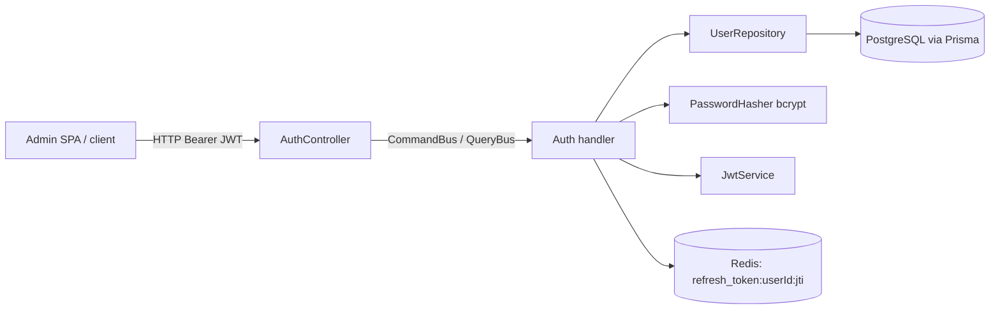

# IAM / Auth bounded context

> Tài liệu này mô tả **mã đang chạy** trong `apps/server/src/contexts/iam/auth`, không phải hợp đồng dự kiến. Auth là phần điều phối xác thực và phiên; dữ liệu người dùng, băm mật khẩu và truy vấn quyền thuộc Users context.

## 1. Trách nhiệm và ranh giới

Auth chịu trách nhiệm:

- Đăng ký qua `RegisterCommand`; tạo `UserEntity` thông qua Users context.
- Đăng nhập, phát access/refresh JWT và lưu trạng thái phiên refresh token vào Redis.
- Xác thực access JWT/refresh JWT bằng Passport; kiểm tra người dùng còn tồn tại, active và chưa bị xóa.
- Đổi refresh token (rotation), liệt kê phiên, thu hồi một phiên hoặc tất cả phiên của chính người dùng.

Auth **không** sở hữu bảng hay aggregate riêng. Nó dùng `UserRepository`, `PasswordHasher` do `UsersModule` export, `CACHE_PORT` (Redis) và `JwtService`. `AuthModule` import `CqrsModule`, `UsersModule`, `PassportModule` và `JwtModule`; controller là `AuthController`, handlers/strategies là providers.



## 2. Cấu trúc mã và ý nghĩa

| Vị trí | Vai trò |
| --- | --- |
| `presentation/controllers/auth.controller.ts` | Khai báo toàn bộ HTTP API, biến DTO thành command/query và gọi `Result.unwrap()`.
| `presentation/dtos/*.dto.ts` | Validation cho đăng ký/đăng nhập: email hợp lệ, username ≥ 3 ký tự (register), password ≥ 6 ký tự.
| `application/commands/*` | Lệnh làm thay đổi trạng thái: register, logout, logout-all, revoke-session.
| `application/queries/*` | Query cho login, refresh và danh sách active sessions. Các query này có side-effect thực tế (ký token/ghi Redis), nên CQRS ở đây là phân tách cấu trúc chứ không hoàn toàn read-only.
| `application/queries/handlers/login.handler.ts` | Kiểm tra thông tin đăng nhập và tạo phiên Redis.
| `application/queries/handlers/refresh.handler.ts` | Cấp cặp token mới, sao chép metadata session và xóa key cũ.
| `application/strategies/*.strategy.ts` | Passport strategy; strategy refresh kiểm tra whitelist Redis trước controller.
| `application/guards/*.guard.ts` | Wrapper `AuthGuard('jwt')`/`AuthGuard('jwt-refresh')`; guard quyền được dùng thực tế là bản shared tại `@shared/infrastructure/guards`.

## 3. Hợp đồng HTTP hiện tại

| Method / URL | Guard | Quyền | Nội dung / kết quả |
| --- | --- | --- | --- |
| `POST /auth/register` | — | — | `{email,username,password}` → user đã presenter (không có password), `201` |
| `POST /auth/login` | — | — | `{email,password}` → `{accessToken,refreshToken}` |
| `POST /auth/refresh` | refresh JWT | — | Refresh token đặt trong `Authorization: Bearer …` → token pair mới |
| `POST /auth/logout` | refresh JWT | — | Thu hồi JTI của refresh token hiện tại → `{success:true}` |
| `POST /auth/logout/global` | access JWT | — | Xóa mọi `refresh_token:<userId>:*` → `{success:true}` |
| `GET /auth/sessions?page&limit` | access JWT | — | Danh sách phiên Redis của người gọi, response phân trang |
| `DELETE /auth/sessions/:jti` | access JWT | — | Xóa key phiên JTI của người gọi → `{success:true}` |

`ValidationPipe` toàn cục trong `main.ts` bật `whitelist`, `forbidNonWhitelisted` và `transform`; field dư ở hai DTO sẽ bị từ chối. Các endpoint không có DTO (sessions, refresh…) dựa vào guard/`PaginationQueryDto`.

## 4. Luồng đăng ký

1. `POST /auth/register` được validate bởi `RegisterDto` rồi controller tạo `RegisterCommand`.
2. `RegisterHandler` tìm email bằng `UserRepository.findByEmail`. Nếu có, trả `Result.fail(UserAlreadyExistsException)`.
3. Handler gọi `PasswordHasher` (implementation `BcryptPasswordHasher`) để băm password raw, gọi `UserEntity.register`, rồi `save`.
4. `UserEntity.register` dựng value objects (`UserId`, `Email`, `Username`, `Password`), mặc định `isActive=true`, `isDeleted=false`, role `USER`, và thêm `UserRegisteredEvent`.
5. `PrismaUserRepository.save` upsert user, đồng bộ `user_roles` trong transaction, rồi `DomainEventDispatcher` publish event **sau** transaction.
6. Các subscriber độc lập phản ứng: Queue bridge thêm job welcome-email vào BullMQ; Notifications context tạo welcome notification. Controller presenter hóa user và trả `201`.

## 5. Luồng login, refresh và session

### Login

```mermaid
sequenceDiagram
  actor U as Client
  participant C as AuthController
  participant H as LoginQueryHandler
  participant DB as UserRepository/Prisma
  participant R as Redis
  U->>C: POST /auth/login
  C->>H: LoginQuery(email,password,ip,userAgent)
  H->>DB: findByEmail; kiểm tra active; getPermissions
  H->>H: bcrypt.compare; UUID jti; ký JWT
  H->>R: SET refresh_token:userId:jti metadata EX 604800
  H-->>C: accessToken + refreshToken
  C-->>U: 200
```

Access token payload là `{ sub, email, permissions }`, ký bằng `JWT_ACCESS_SECRET`, TTL cố định `15m`. Refresh payload là `{ sub, email, jti }`, ký bằng `JWT_REFRESH_SECRET`, TTL `7d`. Redis lưu cùng TTL 604800 giây một object gồm `jti`, `ip`, `userAgent`, `createdAt`; đây là nguồn dữ liệu của màn hình Sessions. Secrets không có default khi ký, vì vậy phải cấu hình cả hai biến môi trường.

### Refresh rotation

`JwtRefreshStrategy` lấy Bearer token, kiểm chữ ký/expiry bằng `JWT_REFRESH_SECRET`, load user và từ chối user inactive/soft-deleted. Nó **bắt buộc** key `refresh_token:<sub>:<jti>` còn tồn tại trong Redis, rồi gắn `{ user, refreshToken, jti }` vào `req.user`.

`RefreshQueryHandler` lấy quyền mới từ DB, sinh JTI mới, ký token mới, đọc metadata key cũ nếu có, `SET` key mới 7 ngày rồi `DEL` key cũ. Như vậy rotation được bảo vệ ở strategy trước khi handler chạy; hai refresh request đồng thời có thể cùng vượt qua kiểm tra tồn tại trước khi một request xóa key cũ — đây là một race condition cần cân nhắc nếu yêu cầu one-time-use tuyệt đối.

### Thu hồi

- Logout và `DELETE /sessions/:jti`: xóa chính xác một key Redis.
- Logout global: `invalidatePattern('refresh_token:<userId>:*')`; implementation Redis dùng `KEYS` + `DEL`.
- Deactivate ở Users phát `UserDeactivatedEvent`; cache/event bridge xóa toàn bộ refresh key, realtime bridge gửi `force_logout`, queue gửi email và Notifications context tạo notification.

## 6. Authentication và authorization

`JwtStrategy` xác minh access token, sau đó vẫn gọi `findById`; user không tồn tại, inactive hoặc soft-deleted nhận `401`. Strategy gắn `payload.permissions` vào entity trả về. API shared `PermissionsGuard` kiểm tra permissions trực tiếp từ payload này với logic **AND** (`every`). Vì quyền được snapshot trong access JWT, thay đổi role có hiệu lực với request access-token mới sau login/refresh (tối đa TTL access token), trừ khi user bị deactivate thì strategy chặn ngay.

Lưu ý: trong thư mục Auth cũng có `application/guards/permissions.guard.ts` truy vấn DB, nhưng controllers hiện import `@shared/infrastructure/guards`; bản shared mới là đường chạy thực tế.

## 7. Client admin liên quan

`ApiClient` của `apps/admin` giữ access token trong memory và refresh token trong `localStorage`. Khi API trả `401`, nó serialise refresh qua `isRefreshing`/subscriber queue, gọi `POST /auth/refresh` bằng refresh token Bearer, lưu token pair mới rồi phát lại request ban đầu. Login store chịu trách nhiệm đặt token; `useWebSocket` dùng access token khi mở Socket.IO và xử lý event `force_logout` bằng `logout()`.

## 8. Lỗi, audit và vận hành

- Handler trả `Result<T, DomainException>`; `unwrap()` ném `DomainException`, rồi global `DomainExceptionFilter` chuẩn hóa `{statusCode,code,translationKey,message,args,error,timestamp}`.
- `logout/global` và `DELETE /sessions/:jti` có `@AuditLog`; interceptor toàn cục chỉ ghi audit **sau khi** handler HTTP thành công. Login/register/logout không được decorate nên không có audit row từ cơ chế này.
- Redis mặc định host `localhost`, port `6380` ở cả Redis/BullMQ module, không phải `6379`; kiểm tra `.env`/Docker trước khi chạy.
- Dữ liệu session chỉ có Redis, không persistence database: restart/flush Redis thu hồi mọi refresh session.

## 9. Khi mở rộng

Thêm endpoint Auth theo chuỗi: DTO (nếu có input) → command/query object → handler đăng ký trong `AuthModule` → controller/guard → test. Không import Prisma trực tiếp vào Auth handler nếu use case đã có port ở Users. Với action cần audit, gắn `@AuditLog(action, callback)` vào method controller; callback không được đưa password/token vào `details`.
