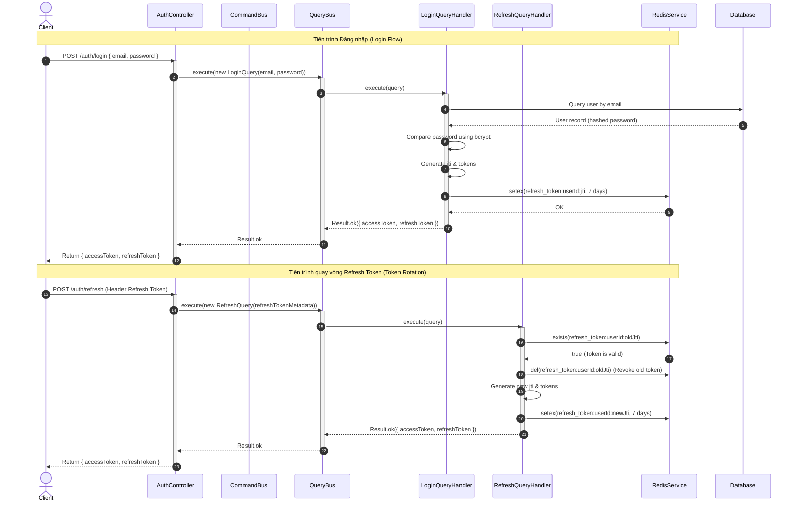

# Tài liệu Kỹ thuật Chi tiết: Module Xác thực (Auth Bounded Context)

Module này chịu trách nhiệm quản lý toàn bộ các khía cạnh liên quan đến định danh, xác thực và quản lý phiên làm việc của người dùng trong hệ thống (Identity and Access Management - IAM).

---

## 1. Nghiệp vụ & Quy tắc cốt lõi (Domain Rules)

* **Mật khẩu bảo mật**: Mật khẩu được mã hóa một chiều sử dụng Bcrypt trước khi ghi xuống cơ sở dữ liệu.
* **Kiểm soát Token bằng Redis (Token Whitelisting)**:
  * **Whitelist**: Khi đăng nhập, Refresh Token hợp lệ được lưu trong Redis dạng `refresh_token:${userId}:${jti}` với thời hạn 7 ngày.
  * **Token Rotation**: Mỗi lần gọi API refresh token, Refresh Token cũ sẽ bị hủy bỏ (thu hồi JTI cũ) và cấp mới hoàn toàn (sinh JTI mới). Điều này bảo vệ người dùng trước các cuộc tấn công phát lại mã (Replay Attacks).
* **Cơ chế đăng xuất**:
  * *Đăng xuất đơn session*: Chỉ xóa JTI của phiên hiện tại khỏi Redis.
  * *Đăng xuất toàn cầu*: Xóa toàn bộ JTI thuộc định danh của người dùng khỏi Redis (`refresh_token:${userId}:*`).

---

## 2. Danh sách Use Cases (CQRS)

### Nhánh Ghi - Lệnh (Commands)
1. **`RegisterCommand`**: Tạo tài khoản người dùng mới. Băm mật khẩu thông qua cổng `PasswordHasher`, kiểm tra trùng lặp email thông qua `UserRepository`.
2. **`LogoutCommand`**: Xóa JTI phiên làm việc hiện tại khỏi Redis Whitelist.
3. **`LogoutAllCommand`**: Quét và hủy toàn bộ phiên làm việc của người dùng hiện tại khỏi Redis.

### Nhánh Đọc - Truy vấn (Queries)
1. **`LoginQuery`**: So khớp mật khẩu đã băm. Sinh cặp Access & Refresh Token kèm JWT ID (`jti`) và lưu thông tin vào Redis.
2. **`RefreshQuery`**: Kiểm tra tính hợp lệ của JTI trên Redis, tiến hành thu hồi JTI cũ và sinh cặp token mới với JTI mới.

---

## 3. Đặc tả API Endpoints

| Giao thức | Route | Bảo vệ bằng | DTO đầu vào | Trả về |
| :--- | :--- | :--- | :--- | :--- |
| **POST** | `/auth/register` | Không | `RegisterDto` | `UserResponse` |
| **POST** | `/auth/login` | Không | `LoginDto` | `{ accessToken, refreshToken }` |
| **POST** | `/auth/refresh` | `JwtRefreshAuthGuard` | Không (Lấy từ Header Bearer) | `{ accessToken, refreshToken }` |
| **POST** | `/auth/logout` | `JwtRefreshAuthGuard` | Không | `{ success: true }` |
| **POST** | `/auth/logout/global`| `JwtAuthGuard` | Không | `{ success: true }` |

---

## 4. Sơ đồ tuần tự Xác thực & Token Rotation (Mermaid)



---

## 5. Chi tiết hoạt động đi qua các Tầng (Layer Transition)

```
[Presentation] -> [Application] -> [Infrastructure/Services]
```

### Tầng 1: Presentation (Đón nhận & Xác thực)
* **`presentation/controllers/auth.controller.ts`**:
  * Cung cấp các REST endpoint xác thực.
  * Tích hợp `JwtAuthGuard` và `JwtRefreshAuthGuard` để bảo vệ tài nguyên và phân tích token.
  * Dispatch các command/query tương ứng.

### Tầng 2: Application (Phát hành Token & Hủy bỏ)
* **`application/queries/handlers/login.handler.ts`**:
  * Xác thực email/password.
  * Sử dụng NestJS `JwtService` để ký cấp phát cặp token.
  * Ghi nhận Token JTI vào Redis để whitelisting.
* **`application/queries/handlers/refresh.handler.ts`**:
  * Kiểm tra xem JTI cũ còn trong Redis whitelist không. Nếu không, coi như token đã bị chiếm đoạt/thu hồi và trả về lỗi 401.
  * Xóa JTI cũ khỏi Redis để ngăn chặn replay attack và cấp mới cặp token.

### Tầng 3: Infrastructure (Caching & Hashing)
* **`shared/infrastructure/cache/redis.service.ts`**:
  * Quản lý kết nối Client Redis, lưu khóa bất đối xứng và kiểm tra thời gian hết hạn (TTL).
