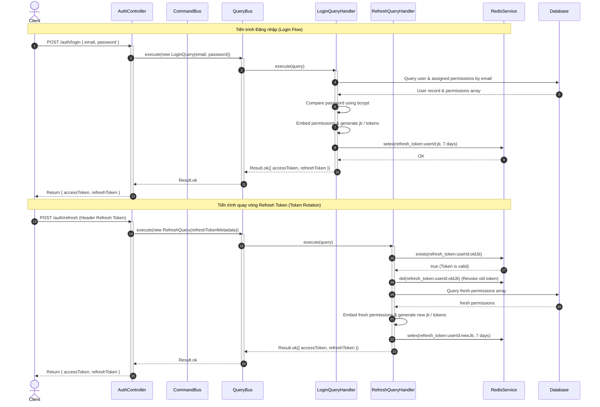

# Tài liệu Kỹ thuật Chi tiết: Module Xác thực (Auth Bounded Context)

Module này chịu trách nhiệm quản lý toàn bộ các khía cạnh liên quan đến định danh, xác thực và quản lý phiên làm việc của người dùng trong hệ thống (Identity and Access Management - IAM).

---

## 1. Nghiệp vụ & Quy tắc cốt lõi (Domain Rules)

* **Mật khẩu bảo mật**: Mật khẩu được mã hóa một chiều sử dụng Bcrypt trước khi ghi xuống cơ sở dữ liệu.
* **Tích hợp Stateless JWT Permissions**: Khi đăng nhập thành công (`LoginQueryHandler`) hoặc làm mới phiên (`RefreshQueryHandler`), danh sách mảng quyền hạn `permissions` được nhúng trực tiếp vào payload của JWT Access Token. Nhờ đó, `PermissionsGuard` xử lý phân quyền hoàn toàn Stateless (In-Memory) với hiệu năng cực cao.
* **Kiểm soát Token bằng Redis (Token Whitelisting)**:
  * **Whitelist**: Khi đăng nhập, Refresh Token hợp lệ được lưu trong Redis dạng `refresh_token:${userId}:${jti}` với thời hạn 7 ngày.
  * **Token Rotation**: Mỗi lần gọi API refresh token, Refresh Token cũ sẽ bị hủy bỏ (thu hồi JTI cũ) và cấp mới hoàn toàn (sinh JTI mới). Điều này bảo vệ người dùng trước các cuộc tấn công phát lại mã (Replay Attacks).
* **Cơ chế đăng xuất**:
  * *Đăng xuất đơn session*: Chỉ xóa JTI của phiên hiện tại khỏi Redis.
  * *Đăng xuất toàn cầu*: Xóa toàn bộ JTI thuộc định danh của người dùng khỏi Redis (`refresh_token:${userId}:*`).

---

## 2. Danh sách Use Cases (CQRS)

### Nhánh Ghi - Lệnh (Commands)
1. **`RegisterCommand`**: Tạo tài khoản người dùng mới. Băm mật khẩu thông qua cổng `PasswordHasher`, kiểm tra trùng lặp email thông qua `UserRepository`.
2. **`LogoutCommand`**: Xóa JTI phiên làm việc hiện tại khỏi Redis Whitelist.
3. **`LogoutAllCommand`**: Quét và hủy toàn bộ phiên làm việc của người dùng hiện tại khỏi Redis.

### Nhánh Đọc - Truy vấn (Queries)
1. **`LoginQuery`**: So khớp mật khẩu đã băm. Nhúng mảng `permissions` vào JWT payload, sinh cặp Access & Refresh Token kèm JWT ID (`jti`) và lưu thông tin vào Redis.
2. **`RefreshQuery`**: Kiểm tra tính hợp lệ của JTI trên Redis, tiến hành thu hồi JTI cũ và sinh cặp token mới đính kèm `permissions` tươi mới.

---

## 3. Đặc tả API Endpoints

| Giao thức | Route | Bảo vệ bằng | DTO đầu vào | Trả về |
| :--- | :--- | :--- | :--- | :--- |
| **POST** | `/auth/register` | Không | `RegisterDto` | `UserResponse` |
| **POST** | `/auth/login` | Không | `LoginDto` | `{ accessToken, refreshToken }` |
| **POST** | `/auth/refresh` | `JwtRefreshAuthGuard` | Không (Lấy từ Header Bearer) | `{ accessToken, refreshToken }` |
| **POST** | `/auth/logout` | `JwtRefreshAuthGuard` | Không | `{ success: true }` |
| **POST** | `/auth/logout/global`| `JwtAuthGuard` | Không | `{ success: true }` |

---

## 4. Chi tiết cấu trúc thư mục và Vai trò từng File

```
auth/
├── application/                                 # LỚP ỨNG DỤNG/ĐIỀU HƯỚNG (APPLICATION LAYER)
│   ├── commands/                                # Các hành động thay đổi trạng thái (Ghi)
│   │   ├── register.command.ts                  # Data object chứa thông tin đăng ký
│   │   ├── logout.command.ts                    # Data object chứa JTI phiên muốn xóa
│   │   ├── logout-all.command.ts                # Data object chứa ID người dùng cần xóa hết token
│   │   └── handlers/
│   │       ├── register.handler.ts              # Xử lý đăng ký & lưu trữ User nghiệp vụ
│   │       ├── logout.handler.ts                # Thực thi xóa khóa Redis của phiên đơn
│   │       └── logout-all.handler.ts            # Quét và xóa toàn bộ khóa Redis của User
│   └── queries/                                 # Các hành động lấy dữ liệu (Đọc)
│       ├── login.query.ts                       # Data object chứa email/mật khẩu
│       ├── refresh.query.ts                     # Data object chứa token để quay vòng
│       └── handlers/
│           ├── login.handler.ts                 # Xác thực tài khoản, nhúng permissions vào JWT, lưu Redis
│           └── refresh.handler.ts               # Kiểm tra whitelist, thu hồi token cũ, cấp token mới đính kèm permissions
│
├── presentation/                                # LỚP GIAO TIẾP (PRESENTATION LAYER)
│   └── controllers/
│       └── auth.controller.ts                   # REST Controller phân phối các route đăng nhập/đăng xuất
```

---

## 5. Sơ đồ tuần tự Xác thực & Token Rotation (Mermaid)



---

## 6. Chi tiết hoạt động đi qua các Tầng (Layer Transition)

Dưới đây là mô tả chi tiết cách thức hoạt động của từng tệp tin khi request đi qua các tầng của hệ thống:

### Tầng 1: Presentation (Đón nhận & Điều hướng HTTP)

#### 1. `presentation/controllers/auth.controller.ts`
* **Nhiệm vụ**: Cung cấp giao diện REST API cho client đăng nhập, đăng ký, đăng xuất, làm mới phiên.
* **Hoạt động**:
  1. Hứng request HTTP POST.
  2. Bọc thông tin email/mật khẩu vào các DTO.
  3. Gửi DTO đó đi dưới dạng Command (`RegisterCommand`) hoặc Query (`LoginQuery`) qua các Bus tương ứng.
  4. Trả kết quả JSON chứa Access & Refresh Token hoặc thông tin phản hồi thành công về cho Client.

---

### Tầng 2: Application (Thực thi nghiệp vụ điều phối)

#### 2. `application/queries/handlers/login.handler.ts`
* **Nhiệm vụ**: Xác thực định danh người dùng và phát hành bộ Token.
* **Hoạt động**:
  1. Lấy thông tin user bằng email từ `UserRepository`.
  2. Khớp mật khẩu đã băm bằng `bcrypt.compare`.
  3. Truy vấn danh sách quyền hạn của tài khoản và nhúng mảng `permissions` vào JWT payload.
  4. Tạo JWT ID (`jti`) duy nhất bằng UUID để theo dõi phiên làm việc.
  5. Ký phát hành Access Token và Refresh Token.
  6. Đăng ký JTI này vào Redis cache (`refresh_token:${userId}:${jti}`) với thời gian sống (TTL) là 7 ngày nhằm đánh dấu whitelist.

#### 3. `application/queries/handlers/refresh.handler.ts`
* **Nhiệm vụ**: Triển khai cơ chế Refresh Token Rotation (Quay vòng Refresh Token).
* **Hoạt động**:
  1. Đọc JTI từ Refresh Token do người dùng gửi lên.
  2. Kiểm tra xem JTI đó còn tồn tại trong Redis whitelist hay không.
  3. Nếu không tìm thấy, lập tức ném ra lỗi Unauthorized (401) vì token có thể đã bị đánh cắp hoặc thu hồi trước đó.
  4. Nếu tìm thấy, lập tức xóa khóa JTI cũ này khỏi Redis.
  5. Truy vấn danh sách quyền tươi mới, sinh mới một JTI và bộ token mới đính kèm `permissions`, tiếp tục đưa JTI mới vào Redis whitelist và trả về cho người dùng.

#### 4. `application/commands/handlers/logout.handler.ts` và `logout-all.handler.ts`
* **Nhiệm vụ**: Thu hồi quyền truy cập của người dùng.
* **Hoạt động**:
  * **Logout**: Xóa trực tiếp JTI của phiên hiện tại khỏi Redis.
  * **Logout All**: Thực hiện quét mẫu `refresh_token:${userId}:*` bằng lệnh SCAN/KEYS của Redis để thu hồi toàn bộ khóa lưu trữ phiên của người dùng đó trên mọi thiết bị.

---

### Tầng 3: Infrastructure (Security Guards & Strategies)

#### 5. `application/strategies/jwt.strategy.ts` và `jwt-refresh.strategy.ts`
* **Nhiệm vụ**: Giải mã và xác thực chữ ký của Token (Passport).
* **Hoạt động**:
  1. Nhận chuỗi token từ Authorization Header.
  2. Sử dụng Secret Key của hệ thống để giải mã thông tin payload (chứa `userId`, `jti`, `email`, và `permissions`).
  3. Đính đối tượng user đã giải mã (bao gồm cả mảng `permissions`) vào context request (`req.user`) để `PermissionsGuard` kiểm tra hoàn toàn Stateless (In-Memory).

#### 6. `application/guards/jwt-auth.guard.ts` và `jwt-refresh-auth.guard.ts`
* **Nhiệm vụ**: Ngăn chặn request không có chữ ký hợp lệ.
* **Hoạt động**:
  * Chạy Passport strategy tương ứng, nếu xác minh chữ ký không hợp lệ, lập tức trả về lỗi **HTTP 401 Unauthorized** trước khi đi vào Controller.
