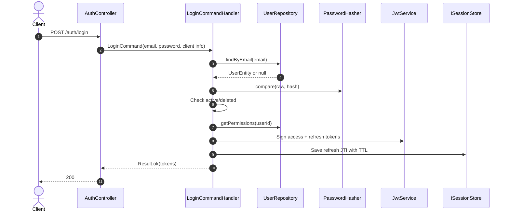
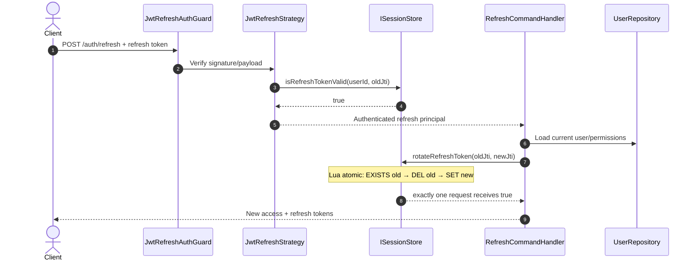

# Auth Bounded Context

> **Phần III · Chương 9 — Danh tính và vòng đời phiên**
>
> Chương trước: [Client Web](../../../../../client/README.md) · [Mục lục handbook](../../../../../../docs/README.md) · Chương sau: [Users context](../users/README.md)

Auth trả lời hai câu: “người đang gọi API là ai?” và “phiên đăng nhập của họ còn hợp lệ không?”. Auth không sửa hồ sơ, không tạo role và không quản lý danh sách permission. Những việc đó thuộc context khác.

Hãy đi theo một phiên đăng nhập. Email và password đổi lấy access token sống ngắn. Khi token đó hết hạn, refresh session cho phép trình duyệt xin cặp token mới mà không bắt người dùng nhập lại mật khẩu. Mỗi lần refresh, phiên cũ bị thay bằng phiên mới; cơ chế này gọi là **refresh rotation**. Logout hoặc thay đổi quyền tài khoản sẽ làm phiên cũ mất hiệu lực.

Auth chịu trách nhiệm xác minh danh tính, cấp token và quản lý vòng đời của phiên refresh (refresh session — bản ghi cho phép một thiết bị xin token mới). Context này trả lời câu hỏi “request đến từ ai?”; còn câu hỏi “người này có được phép làm hành động đó không?” thuộc về phần phân quyền trong Roles.

Nếu chưa đọc [Backend Architecture Handbook](../../../../README.md), hãy đọc nó trước. Chương đó giải thích vì sao controller, handler, domain và code Redis/Prisma được tách thành các phần khác nhau.

## 1. Auth chịu trách nhiệm gì?

Auth sở hữu:

- các use case đăng ký, đăng nhập, refresh và đăng xuất;
- vòng đời của access token và refresh token (cấp mới, hết hạn, thu hồi);
- refresh session lưu trong Redis;
- các strategy xác thực JWT của Passport;
- interface `ISessionStore`.

Auth không sở hữu dữ liệu User hay mô hình role. Nó dùng `UserRepository` và `PasswordHasher` do Users định nghĩa để kiểm tra email/mật khẩu, nhưng không tự sửa trực tiếp bảng User. Khi cấp token, Auth đọc danh sách permission của user từ database rồi nhét vào token; còn permission gồm những quyền gì thì do `@repo/contracts` và Roles định nghĩa.

## 2. Cấu trúc code

```text
auth/
├── domain/
│   └── ports/session-store.port.ts
├── application/
│   ├── commands/
│   │   ├── register, login, refresh
│   │   ├── logout, logout-all, revoke-session
│   │   └── handlers/
│   └── queries/
│       └── get-active-sessions + handler
├── infrastructure/
│   ├── stores/redis-session.store.ts
│   └── strategies/
│       ├── jwt.strategy.ts
│       └── jwt-refresh.strategy.ts
├── presentation/
│   ├── controllers/auth.controller.ts
│   └── dtos/
└── auth.module.ts
```

`auth.module.ts` là nơi lắp ráp mọi mảnh của context này (composition root). Nó đăng ký các handler CQRS, các strategy xác thực, và khai báo rằng interface `ISessionStore` sẽ do Redis adapter đảm nhiệm.

## 3. Token và session model

Access token đại diện cho một người dùng đã đăng nhập thành công (tài liệu gọi là principal). Payload chứa:

- `sub`: user id chuẩn JWT;
- `email`;
- permissions tại thời điểm cấp token;
- `tokenVersion`;
- `jti`: định danh session đã sinh ra token.

Access token và refresh token của cùng một lần cấp dùng chung JTI. JTI chỉ hợp lệ khi Redis còn session tại:

```text
refresh_token:{userId}:{jti}
```

Giá trị lưu tại key đó là `SessionData`, gồm JTI, IP, user-agent và thời điểm tạo. Redis không phải nguồn sự thật về User; nó là registry của các phiên đang hoạt động. Xóa key làm mất hiệu lực cả refresh token lẫn access token mang JTI đó.

## 4. Login flow


```mermaid
sequenceDiagram
    autonumber
    actor Client
    participant Controller as AuthController
    participant Handler as LoginCommandHandler
    participant Users as UserRepository
    participant Hasher as PasswordHasher
    participant JWT as JwtService
    participant Session as ISessionStore

    Client->>Controller: POST /auth/login
    Controller->>Handler: LoginCommand(email, password, client info)
    Handler->>Users: findByEmail(email)
    Users-->>Handler: UserEntity or null
    Handler->>Hasher: compare(raw, hash)
    Handler->>Handler: Check active/deleted
    Handler->>Users: getPermissions(userId)
    Handler->>JWT: Sign access + refresh tokens
    Handler->>Session: Save refresh JTI with TTL
    Handler-->>Controller: Result.ok(tokens)
    Controller-->>Client: 200
```

### Khi refresh không thành công

Email không tồn tại và password sai đều phải trả về cùng một lỗi chung kiểu “sai thông tin đăng nhập”; API không được để lộ email nào có tài khoản, email nào không. User đã bị khóa hoặc đã xóa không được nhận token mới. Nếu ghi session vào Redis thất bại, login không được coi là hoàn tất, vì refresh token vừa cấp sẽ không có bản ghi trong Redis để đối chiếu khi dùng.

## 5. Access request validation

`JwtStrategy` chấp nhận đọc cả database và Redis ở mỗi request để đổi lấy khả năng thu hồi token có hiệu lực ngay lập tức:

1. verify chữ ký bằng `JWT_ACCESS_SECRET`;
2. tải User hiện tại bằng `sub`;
3. từ chối nếu User không tồn tại, inactive hoặc deleted;
4. so sánh `payload.tokenVersion` với `user.tokenVersion`;
5. kiểm tra Redis còn session `refresh_token:{sub}:{jti}`;
6. tạo `AuthenticatedPrincipal` có kiểu và gắn vào request.

Token có chữ ký đúng vẫn có thể bị từ chối. Chữ ký chỉ chứng minh token do server cấp; trạng thái user trong database và session trong Redis mới chứng minh token vẫn còn hiệu lực. Đây là fail-closed dependency: nếu không kiểm tra được session store, backend không được chấp nhận access token dựa riêng vào chữ ký.

Khi role assignment, nội dung permission của role hoặc trạng thái truy cập thay đổi, hệ thống tăng tokenVersion của các user bị ảnh hưởng. Tất cả access token cũ lập tức không còn khớp. Users aggregate xử lý thay đổi assignment/trạng thái của một user; Roles transaction xử lý mọi user đang mang role vừa đổi permission. Thay đổi profile như email, username hoặc avatar không làm quyền truy cập thay đổi nên không tăng version và không tạo một vòng `401 → refresh → retry` không cần thiết.

Khi refresh, handler luôn tải User hiện tại từ database và dùng email hiện tại để ký cả access token lẫn refresh token mới. Email nằm trong refresh token cũ chỉ là claim tại thời điểm token đó được cấp; nó không được dùng làm nguồn dữ liệu sau khi profile đã thay đổi.

## 6. Refresh rotation


```mermaid
sequenceDiagram
    autonumber
    actor Client
    participant Guard as JwtRefreshAuthGuard
    participant Strategy as JwtRefreshStrategy
    participant Store as ISessionStore
    participant Handler as RefreshCommandHandler
    participant Users as UserRepository

    Client->>Guard: POST /auth/refresh + refresh token
    Guard->>Strategy: Verify signature/payload
    Strategy->>Store: isRefreshTokenValid(userId, oldJti)
    Store-->>Strategy: true
    Strategy-->>Handler: Authenticated refresh principal
    Handler->>Users: Load current user/permissions
    Handler->>Store: rotateRefreshToken(oldJti, newJti)
    Note over Store: Lua atomic: EXISTS old → DEL old → SET new
    Store-->>Handler: exactly one request receives true
    Handler-->>Client: New access + refresh tokens
```

Xoay vòng token như vậy (rotation) khiến refresh token cũ khó bị đem dùng lại lần nữa (replay). Khi cấp cặp token mới, handler phải đọc lại trạng thái user và tokenVersion hiện tại từ database, không được sao chép mù quáng payload của token cũ.

Rotation phải diễn ra như một thao tác duy nhất trong Redis. `RedisSessionStore.rotateRefreshToken` gọi `RedisService.replaceIfPresent`; hàm này chạy Lua script để làm ba việc liền nhau:

1. kiểm tra key của phiên cũ còn tồn tại;
2. xóa key cũ;
3. tạo key cho phiên mới.

Redis không cho request khác chen vào giữa script. Vì vậy, nếu hai request cùng dùng một refresh token, đúng một request thành công; request còn lại nhận `401 UNAUTHORIZED`.

Không thay script bằng ba lệnh rời `GET → SET → DEL`. Request thứ hai có thể chen vào giữa các lệnh và làm một refresh token sinh ra nhiều phiên mới; lỗi cạnh tranh như vậy gọi là **race condition**.

## 7. Logout và session management

`LogoutCommand` thu hồi JTI hiện tại. `LogoutAllCommand` xóa mọi key của user và tăng `tokenVersion`, vì vậy đây là thao tác đăng xuất toàn cục thật sự. `RevokeOtherSessionsCommand` xóa mọi session ngoại trừ JTI hiện tại và không tăng `tokenVersion`; tab đang thao tác tiếp tục hoạt động. `RevokeSessionCommand` cho phép người dùng thu hồi một thiết bị cụ thể. `GetActiveSessionsQuery` trả danh sách session có phân trang và đánh dấu `isCurrent` bằng JTI nằm trong access token.

Khi cần tìm các key theo mẫu tên, code dùng lệnh Redis `SCAN` (duyệt dần từng nhóm key), không dùng `KEYS`. `KEYS` quét toàn bộ key trong một lần nên có thể làm Redis đứng hình khi số key lớn — không chấp nhận được cho production.

Vì `JwtStrategy` đối chiếu JTI với Redis trên từng request, logout một phiên hoặc thu hồi các phiên khác làm access token và refresh token của thiết bị đó chết ngay. Global logout vẫn tăng thêm `tokenVersion`: lớp bảo vệ thứ hai này thu hồi mọi access token của user kể cả khi một session key bị tạo lại do lỗi vận hành hoặc một flow cấp token mới được bổ sung sau này.

## 8. API surface

| Endpoint                            | Guard              | Use case                            |
| ----------------------------------- | ------------------ | ----------------------------------- |
| `POST /auth/register`               | Public             | Tạo account                         |
| `POST /auth/login`                  | Public             | Xác thực và cấp token               |
| `POST /auth/refresh`                | Refresh JWT        | Rotate token                        |
| `POST /auth/logout`                 | Refresh JWT        | Revoke current session              |
| `POST /auth/logout/global`          | Access JWT         | Revoke all refresh sessions         |
| `POST /auth/sessions/revoke-others` | Refresh JWT cookie | Revoke mọi phiên trừ phiên hiện tại |
| `GET /auth/sessions`                | Access JWT         | Liệt kê active sessions             |
| `DELETE /auth/sessions/:jti`        | Access JWT         | Revoke một session                  |

DTO chịu trách nhiệm kiểm tra dữ liệu vào lúc chạy (runtime validation). Controller chỉ làm ba việc: gom input cùng thông tin client (IP, user-agent), gửi command/query vào CQRS bus, rồi mở kết quả ra để trả về HTTP.

## 9. Ý nghĩa từng nhóm file

`session-store.port.ts` khai báo interface: tầng application chỉ biết “lưu phiên, tìm phiên, rotate atomic, xóa phiên”, không biết dữ liệu nằm ở Redis hay key đặt tên thế nào. `redis-session.store.ts` là nơi duy nhất biết chuyện đó: nó đọc/ghi các key Redis dạng `refresh_token:{userId}:{jti}`. Atomicity là một phần của contract `rotateRefreshToken`, không phải chi tiết tùy chọn của adapter.

Mỗi command file là một gói dữ liệu bất biến mô tả yêu cầu ghi (“hãy đăng nhập với email này, password này”). Handler là nơi làm việc thật: gọi repository, so mật khẩu, ký token, lưu phiên — nhưng không chứa decorator HTTP nào. Query/handler của active sessions là đường đọc, không thay đổi dữ liệu.

Hai strategy là chỗ Passport cắm vào để kiểm tra token cho từng request. Strategy chỉ xác minh token rồi trả về principal, không sửa dữ liệu nghiệp vụ nào.

`auth.controller.ts` là lớp tiếp nhận HTTP: nhận request, gọi use case, trả response. `login.dto.ts` và `register.dto.ts` đứng gác ở cửa vào: request thiếu trường hay sai định dạng bị chặn ngay tại đây.

## 10. Những quy tắc bảo mật luôn phải đúng

- Không có default/fallback JWT secret trong code.
- Secret dùng cho production phải qua được bước kiểm tra độ dài tối thiểu.
- Không log password, access token, refresh token hoặc giá trị session trong Redis.
- Refresh token chỉ được chấp nhận khi JTI của nó vẫn còn nằm trong store.
- Người mang access token phải khớp trạng thái User/tokenVersion trong database và JTI session trong Redis.
- Thông báo lỗi không được giúp kẻ tấn công dò ra email nào có tài khoản (account enumeration).
- IP và user-agent của client chỉ là thông tin ghi kèm để truy vết, không phải bằng chứng xác thực.

## 11. Cách mở rộng

Khi thêm MFA hoặc chức năng đặt lại mật khẩu, trước tiên xác định flow đó thuộc Auth hay Users. Việc tạo, kiểm tra và cho hết hạn các token/mã xác nhận thuộc Auth; việc đổi password hash và tăng tokenVersion thuộc Users. Hai context nên nói chuyện với nhau qua use case/port rõ ràng, không để Auth gọi thẳng vào bảng User qua Prisma.

Use case mới cần:

1. command/query contract;
2. handler có kiểu kết quả rõ ràng;
3. port nếu cần gọi ra hệ thống bên ngoài (Redis, mail...);
4. adapter hiện thực port đó;
5. DTO và guard cho controller;
6. unit test cho cả ca thành công lẫn thất bại;
7. test E2E chứng minh việc thu hồi token và các hành vi bảo mật chạy đúng.

## 12. Anti-pattern

- Chỉ kiểm tra chữ ký JWT rồi tin toàn bộ nội dung bên trong, bỏ qua trạng thái user trong database.
- Lưu refresh token mà không gắn JTI và không xoay vòng khi refresh.
- Gọi `RedisService` trực tiếp trong handler thay vì đi qua `ISessionStore`.
- Trả nguyên object User của domain (còn chứa password hash) ra controller.
- Đọc `process.env` hoặc đặt secret dự phòng rải rác trong code.
- Chỉ xóa refresh session nhưng không đối chiếu JTI khi xác thực access token; cách đó để thiết bị đã bị thu hồi tiếp tục gọi API tới khi access token hết hạn.

## 13. Checklist review Auth

- Token có đúng type, thời hạn, secret và tokenVersion không?
- Khoảng hở giữa lúc lưu JTI mới và lúc xóa JTI cũ đã được chấp nhận hoặc xử lý chưa?
- User bị khóa/đã xóa có bị chặn ở cả bước login lẫn từng request sau đó không?
- Flow có để lộ mật khẩu, hoặc để lộ tài khoản nào tồn tại không?
- Có chỗ nào log secret/token không?
- Test có bao phủ các ca dùng lại token cũ (replay), thu hồi token và token hết hiệu lực không?
