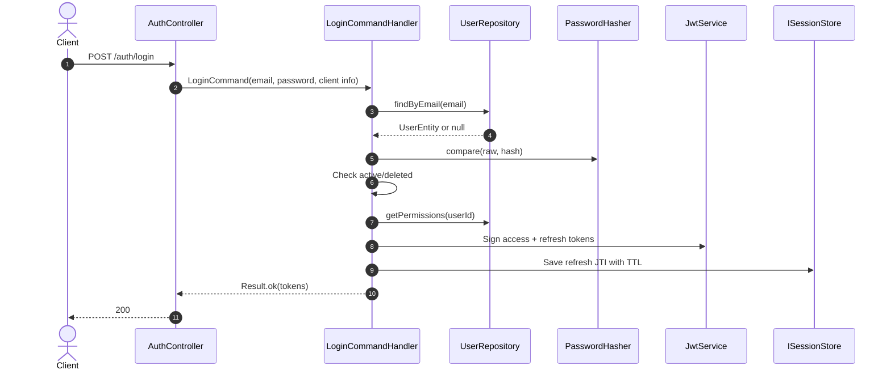
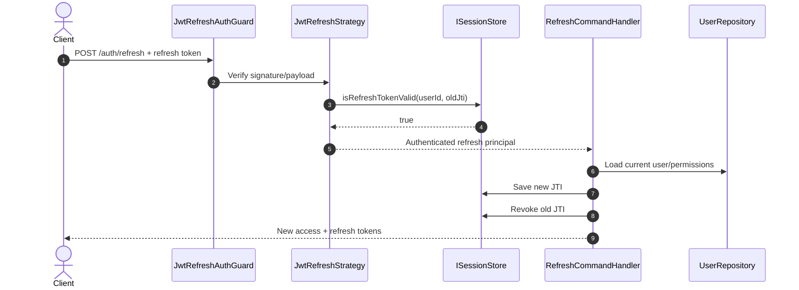

# Auth Bounded Context

Auth chịu trách nhiệm xác minh danh tính, cấp token và quản lý vòng đời refresh session. Context này trả lời câu hỏi “request đến từ ai?”; việc principal có được thực hiện một hành động hay không thuộc authorization/Roles.

Đọc [Backend Architecture Handbook](../../../../README.md) trước nếu chưa quen với dependency direction, CQRS và port/adapter.

## 1. Ranh giới và ownership

Auth sở hữu:

- register/login/refresh/logout use cases;
- access token và refresh token lifecycle;
- refresh session trong Redis;
- Passport JWT strategies;
- contract `ISessionStore`.

Auth không sở hữu User state hoặc role model. Nó dùng `UserRepository` và `PasswordHasher` do Users định nghĩa để xác thực, nhưng không tự cập nhật trực tiếp bảng User. Permission được tải từ IAM data và đưa vào token; định nghĩa permission thuộc shared contracts/Roles.

## 2. Cấu trúc code

```text
auth/
├── domain/
│   └── ports/session-store.port.ts
├── application/
│   ├── commands/
│   │   ├── register, login, refresh
│   │   ├── logout, logout-all, revoke-session
│   │   └── handlers/
│   └── queries/
│       └── get-active-sessions + handler
├── infrastructure/
│   ├── stores/redis-session.store.ts
│   └── strategies/
│       ├── jwt.strategy.ts
│       └── jwt-refresh.strategy.ts
├── presentation/
│   ├── controllers/auth.controller.ts
│   └── dtos/
└── auth.module.ts
```

`auth.module.ts` là composition root cục bộ. Nó đăng ký CQRS handlers, strategies và bind `ISessionStore` với Redis adapter.

## 3. Token và session model

Access token đại diện cho một principal đã xác thực. Payload chứa:

- `sub`: user id chuẩn JWT;
- `email`;
- permissions tại thời điểm cấp token;
- `tokenVersion`;
- JTI nếu flow cần.

Refresh token cũng có JTI. JTI chỉ hợp lệ khi Redis còn session tại:

```text
refresh_token:{userId}:{jti}
```

Session value là `SessionData`, gồm JTI, IP, user-agent và thời điểm tạo. Redis không phải nguồn sự thật của User; nó chỉ là registry cho refresh session có thể thu hồi.

## 4. Login flow


```mermaid
sequenceDiagram
    autonumber
    actor Client
    participant Controller as AuthController
    participant Handler as LoginCommandHandler
    participant Users as UserRepository
    participant Hasher as PasswordHasher
    participant JWT as JwtService
    participant Session as ISessionStore

    Client->>Controller: POST /auth/login
    Controller->>Handler: LoginCommand(email, password, client info)
    Handler->>Users: findByEmail(email)
    Users-->>Handler: UserEntity or null
    Handler->>Hasher: compare(raw, hash)
    Handler->>Handler: Check active/deleted
    Handler->>Users: getPermissions(userId)
    Handler->>JWT: Sign access + refresh tokens
    Handler->>Session: Save refresh JTI with TTL
    Handler-->>Controller: Result.ok(tokens)
    Controller-->>Client: 200
```

### Failure path

Email không tồn tại và password sai đều phải dẫn đến lỗi credential có kiểm soát; API không nên tiết lộ account nào tồn tại. User inactive/deleted không được nhận token mới. Nếu ghi session thất bại, login không được coi là hoàn tất vì refresh token vừa cấp sẽ không có registry hợp lệ.

## 5. Access request validation

`JwtStrategy` chủ động đánh đổi một database read để có revoke semantics mạnh:

1. verify chữ ký bằng `JWT_ACCESS_SECRET`;
2. tải User hiện tại bằng `sub`;
3. từ chối nếu User không tồn tại, inactive hoặc deleted;
4. so sánh `payload.tokenVersion` với `user.tokenVersion`;
5. tạo `AuthenticatedPrincipal` có kiểu và gắn vào request.

Token có chữ ký đúng vẫn có thể bị từ chối. Chữ ký chứng minh token do server cấp; database state chứng minh token vẫn còn hiệu lực.

Khi profile, role hoặc trạng thái truy cập thay đổi, Users aggregate tăng tokenVersion. Tất cả access token cũ lập tức không còn khớp.

## 6. Refresh rotation


```mermaid
sequenceDiagram
    autonumber
    actor Client
    participant Guard as JwtRefreshAuthGuard
    participant Strategy as JwtRefreshStrategy
    participant Store as ISessionStore
    participant Handler as RefreshCommandHandler
    participant Users as UserRepository

    Client->>Guard: POST /auth/refresh + refresh token
    Guard->>Strategy: Verify signature/payload
    Strategy->>Store: isRefreshTokenValid(userId, oldJti)
    Store-->>Strategy: true
    Strategy-->>Handler: Authenticated refresh principal
    Handler->>Users: Load current user/permissions
    Handler->>Store: Save new JTI
    Handler->>Store: Revoke old JTI
    Handler-->>Client: New access + refresh tokens
```

Rotation làm giảm khả năng replay refresh token cũ. Refresh handler phải dùng user state và tokenVersion hiện tại, không sao chép mù payload cũ.

Implementation hiện ghi session mới rồi revoke session cũ bằng hai Redis operation tuần tự, chưa phải một atomic Redis transaction/script. Nếu bước revoke thất bại sau khi save thành công, cả JTI cũ và mới có thể cùng tồn tại đến khi hết TTL hoặc được cleanup. Đây là failure window cần được harden nếu hệ thống yêu cầu single-use refresh token nghiêm ngặt.

## 7. Logout và session management

`LogoutCommand` thu hồi JTI hiện tại. `LogoutAllCommand` xóa mọi key của user. `RevokeSessionCommand` cho phép người dùng thu hồi một thiết bị cụ thể. `GetActiveSessionsQuery` trả danh sách session có phân trang.

Pattern lookup dùng Redis `SCAN`, không dùng `KEYS`. `KEYS` có thể block Redis khi keyspace lớn và không phù hợp cho nền tảng production.

Logout chỉ đảm bảo refresh token không thể dùng tiếp. Access token được xử lý bằng expiry và tokenVersion. Global logout hiện thu hồi refresh sessions; nếu sản phẩm yêu cầu vô hiệu access token ngay khi global logout, use case phải tăng tokenVersion qua Users aggregate.

## 8. API surface

| Endpoint                     | Guard       | Use case                    |
| ---------------------------- | ----------- | --------------------------- |
| `POST /auth/register`        | Public      | Tạo account                 |
| `POST /auth/login`           | Public      | Xác thực và cấp token       |
| `POST /auth/refresh`         | Refresh JWT | Rotate token                |
| `POST /auth/logout`          | Refresh JWT | Revoke current session      |
| `POST /auth/logout/global`   | Access JWT  | Revoke all refresh sessions |
| `GET /auth/sessions`         | Access JWT  | Liệt kê active sessions     |
| `DELETE /auth/sessions/:jti` | Access JWT  | Revoke một session          |

DTO chịu trách nhiệm runtime validation. Controller chỉ thu input/client info, dispatch CQRS message và unwrap result.

## 9. Ý nghĩa từng nhóm file

`session-store.port.ts` giữ contract để application không biết Redis key format. `redis-session.store.ts` là nơi duy nhất chuyển hành vi session thành cache operations.

Các command file là immutable request model của write use case. Handler chứa orchestration, không chứa HTTP decorator. Query/handler của active sessions là read path.

Hai strategy là authentication adapter của Passport. Strategy không thực hiện business mutation.

`auth.controller.ts` là HTTP adapter; `login.dto.ts` và `register.dto.ts` bảo vệ boundary.

## 10. Invariant và security rules

- Không có default/fallback JWT secret trong code.
- Production secret phải vượt validation độ dài.
- Không log password, access token, refresh token hoặc Redis session value.
- Refresh token bắt buộc có JTI hợp lệ trong store.
- Access principal bắt buộc khớp User state và tokenVersion hiện tại.
- Error không được tiết lộ account enumeration.
- Client IP/user-agent là audit metadata, không phải bằng chứng authentication.

## 11. Cách mở rộng

Khi thêm MFA hoặc password reset, trước tiên xác định flow đó thuộc Auth hay Users. Token/challenge lifecycle thuộc Auth; thay đổi password hash và tokenVersion thuộc Users. Hai context nên giao tiếp qua use case/port rõ ràng, không để Auth gọi trực tiếp Prisma User.

Use case mới cần:

1. command/query contract;
2. handler có kiểu kết quả rõ ràng;
3. port nếu có external capability;
4. adapter implementation;
5. controller DTO/guard;
6. unit test failure/success;
7. E2E chứng minh revoke và security behavior.

## 12. Anti-pattern

- Chỉ verify JWT signature rồi tin mọi claim.
- Lưu refresh token mà không có JTI/rotation.
- Gọi `RedisService` trực tiếp trong handler thay vì `ISessionStore`.
- Trả cùng lúc domain User object có password ra controller.
- Dùng `process.env` hoặc secret fallback rải rác.
- Dùng logout như bằng chứng access token đã bị revoke ngay.

## 13. Checklist review Auth

- Token có đúng type, expiry, secret và tokenVersion không?
- Failure window giữa save JTI mới và revoke JTI cũ đã được chấp nhận hoặc xử lý chưa?
- User inactive/deleted có bị chặn ở cả login và access request không?
- Flow có làm lộ credential/account existence không?
- Có log secret/token không?
- Test có bao phủ replay, revoke và token cũ không?
