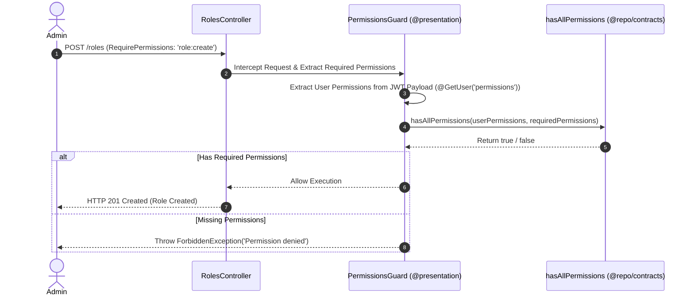

# 🔑 Roles Bounded Context Documentation

Bounded Context **Roles** chịu trách nhiệm quản lý hệ thống phân quyền dựa trên vai trò **RBAC (Role-Based Access Control)**, định nghĩa danh sách Role và gắn ánh xạ danh sách `PermissionType[]` cho từng Role.

---

## 🏛️ 1. Cấu Trúc Thư Mục Clean Architecture

```text
contexts/iam/roles/
├── domain/                                ─── [Domain Layer]
│   ├── role.entity.ts                     # Role Aggregate Root Entity
│   └── ports/
│       └── role.repository.ts             # RoleRepository Port Interface
│
├── application/                           ─── [Application Layer / CQRS]
│   ├── commands/                          # CreateRole, UpdateRolePermissions, DeleteRole Commands
│   └── queries/                           # GetRoles, GetPermissions Queries & Handlers
│
├── infrastructure/                        ─── [Infrastructure Layer]
│   └── repositories/
│       └── prisma-role.repository.ts      # Prisma Adapter triển khai RoleRepository
│
└── presentation/                          ─── [Presentation Layer]
    └── controllers/
        └── roles.controller.ts            # REST API Controller (@UseGuards PermissionsGuard)
```

---

## 🔒 2. Luồng Kiểm Tra Phân Quyền (RBAC Guard Flow)



---

## 🔑 3. Các Điểm Nổi Bật Về Thiết Kế

1. **Shared Contract Utilities (`@repo/contracts`)**:
   - Logic so sánh permissions (`hasAllPermissions`, `hasAnyPermission`, `hasPermission`) được dùng chung trực tiếp từ gói `@repo/contracts`.
   - Backend và Frontend dùng chung 1 hàm so sánh duy nhất, tránh lệch mã kiểm tra quyền.
2. **Stateless Permission Evaluation**:
   - `PermissionsGuard` kiểm tra quyền của User trực tiếp từ Access Token Payload (**0 Query DB**), đem lại tốc độ kiểm tra quyền tính bằng Microsecond.
