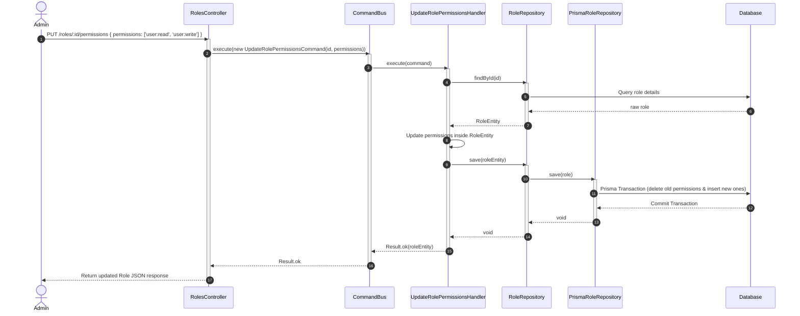

# Tài liệu Kỹ thuật Chi tiết: Module Vai trò & Phân quyền (Roles Bounded Context)

Module này quản lý thực thể Vai trò (Role Aggregate), ánh xạ danh sách Quyền hạn (Permissions) tương ứng và cập nhật cấu trúc phân quyền hệ thống.

---

## 1. Nghiệp vụ & Quy tắc cốt lõi (Domain Rules)

* **Thực thể Role**: Mỗi vai trò đại diện bởi tên định danh duy nhất (`name`, ví dụ: `ADMIN`, `USER`), mô tả (`description`) và danh sách các quyền hạn (`permissions`).
* **Mối quan hệ Nhiều-Nhiều (Many-to-Many)**: User liên kết với Roles qua bảng trung gian `UserRole`. Roles liên kết với Permissions qua bảng trung gian `RolePermission`.
* **Xóa mềm (Soft Delete)**: Khi xóa Role, thuộc tính `isDeleted` cập nhật thành `true` thay vì xóa vật lý khỏi database để đảm bảo toàn vẹn dữ liệu lịch sử thao tác.

---

## 2. Danh sách Use Cases (CQRS)

### Nhánh Ghi - Lệnh (Commands)
1. **`CreateRoleCommand`**: Tạo vai trò mới trong hệ thống.
2. **`UpdateRolePermissionsCommand`**: Cập nhật/Đồng bộ lại danh sách quyền hạn gán cho vai trò cụ thể.
3. **`DeleteRoleCommand`**: Đánh dấu xóa vai trò.

### Nhánh Đọc - Truy vấn (Queries)
1. **`GetRolesQuery`**: Truy vấn danh sách toàn bộ các vai trò và quyền hạn tương ứng có trong hệ thống.
2. **`GetPermissionsQuery`**: Lấy danh sách tất cả các quyền hạn hệ thống hỗ trợ để hiển thị trên UI cấu hình.

---

## 3. Đặc tả API Endpoints

| Giao thức | Route | Bảo vệ bằng | DTO đầu vào | Trả về |
| :--- | :--- | :--- | :--- | :--- |
| **GET** | `/roles` | `JwtAuthGuard` & `PermissionsGuard` | Không | `Role[]` |
| **GET** | `/roles/permissions` | `JwtAuthGuard` & `PermissionsGuard` | Không | `Permission[]` |
| **POST** | `/roles` | `JwtAuthGuard` & `PermissionsGuard` | `CreateRoleDto` | `Role` |
| **PUT** | `/roles/:id/permissions`| `JwtAuthGuard` & `PermissionsGuard` | `UpdateRolePermissionsDto` | `Role` |
| **DELETE** | `/roles/:id` | `JwtAuthGuard` & `PermissionsGuard` | Không | `{ success: true }` |

---

## 4. Sơ đồ tuần tự Cập nhật Quyền của Vai trò (Mermaid)

---

## 5. Chi tiết hoạt động đi qua các Tầng (Layer Transition)

* **`presentation/controllers/roles.controller.ts`**:
  * Chứa các endpoint quản lý Roles.
  * Được gán các quyền kiểm soát `@RequirePermissions('role:read')` hoặc `role:write`.
* **`application/commands/handlers/update-role-permissions.handler.ts`**:
  * Điều phối tiến trình cập nhật danh sách quyền.
  * Tận dụng Transaction của cơ sở dữ liệu để đồng bộ hóa danh sách `RolePermission` một cách nguyên tử (Atomic).
* **`infrastructure/repositories/prisma-role.repository.ts`**:
  * Thực hiện câu lệnh SQL chèn hoặc xóa mềm Role.
  * Map dữ liệu DB sang Entity nghiệp vụ.
