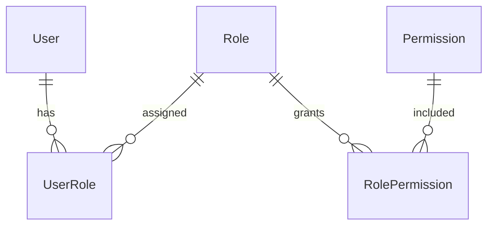
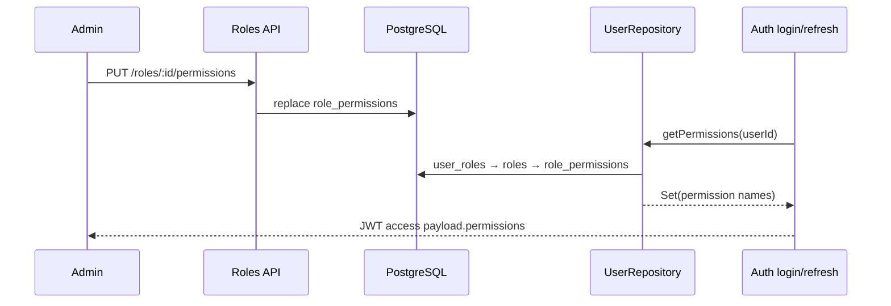

# IAM / Roles bounded context

Roles sở hữu khái niệm role và phép gán permission cho role. Đây là nửa quản trị của RBAC; Users sở hữu liên kết user–role và Auth phát permission hiệu dụng vào access JWT.

## 1. Mô hình dữ liệu và ranh giới

Các bảng Prisma là `roles`, `permissions`, `user_roles`, `role_permissions`. Quan hệ N–N được biểu diễn bằng bảng liên kết có composite key. `Role` có `isDeleted`, audit fields và `name` unique; `Permission` là catalog hệ thống. Danh mục permission được chia sẻ từ `@repo/contracts`:

| Nhóm | Giá trị |
| --- | --- |
| User | `user:create`, `user:read`, `user:update`, `user:delete` |
| Role | `role:create`, `role:read`, `role:update`, `role:delete` |
| Session | `session:read`, `session:delete` |
| Audit | `audit:read` |

Seed tạo `ADMIN` (mọi permission) và `USER` (`user:read`), rồi gán `ADMIN` cho `admin@example.com`. UI và API dùng string permission, vì vậy permission seed/catalog phải khớp chính xác constants.

## 2. Cấu trúc thực thi

| Vị trí | Trách nhiệm |
| --- | --- |
| `roles.module.ts` | Đăng ký CQRS, controller, `PrismaRoleRepository` dưới token `RoleRepository`; import `UsersModule` để shared guard có thể resolve dependency nếu cần. |
| `domain/role.entity.ts` | Aggregate `RoleEntity`: tạo role, cập nhật permission/details, giữ audit fields; hiện không phát domain event. |
| `domain/ports/role.repository.ts` | Port persistence/read-model: role và catalog permission. |
| `infrastructure/repositories/prisma-role.repository.ts` | Adapter Prisma, map row inline sang entity, transaction khi save/sync permission. |
| `application/commands` | Create, update permission, soft delete. |
| `application/queries` | Đọc mọi role hoặc mọi permission. |
| `presentation/controllers/roles.controller.ts` | REST, guard JWT + permission, response projection và audit metadata. |

## 3. API và phân quyền

Tất cả endpoints nằm dưới `Controller('roles')`, yêu cầu access JWT hợp lệ, sau đó `PermissionsGuard`. Permission required là AND-list; mỗi endpoint hiện chỉ yêu cầu một permission.

| API | Required | Luồng |
| --- | --- | --- |
| `GET /roles` | `role:read` | `GetRolesQuery` → role kèm `permissions` |
| `GET /roles/permissions` | `role:read` | `GetPermissionsQuery` → catalog permission DB |
| `POST /roles` | `role:create` | body `{name, description?}` → role mới |
| `PUT /roles/:id/permissions` | `role:update` | body `{permissions: string[]}` → thay toàn bộ mapping |
| `DELETE /roles/:id` | `role:delete` | soft delete, HTTP 204 |

Controller hiện dùng object body tự khai báo, không có `class-validator` DTO cho Roles. Nó chỉ kiểm tra `name` tồn tại khi create và `permissions` là array khi update; validation sâu hơn nên được bổ sung nếu API public hơn.

## 4. Luồng ghi chi tiết

### Tạo role

1. Controller kiểm tra `body.name`, lấy actor qua `@GetUser()` và dispatch `CreateRoleCommand`.
2. Handler tìm role active theo name. Trùng tên trả `RoleAlreadyExistsException`.
3. `RoleEntity.register` tạo UUID từ repository, `isDeleted=false`, audit fields và **mặc định permission `['user:read']`**.
4. Repository transaction: create row Role, truy vấn Permission có `name in` danh sách entity, xóa mapping cũ (không có với role mới), rồi `createMany` `role_permissions` cho những permission thực sự tồn tại.
5. Controller trả role projection và global audit interceptor ghi `ROLE_CREATE` sau response thành công.

### Thay permission

`UpdateRolePermissionsCommandHandler` load role active theo id; thiếu thì `RoleNotFoundException`. `role.updatePermissions` thay mảng trong aggregate và set `updatedAt`/`updatedBy`; repository transaction update Role, resolve `Permission` theo name, **xóa toàn bộ** `role_permissions` của role rồi insert mapping mới. String không có trong bảng Permission bị loại im lặng: response từ entity vẫn chứa input string, nhưng lần `GET /roles` sau chỉ phản ánh mapping thực đã lưu. Đây là chi tiết quan trọng khi tích hợp UI.

### Xóa role

Handler xác nhận role còn active, repository `update({isDeleted:true})`; không xóa vật lý row hay các join rows. `findById`, `findByName`, `findAll` luôn filter `isDeleted:false`, nên role xóa biến mất khỏi API và không thể tạo lại cùng `name` vì unique constraint DB vẫn còn. Đó là hạn chế thực tế của soft delete + unique name hiện tại.

## 5. Role trở thành permission người dùng như thế nào

`PrismaUserRepository.getPermissions` union toàn bộ permission từ mọi role của user bằng `Set`. Login và refresh đọc lại từ DB nên token phát sau thay đổi role có quyền mới. Access JWT hiện hữu không bị revoke/invalidate bởi update permission; shared guard đọc snapshot `request.user.permissions` từ token. Muốn ép hiệu lực tức thời cần revoke session, giảm TTL hoặc áp dụng version/check server-side.

## 6. Error, audit, client

- `RoleAlreadyExistsException` và `RoleNotFoundException` kế thừa `DomainException`; `Result.unwrap()` để global filter đổi sang response chuẩn trong `@repo/contracts`.
- `POST`, `PUT permissions`, `DELETE` gắn `@AuditLog`: action/details, actor, IP, User-Agent đi vào `audit_logs` sau khi call thành công. Không ghi log các request thất bại.
- Admin SPA gọi `GET /roles` và `GET /roles/permissions` qua React Query hook, route `/roles` được chặn ở frontend bằng `role:read`; backend vẫn là enforcement quyết định.

## 7. Hướng dẫn thay đổi an toàn

Khi thêm permission mới: thêm constant trong `packages/contracts/src/auth/permissions.ts`, seed/migration record `Permission`, cập nhật UI nếu cần, rồi gán nó cho role. Khi thêm use case role: tạo command/query + handler, khai báo provider `RolesModule`, giữ persistence sau `RoleRepository`; trang trí endpoint bằng permission/audit phù hợp. Tránh dùng `RoleEntity` để chỉnh mapping user–role: mapping đó thuộc Users context.
