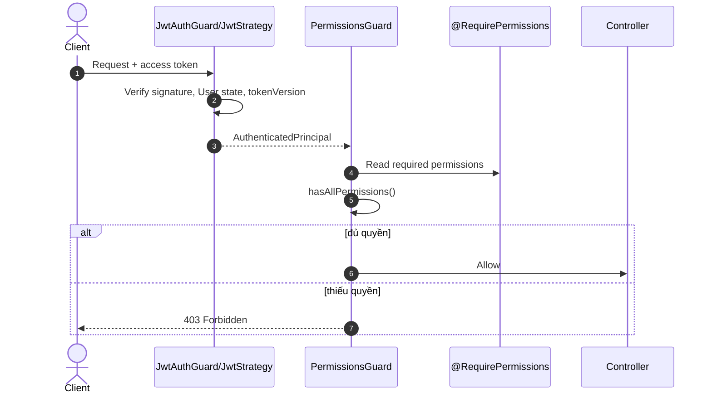

# Roles Bounded Context

Roles sở hữu mô hình RBAC: role, permission catalog và quan hệ role-permission. Context này trả lời “một role đại diện cho tập quyền nào?”. Việc một HTTP request có tập quyền cần thiết được thực hiện ở presentation guard.

> Gặp từ lạ (RBAC, guard, aggregate, tokenVersion…)? Tra [Bảng thuật ngữ](../../../../../../docs/glossary.md).

## 1. Khái niệm nghiệp vụ

Permission là capability nhỏ, ổn định và dùng chung qua `@repo/contracts`, ví dụ quyền đọc hoặc cập nhật user. Role là nhóm permission có tên và mô tả. User nhận permission thông qua role assignments.

Luồng khái niệm:

```text
User ──has──> Role ──contains──> Permission
                         │
JWT access token <──── resolved permissions
```

Frontend và backend dùng chung permission identifiers để tránh drift. Tuy nhiên backend luôn là nơi enforcement cuối cùng.

## 2. Ranh giới và ownership

Roles sở hữu:

- Role aggregate;
- role repository port;
- create/delete/update-permission use cases;
- query role list và permission catalog;
- Prisma mapping Role/Permission/RolePermission.

Roles không sở hữu UserRole mutation của User aggregate. Khi admin cập nhật role assignments của một user, Users context chịu trách nhiệm và tăng tokenVersion.

## 3. Cấu trúc code

```text
roles/
├── domain/
│   ├── role.entity.ts
│   ├── exceptions/
│   └── ports/role.repository.ts
├── application/
│   ├── commands/ + handlers/
│   └── queries/ + handlers/
├── infrastructure/
│   └── repositories/prisma-role.repository.ts
├── presentation/
│   ├── controllers/roles.controller.ts
│   └── dtos/
└── roles.module.ts
```

## 4. Authorization request flow


```mermaid
sequenceDiagram
    autonumber
    actor Client
    participant JWT as JwtAuthGuard/JwtStrategy
    participant Guard as PermissionsGuard
    participant Meta as @RequirePermissions
    participant Controller

    Client->>JWT: Request + access token
    JWT->>JWT: Verify signature, User state, tokenVersion
    JWT-->>Guard: AuthenticatedPrincipal
    Guard->>Meta: Read required permissions
    Guard->>Guard: hasAllPermissions()
    alt đủ quyền
        Guard->>Controller: Allow
    else thiếu quyền
        Guard-->>Client: 403 Forbidden
    end
```

Permission check dùng claim trong token sau khi strategy đã xác nhận token vẫn thuộc revision hiện tại của User. Vì đổi role assignment tăng tokenVersion, token chứa permission cũ sẽ bị từ chối.

Authentication failure trả 401; principal hợp lệ nhưng thiếu permission trả 403. Hai trường hợp không được trộn.

### Thử bằng tay: phân biệt 401 và 403

```bash
# Không có token → 401: "bạn là ai tôi còn chưa biết"
curl -s -o /dev/null -w "%{http_code}\n" http://localhost:3001/roles
# → 401

# Token hợp lệ nhưng user KHÔNG có ROLE.READ → 403: "biết bạn là ai, nhưng không được phép"
# (đăng nhập bằng một user thường chỉ có role USER)
curl -s -o /dev/null -w "%{http_code}\n" http://localhost:3001/roles \
  -H "Authorization: Bearer <token của user thường>"
# → 403

# Token admin → 200 kèm danh sách role và permission
curl -s http://localhost:3001/roles -H "Authorization: Bearer <admin token>"
```

> **Tóm lại:**
>
> - Hai cổng nối tiếp: JwtAuthGuard trả lời "bạn là ai?" (sai → 401), PermissionsGuard trả lời "bạn được làm gì?" (thiếu → 403).
> - Permission check đọc claim trong token — tin được vì JwtStrategy đã đối chiếu `tokenVersion` với DB ngay trước đó.
> - Đổi role assignment của user ⇒ tokenVersion tăng ⇒ token cũ mang permission cũ bị loại ngay.

## 5. Create role flow

1. DTO validate name/description.
2. `PermissionsGuard` yêu cầu `ROLE.CREATE`.
3. Controller dựng `CreateRoleCommand`.
4. Handler kiểm tra role name đã tồn tại.
5. Handler tạo `RoleEntity`.
6. Repository lưu role và mapping cần thiết.
7. Audit interceptor ghi actor/action sau thành công.

Role trùng tên trả domain error có mã rõ ràng, không để Prisma unique error rò thẳng ra HTTP.

## 6. Update permissions flow

`PUT /roles/:id/permissions` nhận một mảng string. Handler tải aggregate, áp dụng tập quyền mới rồi repository đồng bộ join table.

Tập permissions được hiểu là desired state, không phải danh sách patch ngầm. Repository chỉ lấy những permission thực sự tồn tại trong database; identifier không tồn tại hiện bị bỏ qua. Đây là behavior hiện tại, nhưng chưa phải contract lý tưởng vì client không nhận được lỗi khi gõ sai permission.

Hướng chuẩn hóa tiếp theo là validate toàn bộ identifier trước khi thay mapping và trả domain error nếu có giá trị không tồn tại. Cho tới khi phần đó được triển khai, tài liệu và API không được tuyên bố input đã được allowlist hoàn toàn.

Khi role definition đổi, access token đã cấp có thể vẫn chứa permissions cũ cho tới khi tokenVersion của các user liên quan thay đổi. Hiện tại tokenVersion tăng khi role assignments của User đổi, không tự động fan-out khi nội dung Role đổi. Nếu sản phẩm yêu cầu revoke ngay cho mọi user thuộc role vừa sửa, cần bổ sung một use case/outbox flow rõ ràng; không nên ngầm tuyên bố behavior chưa tồn tại.

> **Tóm lại (hai giới hạn thật cần nhớ):**
>
> - Gửi permission string sai chính tả hiện bị **âm thầm bỏ qua**, không báo lỗi — đừng tin rằng "gọi API thành công nghĩa là mọi permission đã được gán".
> - Sửa NỘI DUNG một role **không** tự thu hồi token của những user đang mang role đó; chỉ sửa ASSIGNMENT của từng user mới bump tokenVersion.

## 7. Delete semantics

Delete role hiện là business operation qua command/repository và dùng soft-delete state. Trước khi mở rộng production policy, cần quyết định rõ:

- role hệ thống nào không được xóa;
- role đang gắn cho user có được xóa không;
- user mất role sẽ nhận fallback gì;
- token của user liên quan được revoke ra sao.

Các policy này phải nằm trong domain/application, không chôn trong Prisma adapter.

## 8. API surface

| Endpoint                     | Permission    | Mục đích              |
| ---------------------------- | ------------- | --------------------- |
| `GET /roles`                 | `ROLE.READ`   | Roles kèm permissions |
| `GET /roles/permissions`     | `ROLE.READ`   | Permission catalog    |
| `POST /roles`                | `ROLE.CREATE` | Tạo role              |
| `PUT /roles/:id/permissions` | `ROLE.UPDATE` | Thay tập permission   |
| `DELETE /roles/:id`          | `ROLE.DELETE` | Xóa role              |

## 9. Ý nghĩa từng nhóm file

`role.entity.ts` giữ role state và hành vi. Exceptions chuyển failure có ý nghĩa thành domain error. `role.repository.ts` là contract persistence và DI token.

Command/query files mô tả use case; handlers orchestration entity/repository. `prisma-role.repository.ts` map aggregate với Role, Permission và RolePermission records.

DTO xác nhận input runtime; controller chỉ làm HTTP mapping, guard, audit và CQRS dispatch.

## 10. Shared permission contracts

Permission constants và helpers như `hasAllPermissions` nằm trong `@repo/contracts` vì nhiều application cùng cần một ngôn ngữ authorization.

Khi thêm permission:

1. khai báo identifier trong contracts;
2. cập nhật seed/catalog database;
3. gắn permission vào role phù hợp;
4. dùng constant trong decorator, không hard-code string;
5. cập nhật admin UI nếu cần;
6. test cả allow và deny.

## 11. Invariant và policy

- Role name phải unique theo policy repository/domain.
- Permission chỉ được persistence khi tồn tại trong catalog; unknown identifier hiện bị bỏ qua và là điểm cần harden.
- Controller không được tự thao tác join table.
- Role/permission identifiers không hard-code rải rác.
- Backend không tin UI đã ẩn nút; guard luôn enforcement server-side.
- Thay đổi ảnh hưởng user token phải có revoke policy rõ.

## 12. Anti-pattern

- Dùng role name trực tiếp để authorize endpoint.
- Query database permission trong từng controller.
- Chấp nhận permission string tùy ý rồi âm thầm bỏ qua giá trị sai.
- Sửa join table ngoài repository.
- Xóa role hệ thống mà không có invariant.
- Cho rằng sửa Role tự động revoke token dù chưa có implementation.

## 13. Checklist review Roles

- Permission mới đã có contract và seed chưa?
- Endpoint dùng permission constant đúng không?
- 401/403 semantics đúng không?
- Mutation role có policy cho user/token liên quan không?
- Repository có đồng bộ desired state nhất quán không?
- Có test allow, deny, duplicate và missing role không?
