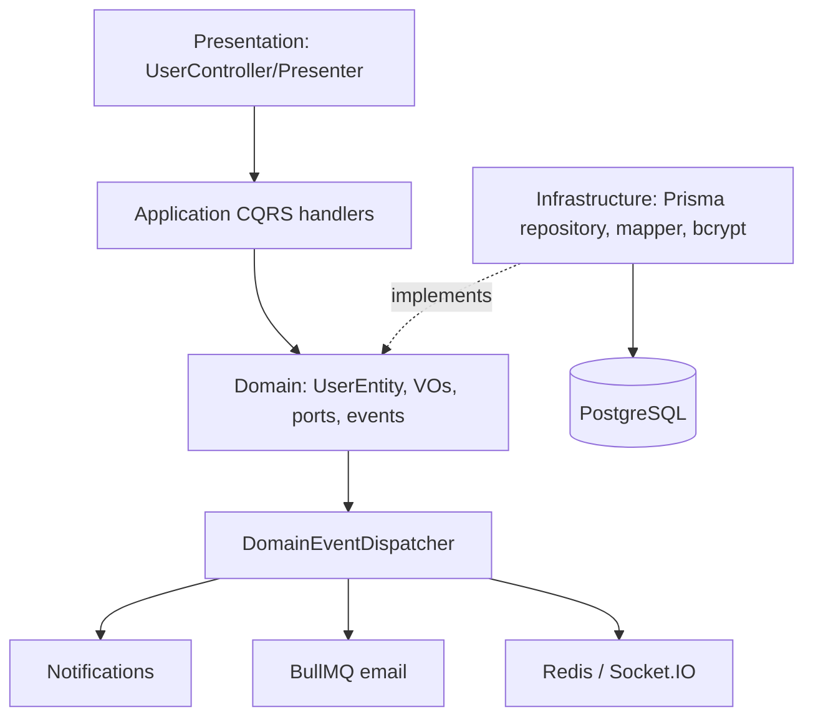
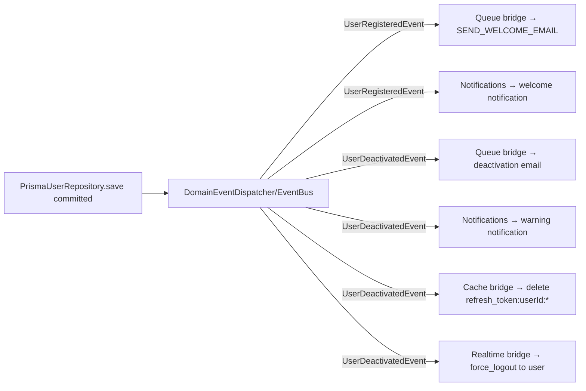

# IAM / Users bounded context

Users là bounded context sở hữu vòng đời user, value objects, persistence user–role, password hashing và các domain event về đăng ký/vô hiệu hóa. Auth dùng nó để xác thực; Roles sở hữu catalog role/permission; Notifications, Queue, Cache và Realtime phản ứng qua event.

## 1. Mô hình và bất biến domain

`UserEntity` là `AggregateRoot`, bao bọc `UserProps` thay vì lộ database model. Các value object `UserId`, `Email`, `Username`, `Password` validate tại biên domain (email, username/password hợp lệ theo implementation). Entity giữ `id`, email, username, password hash, avatar, active/deleted flags, role names và created/updated-by/timestamps.

| Hành vi entity | Tác dụng |
| --- | --- |
| `register` | Active, chưa deleted, role mặc định `USER` (trừ roles được truyền), thêm `UserRegisteredEvent`. |
| `updateInfo`, `updateRoles` | Sửa profile / role names và cập nhật audit fields. |
| `deactivate` | `isActive=false`, thêm `UserDeactivatedEvent`. |
| `activate` | Mở lại, không phát event. |
| `softDelete` | `isDeleted=true`; repository vẫn lưu row. |

`PrismaUserRepository.findById/findByEmail/findAll` chỉ đọc `isDeleted:false`, vì vậy soft-deleted user không đăng nhập và không xuất hiện trong API. `UserPresenter` loại password/hash khỏi mọi response.

## 2. Cấu trúc và dependency direction

| Thư mục | Nội dung |
| --- | --- |
| `domain/` | Entity, value objects, repository/password ports, exceptions, `UserRegisteredEvent`/`UserDeactivatedEvent`. |
| `application/commands` | Create/update/delete/deactivate/toggle-status handlers. |
| `application/queries` | List users và lấy user theo ID. |
| `application/queues` | Constants và BullMQ processor gửi email welcome/deactivation qua Nodemailer. |
| `infrastructure` | `PrismaUserRepository`, mapper từ Prisma, Bcrypt adapter, `UserPermissionFacade`. |
| `presentation` | Controller REST và presenter response. |
| `users.module.ts` | Bind token `'UserRepository'`, `'PasswordHasher'`, facade; đăng ký queue `user-queue`; export cho Auth/Role contexts. |

Repository save chạy transaction: upsert `users`, xóa mọi `user_roles`, resolve role names rồi insert mapping. Nếu entity roles rỗng và user mới, nó tự gán DB role `USER`. Sau transaction, repository publish toàn bộ event bị entity tích lũy.

## 3. API, guards và cache

Mọi endpoint `/users` cần access JWT. Các endpoint quản trị thêm shared `PermissionsGuard`; quyền là permission trong access-token payload (AND logic).

| API | Permission | Thao tác |
| --- | --- | --- |
| `GET /users/me` | chỉ JWT | Profile presenter + `permissions` từ JWT; Redis cache key `users:me:{userId}`, TTL 60 s |
| `GET /users` | `user:read` | Pagination/search/sort, chỉ user chưa deleted |
| `POST /users` | `user:create` | Admin tạo user; body cần email/password, username/roles/avatar tùy chọn |
| `PATCH /users/:id/toggle-status` | `user:update` | Đổi active ↔ inactive |
| `PATCH /users/:id/deactivate` | `user:update` | Luôn inactive |
| `PUT /users/:id` | `user:update` | Cập nhật email, username, avatar, roles |
| `DELETE /users/:id` | `user:delete` | Soft delete, 204 |

`GET /users` chuyển `PaginationQueryDto` thành `GetUsersQuery`. Repository search **chỉ theo email** (case-insensitive); `sortBy` được đưa thẳng vào Prisma orderBy, còn mặc định là `createdAt desc`. Không có cache interceptor trên list dù các mutation invalidate `users:all`; hiện key đó không được list endpoint tạo. Mutation invalidates `users:all` và `users:me:{id}` sau response handler thành công.

Body các mutation là TypeScript inline type, không phải DTO `class-validator`; global pipe không validate property/shape như DTO. `POST` tự kiểm tra email/password; `PUT` chỉ kiểm tra email. Đây là boundary cần củng cố trước khi coi API là public.

## 4. Luồng ghi

### Tạo user (admin hoặc register)

Hai đường dùng cùng entity/repository:

- Auth `RegisterHandler` nhận password raw từ `RegisterDto`, check email, bcrypt hash, `UserEntity.register`, save.
- `CreateUserCommandHandler` làm gần tương tự, nhận field tên `passwordHash` nhưng thực tế đây vẫn là password raw rồi hash trong handler; roles/avatar/createdBy do admin cung cấp.

`save` đồng bộ role bằng **name**. Role name không tồn tại bị bỏ qua; nếu caller truyền mảng roles không rỗng nhưng toàn tên sai, không có mapping role được tạo (fallback `USER` chỉ xảy ra khi roles rỗng với user mới). Nên validate role names ở use case nếu đây không phải hành vi mong muốn.

### Update, deactivate và xóa

`UpdateUserCommandHandler` load user, check trùng email (trừ chính nó), gọi `updateInfo`/`updateRoles`, save. Toggle gọi `deactivate` hay `activate`. Deactivate riêng luôn `deactivate`; gọi trên user đã inactive vẫn thêm một `UserDeactivatedEvent` nếu entity được save. Delete gọi `softDelete` rồi save; repository `save` còn đồng bộ role joins thay vì gọi port `delete` (port method `delete` tồn tại nhưng handler không dùng).

`@AuditLog` có trên create, toggle, update, delete; `PATCH deactivate` không có decorator nên không tạo audit log từ cơ chế global.

## 5. Event-driven hậu xử lý

`UserRegisteredEvent` implements queue-event interface. `UserDeactivatedEvent` implements queue, cache-invalidation và realtime interfaces. Global bridges subscribe `EventBus.subject$`; `UserQueueProcessor` dùng Nodemailer với `MAIL_HOST`, `MAIL_PORT`, `MAIL_FROM`. Notification handlers lắng nghe typed events và dispatch command sang Notifications context. Publish sau transaction có nghĩa DB user đã commit trước khi consumer chạy; không có outbox/retry transaction giữa DB và các side effect.

## 6. Quan hệ Auth/RBAC/realtime

`PrismaUserRepository.getPermissions(userId)` join `user_roles → role → role_permissions → permission`, union tên permission. Auth login/refresh dùng nó để ký JWT; `JwtStrategy` lại load user ở mọi request và chặn inactive/deleted. Khi deactivate, event xóa tất cả refresh session đồng thời gửi Socket.IO `force_logout`; admin client nhận event và gọi logout. Access JWT còn hạn cũng bị `JwtStrategy` chặn do user inactive.

`UserPermissionFacade` là wrapper cho `getPermissions` dưới token `USER_PERMISSION_FACADE`; nó tồn tại để context khác phụ thuộc port thay vì repository nhưng hiện tuyến auth đang inject repository trực tiếp.

## 7. Exception, response và cách thêm use case

Domain/application exception kế thừa `DomainException`; handler trả `Result`, controller `unwrap`, global filter chuẩn hóa lỗi theo error definition trong `@repo/contracts`. `findById` query có thể trả `null`; `/users/me` cũng trả `null` nếu không còn entity, dù guard thường đã kiểm tra tồn tại.

Để thêm mutation: tạo command + handler ở Application, thao tác qua `UserEntity` thay vì sửa primitive, persist qua `UserRepository`, thêm event nếu có side effect liên context, đăng ký provider trong `UsersModule`, rồi expose controller với guard/permission/audit/cache policy. Không đưa password vào presenter, audit detail hay event payload trừ khi thật sự cần.
