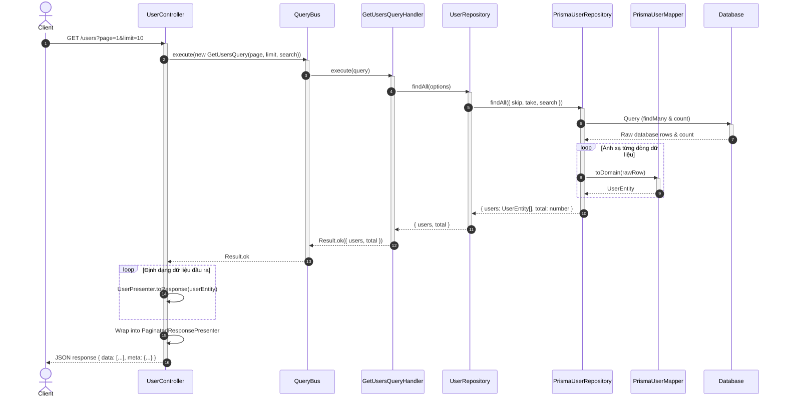
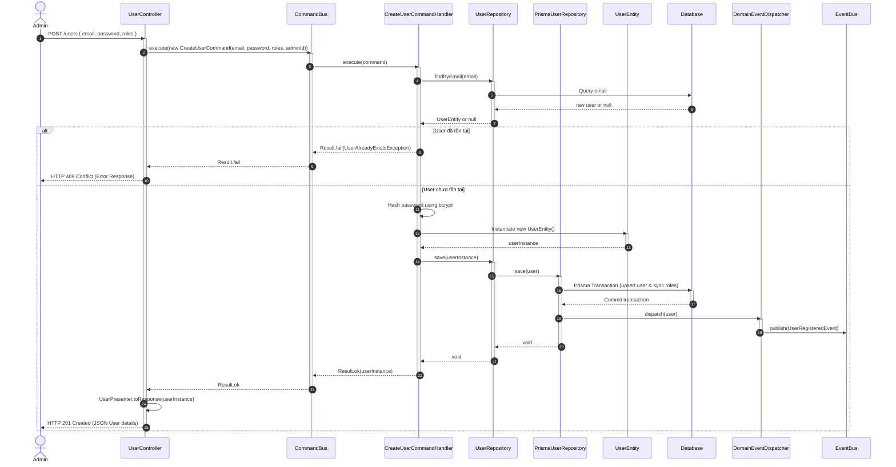

# Tài liệu Kỹ thuật Chi tiết: Module Người dùng (Users Bounded Context)

Tài liệu này cung cấp hướng dẫn lập trình toàn diện, mô tả chi tiết kiến trúc, cấu trúc tệp tin, luồng hoạt động (Data Flow) kèm sơ đồ Mermaid, đặc tả API và các cơ chế bảo mật chéo (Cross-cutting Concerns) của module **Users**.

---

## 1. Nghiệp vụ & Quy tắc cốt lõi (Domain Rules)

Module `Users` được thiết kế theo nguyên lý **Domain-Driven Design (DDD)** với thực thể `User` đóng vai trò là một **Aggregate Root**:

* **Giá trị bất biến (Value Objects)**:
  * `UserId`: Định dạng định danh duy nhất UUID.
  * `Email`: Đảm bảo định dạng chuẩn email, không chứa khoảng trắng và không trống.
  * `Password`: Bảo vệ an toàn dữ liệu mật khẩu thô và mật khẩu đã băm (bcrypt).
* **Trạng thái kích hoạt**: Tài khoản có thể chuyển đổi qua lại giữa hoạt động (`isActive: true`) và khóa/ngưng hoạt động (`isActive: false`).
* **Phân quyền dựa trên vai trò (RBAC)**: Tích hợp bảo vệ các tài nguyên HTTP nhạy cảm dựa trên danh sách quyền hạn lấy từ database (`userPermissions`) thông qua `PermissionsGuard`.

---

## 2. Danh sách Use Cases (CQRS)

Để tối ưu hóa việc phân tách đọc/ghi, module này áp dụng triệt để mẫu thiết kế **CQRS (Command Query Responsibility Segregation)**:

### Nhánh Ghi - Lệnh (Commands)
1. **`CreateUserCommand`**: Tạo tài khoản người dùng mới kèm danh sách vai trò phân quyền.
2. **`UpdateUserCommand`**: Cập nhật thông tin chi tiết của người dùng (Email, Vai trò).
3. **`ToggleUserStatusCommand`**: Chuyển đổi trạng thái hoạt động (Khóa hoặc Kích hoạt lại).
4. **`DeleteUserCommand`**: Đánh dấu xóa tài khoản (Xóa mềm - Soft Delete).

### Nhánh Đọc - Truy vấn (Queries)
1. **`GetUsersQuery`**: Lấy danh sách người dùng hỗ trợ phân trang Server-side, giới hạn bản ghi, và tìm kiếm mờ (Debounced Search).
2. **`GetUserByIdQuery`**: Lấy chi tiết thông tin người dùng dựa trên ID.

---

## 3. Đặc tả API Endpoints

Toàn bộ API được bảo mật bằng cơ chế Token Bearer và kiểm soát phân quyền cụ thể:

| Giao thức | Route | Bảo vệ bằng | Quyền yêu cầu | Trả về | Cache (Redis) |
| :--- | :--- | :--- | :--- | :--- | :--- |
| **GET** | `/users` | `JwtAuthGuard` & `PermissionsGuard` | `user:read` | `PaginatedResult<User>` | Có (120 giây) |
| **GET** | `/users/:id` | `JwtAuthGuard` & `PermissionsGuard` | `user:read` | `User` | Có (60 giây) |
| **POST** | `/users` | `JwtAuthGuard` & `PermissionsGuard` | `user:write` | `User` | Không |
| **PUT** | `/users/:id` | `JwtAuthGuard` & `PermissionsGuard` | `user:write` | `User` | Không (Clear cache) |
| **PATCH** | `/users/:id/toggle-status` | `JwtAuthGuard` & `PermissionsGuard` | `user:write` | `User` | Không (Clear cache) |
| **DELETE** | `/users/:id` | `JwtAuthGuard` & `PermissionsGuard` | `user:write` | `{ success: true }` | Không (Clear cache) |

---

## 4. Chi tiết cấu trúc thư mục và Vai trò từng File

```
users/
├── domain/                                      # LỚP NGHIỆP VỤ LÕI (DOMAIN LAYER)
│   ├── user.entity.ts                           # Thực thể User nghiệp vụ
│   ├── ports/
│   │   └── user.repository.ts                   # Cổng giao tiếp DB (Interface)
│   └── exceptions/                              # Định nghĩa các ngoại lệ nghiệp vụ của User
│       ├── invalid-email.exception.ts
│       ├── invalid-password.exception.ts
│       ├── user-already-exists.exception.ts
│       └── user-not-found.exception.ts
│
├── application/                                 # LỚP ỨNG DỤNG/ĐIỀU HƯỚNG (APPLICATION LAYER)
│   ├── commands/                                # Các hành động thay đổi trạng thái (Ghi)
│   │   ├── create-user.command.ts               # Data object chứa tham số tạo User
│   │   ├── delete-user.command.ts               # Data object xóa User
│   │   ├── toggle-user-status.command.ts        # Data object đổi trạng thái User
│   │   ├── update-user.command.ts               # Data object cập nhật User
│   │   └── handlers/                            # Các bộ xử lý Command tương ứng
│   │       ├── create-user.handler.ts
│   │       ├── delete-user.handler.ts
│   │       ├── toggle-user-status.handler.ts
│   │       └── update-user.handler.ts
│   └── queries/                                 # Các hành động lấy dữ liệu (Đọc)
│       ├── get-users.query.ts                   # Data object chứa bộ lọc tìm kiếm/phân trang
│       ├── get-user-by-id.query.ts              # Data object lấy chi tiết User
│       └── handlers/                            # Các bộ xử lý Query tương ứng
│           ├── get-users.handler.ts
│           └── get-user-by-id.handler.ts
│
├── infrastructure/                              # LỚP HẠ TẦNG (INFRASTRUCTURE LAYER)
│   ├── repositories/
│   │   └── prisma-user.repository.ts            # Cài đặt cụ thể kết nối PostgreSQL qua Prisma
│   └── mappers/
│       └── prisma-user.mapper.ts                # Chuyển đổi Prisma Database Model <=> Domain Entity
│
└── presentation/                                # LỚP GIAO TIẾP (PRESENTATION LAYER)
    ├── controllers/
    │   └── user.controller.ts                   # Đón tiếp HTTP requests (REST API)
    └── presenters/
        └── user.presenter.ts                    # Định dạng JSON trả về cho Client (Evict mật khẩu)
```

---

## 5. Sơ đồ Luồng Hoạt động (Sequence Diagrams)

### Luồng 1: Đọc dữ liệu phân trang (`GET /users?page=1&limit=10`)



---

### Luồng 2: Ghi dữ liệu (`POST /users` - Tạo tài khoản mới)



---

## 6. Chi tiết hoạt động đi qua các Tầng (Layer Transition)

Dưới đây là hành trình của luồng dữ liệu đi qua từng tệp tin từ ngoài vào trong:

```
[Presentation] -> [Application] -> [Domain] -> [Infrastructure]
```

### Tầng 1: Presentation (Đón nhận & Xuất bản)

#### 1. `presentation/controllers/user.controller.ts`
* **Nhiệm vụ**: Nhận và lọc thô dữ liệu đầu vào.
* **Hoạt động**:
  1. Nhận các tham số hoặc body từ HTTP request.
  2. Sử dụng `ValidationPipe` (class-validator) để tự động check định dạng.
  3. Đóng gói dữ liệu sạch vào đối tượng **Command** hoặc **Query** nghiệp vụ (ví dụ: `new CreateUserCommand(email, password, roles)`).
  4. Dispatch qua `CommandBus` hoặc `QueryBus` của NestJS để chuyển giao việc xử lý cho tầng Application. Không tự xử lý DB tại đây.

#### 2. `presentation/presenters/user.presenter.ts`
* **Nhiệm vụ**: Định dạng dữ liệu output.
* **Hoạt động**:
  1. Sau khi Command/Query xử lý xong và trả về `UserEntity` của tầng Domain.
  2. Presenter nhận Entity này và ánh xạ sang dạng DTO trả ra ngoài (Client Response).
  3. Lọc bỏ các thông tin nhạy cảm: **Tuyệt đối loại bỏ password hash, mã bảo mật**.

---

### Tầng 2: Application (Điều phối luồng dữ liệu)

#### 3. `application/commands/create-user.command.ts` (và các file `.query.ts`)
* **Nhiệm vụ**: Khai báo cấu trúc tham số nghiệp vụ.
* **Hoạt động**:
  1. Chỉ là các `class` đơn giản với các thuộc tính ở dạng `readonly`.
  2. Đảm bảo dữ liệu không bị thay đổi (immutable) trong quá trình di chuyển giữa các tầng.

#### 4. `application/commands/handlers/create-user.handler.ts` (và các file `*handler.ts`)
* **Nhiệm vụ**: Điều phối và giải quyết kịch bản nghiệp vụ (Use Case).
* **Hoạt động**:
  1. Được gắn decorator `@CommandHandler(CreateUserCommand)`.
  2. Nhận Command, inject interface `UserRepository` (Port) để kiểm tra các điều kiện tiên quyết (ví dụ: kiểm tra trùng lặp email).
  3. Nếu điều kiện tiên quyết bị vi phạm, lập tức trả về `Result.fail(...)`.
  4. Nếu hợp lệ, tiến hành mã hóa thông tin (ví dụ: mã hóa mật khẩu bằng `bcrypt.hash`).
  5. Gọi hàm tạo của `UserEntity` để khởi tạo thực thể nghiệp vụ.
  6. Truyền thực thể đó cho `UserRepository` để lưu trữ.
  7. Trả về kết quả bọc trong `Result.ok(userEntity)`.

---

### Tầng 3: Domain (Trái tim của nghiệp vụ)

#### 5. `domain/user.entity.ts`
* **Nhiệm vụ**: Chứa logic nghiệp vụ cốt lõi, điều kiện hợp lệ nội tại của thực thể.
* **Hoạt động**:
  1. Quản lý trạng thái nội tại của User (ví dụ: trạng thái `isActive`, các quyền `roles` đã gán).
  2. Cung cấp các phương thức nghiệp vụ để thay đổi trạng thái thay vì cho phép gán trực tiếp (ví dụ: phương thức `deactivate()`, `changeEmail()`).
  3. Đảm bảo Entity luôn ở trạng thái hợp lệ (Valid State). Không chứa bất kỳ framework code nào (như NestJS hay Prisma).

#### 6. `domain/ports/user.repository.ts`
* **Nhiệm vụ**: Cổng giao tiếp dữ liệu trừu tượng (Port).
* **Hoạt động**:
  1. Định nghĩa các interface/hàm dùng để giao tiếp với DB (ví dụ: `save()`, `findById()`, `findAll()`).
  2. Giúp tầng Application và Domain hoàn toàn độc lập với công nghệ lưu trữ. Họ chỉ cần biết "hàm này tồn tại", không cần biết DB được chọc như thế nào.

---

### Tầng 4: Infrastructure (Hiện thực hóa & Lưu trữ vật lý)

#### 7. `infrastructure/repositories/prisma-user.repository.ts`
* **Nhiệm vụ**: Cài đặt kết nối vật lý xuống database (Adapter).
* **Hoạt động**:
  1. Triển khai (implement) interface `UserRepository` ở tầng Domain.
  2. Sử dụng `PrismaService` để viết các câu lệnh truy vấn xuống PostgreSQL.
  3. Chịu trách nhiệm thực hiện các transaction ở DB (như lưu đồng thời User và ánh xạ bảng Role liên kết).
  4. Tự động giải phóng các sự kiện miền (Domain Events) bằng cách gọi `DomainEventDispatcher.dispatch(user)` ngay sau khi giao dịch thành công.
  5. Gọi Mapper để chuyển đổi dữ liệu thô từ DB thành `UserEntity` nghiệp vụ rồi mới trả lại cho Handler.

#### 8. `infrastructure/mappers/prisma-user.mapper.ts`
* **Nhiệm vụ**: Cầu nối chuyển đổi mô hình dữ liệu.
* **Hoạt động**:
  1. `toDomain(rawModel)`: Chuyển đổi dữ liệu bảng PostgreSQL thô do Prisma trả về thành đối tượng `UserEntity` chuẩn của Domain.
  2. `toPersistence(userEntity)`: Chuyển ngược lại thực thể `UserEntity` thành cấu trúc bảng DB để Prisma có thể thực hiện câu lệnh Insert/Update.

---

## 7. Các cơ chế Bảo vệ chéo (Cross-cutting Concerns)

### A. Phân quyền chặt chẽ (RBAC)
Tại tệp **[user.controller.ts](file:///d:/Workspaces/Repo/turborepo-advanced-starter/apps/server/src/contexts/iam/users/presentation/controllers/user.controller.ts)**:
```typescript
@Get()
@UseGuards(PermissionsGuard)
@RequirePermissions('user:read')
```
* **`PermissionsGuard`**: Lấy danh sách các quyền hạn của tài khoản đang đăng nhập trong cơ sở dữ liệu và đối sánh nghiêm ngặt. Nếu thiếu quyền `'user:read'`, request bị ngắt và trả về lỗi **HTTP 403 Forbidden** trước khi đi vào logic nghiệp vụ.

### B. Cơ chế ghi nhật ký hoạt động (Audit Logs Interceptor)
Mọi hành động thay đổi dữ liệu của Admin đều được giám sát tự động bằng tầng Interceptor:
```typescript
@Post()
@AuditLog('USER_CREATE', (req) => `Tạo tài khoản mới: ${req.body.email} với quyền: ${req.body.roles?.join(', ')}`)
```
* **`AuditLogInterceptor`**: Đọc Metadata từ decorator, nếu request kết thúc thành công, nó sẽ tự động thu thập IP, User-Agent, Email của Admin đang thực thi và lưu một bản ghi lịch sử xuống bảng `audit_logs` một cách bất đồng bộ để không ảnh hưởng đến độ trễ phản hồi của client.

### C. Quản lý Cache tự động (Cache Invalidation)
Để tránh tình trạng trả về dữ liệu cũ (stale data) cho người dùng, các API thay đổi trạng thái sẽ đi kèm bộ quét dọn bộ nhớ cache:
```typescript
@Put(':id')
@UseInterceptors(CacheInvalidationInterceptor)
@InvalidateCache('users:all', 'users:me:{id}')
```
* Khi thực hiện cập nhật thành công, Cache Interceptor sẽ tự động xóa bản lưu tạm danh sách người dùng (`users:all`) và chi tiết người dùng đó (`users:me:{id}`) trong Redis Cache, ép buộc các request đọc tiếp theo phải truy vấn thông tin mới nhất từ cơ sở dữ liệu.
