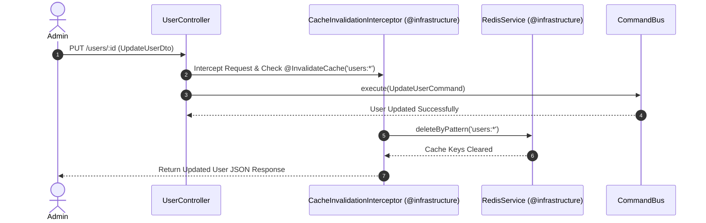

# 👤 Users Bounded Context Documentation

Bounded Context **Users** chịu trách nhiệm quản lý **Thực thể Người dùng (User Aggregate Root)**, thông tin tài khoản, trạng thái hoạt động và tích hợp xử lý hàng chờ bất đồng bộ (Background Queues).

---

## 🏛️ 1. Cấu Trúc Thư Mục Clean Architecture

```text
contexts/iam/users/
├── domain/                                ─── [Domain Layer]
│   ├── user.entity.ts                     # User Aggregate Root (Entities & Value Objects)
│   ├── exceptions/                        # User Domain Exceptions
│   │   ├── user-not-found.exception.ts
│   │   └── user-deactivated.exception.ts
│   └── ports/                             # Domain Interfaces
│       ├── user.repository.ts             # UserRepository Port Interface
│       └── password-hasher.ts             # PasswordHasher Port Interface
│
├── application/                           ─── [Application Layer / CQRS]
│   ├── commands/                          # Create, Update, Delete, ToggleStatus Commands & Handlers
│   ├── queries/                           # GetUsers, GetUserById Queries & Handlers
│   └── queues/                            # Background Job Queue Processor
│       ├── user-queue.constants.ts        # USER_QUEUE Constant
│       └── user-queue.processor.ts        # BullMQ Worker Processor
│
├── infrastructure/                        ─── [Infrastructure Layer]
│   ├── repositories/
│   │   └── prisma-user.repository.ts      # Prisma Adapter triển khai UserRepository
│   ├── services/
│   │   └── bcrypt-password-hasher.ts      # Bcrypt Adapter triển khai PasswordHasher
│   └── mappers/
│       └── prisma-user.mapper.ts          # Mapper chuyển đổi giữa Prisma Model <-> UserEntity
│
└── presentation/                          ─── [Presentation Layer]
    ├── controllers/
    │   └── user.controller.ts             # REST API Controller
    └── presenters/
        └── user.presenter.ts              # Presenter format User Response JSON
```

---

## ⚡ 2. Cơ Chế Cache Invalidation (Cache Eviction Sequence)

Dự án áp dụng Interceptor tự động vô hiệu hóa Cache Redis khi có thao tác làm thay đổi dữ liệu (Mutation Commands):



---

## 🔑 3. Các Điểm Nổi Bật Về Thiết Kế

1. **User Aggregate Root (`user.entity.ts`)**:
   - Chứa toàn bộ luật nghiệp vụ miền (Business Rules) liên quan đến User như `deactivate()`, `changePassword()`.
2. **Loại bỏ `UserPermissionFacade`**:
   - Việc kiểm tra phân quyền hiện tại đã được thực hiện bằng **Stateless JWT Payload** (`@GetUser('permissions')`), loại bỏ hoàn toàn việc `UsersModule` phải xuất Facade query DB.
3. **Queue Processing (`user-queue.processor.ts`)**:
   - Đăng ký BullMQ Queue xử lý các tác vụ nền như gửi Email chào mừng, tính toán chỉ số người dùng mà không làm nghẽn Main Loop.
