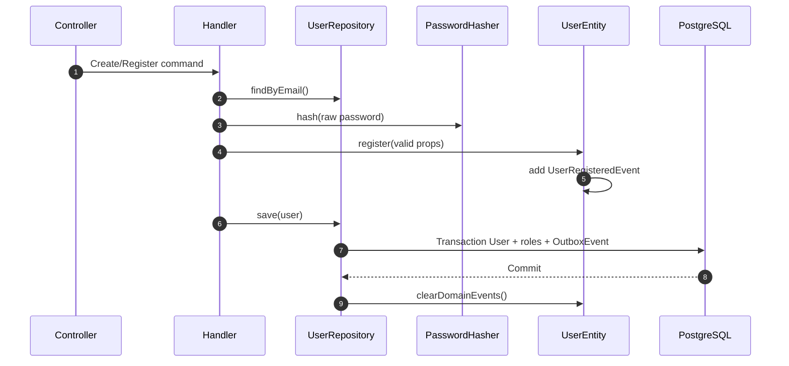

# Users Bounded Context

Users sở hữu User aggregate: danh tính nội bộ, profile, password hash, role assignments, trạng thái active/deleted và version dùng để thu hồi token. Đây là nơi đặt mọi invariant liên quan đến vòng đời tài khoản.

## 1. Ranh giới và ownership

Users sở hữu:

- User entity và value objects;
- create/update/deactivate/delete/toggle state use cases;
- persistence User và UserRole;
- password hashing port;
- các domain event mô tả thay đổi User.

Users không sở hữu token signing hoặc refresh sessions; đó là Auth. Users cũng không tự gửi email, tạo notification hoặc push Socket.IO. Nó chỉ phát domain fact, sau đó outbox infrastructure route side effect.

## 2. Aggregate model

`UserEntity` là aggregate root. State chính gồm identity, email, username, password hash, avatar, roles, active/deleted flags, tokenVersion và audit timestamps.

Aggregate bảo vệ state transition:

- `register()` tạo user mới active, chưa deleted, version bằng 0 và phát `UserRegisteredEvent`.
- `updateInfo()` thay email/username/avatar, tăng tokenVersion và cập nhật audit fields.
- `updateRoles()` đổi role assignments và tăng tokenVersion.
- `deactivate()` tắt truy cập, tăng tokenVersion và phát `UserDeactivatedEvent`.
- `activate()`, `softDelete()` và `restore()` thay trạng thái và revoke token cũ bằng version.

Token version thuộc aggregate vì nó biểu diễn revision của quyền truy cập User, không phải chi tiết JWT.

## 3. Value objects

`UserId`, `Email`, `Username` và `Password` đảm bảo dữ liệu không hợp lệ không thể âm thầm đi vào aggregate. DTO validation tạo phản hồi HTTP sớm; value object bảo vệ domain ở mọi entry point.

Password value object giữ hash, không giữ raw password. Raw password chỉ tồn tại ngắn trong command boundary và được xử lý qua `PasswordHasher`.

## 4. Cấu trúc code

```text
users/
├── domain/
│   ├── user.entity.ts
│   ├── value-objects/
│   ├── events/
│   ├── exceptions/
│   └── ports/
│       ├── user.repository.ts
│       └── password-hasher.ts
├── application/
│   ├── commands/ + handlers/
│   ├── queries/ + handlers/
│   └── queues/
├── infrastructure/
│   ├── repositories/prisma-user.repository.ts
│   ├── mappers/prisma-user.mapper.ts
│   └── services/bcrypt-password-hasher.ts
├── presentation/
│   ├── controllers/
│   ├── dtos/
│   └── presenters/
└── users.module.ts
```

## 5. Create user flow

Admin create và public register đều cuối cùng phải tạo User aggregate theo invariant thống nhất, dù command entry khác nhau.


```mermaid
sequenceDiagram
    autonumber
    participant Controller
    participant Handler
    participant Repo as UserRepository
    participant Hasher as PasswordHasher
    participant User as UserEntity
    participant DB as PostgreSQL

    Controller->>Handler: Create/Register command
    Handler->>Repo: findByEmail()
    Handler->>Hasher: hash(raw password)
    Handler->>User: register(valid props)
    User->>User: add UserRegisteredEvent
    Handler->>Repo: save(user)
    Repo->>DB: Transaction User + roles + OutboxEvent
    DB-->>Repo: Commit
    Repo->>User: clearDomainEvents()
```

Nếu email đã tồn tại, handler trả domain error trước khi hash/save. Nếu transaction thất bại, cả User lẫn outbox đều rollback.

## 6. Deactivation và side effects

Khi admin deactivate account, entity chỉ thay state và ghi event. Sau transaction, outbox router:

1. xóa refresh sessions bằng cache port;
2. enqueue deactivation email với eventId làm jobId;
3. tạo notification bằng deterministic id;
4. push `force_logout` qua realtime.

Side effect không nằm trong entity hoặc handler vì nó có failure/retry lifecycle khác database transaction.

## 7. Persistence và transaction boundary

`PrismaUserRepository` hiện thực `UserRepository`. Mapper chuyển Prisma record sang aggregate; `toPrimitives()` chuyển aggregate về dữ liệu persistence có kiểu.

`save()` thực hiện trong một transaction:

- upsert User;
- đồng bộ UserRole join records;
- insert mọi domain event vào OutboxEvent.

Domain events chỉ được clear sau commit. Nếu clear trước commit và transaction thất bại, retry sẽ mất event.

Repository không tự quyết định business transition. Nó chỉ lưu state aggregate đã được domain xác nhận.

## 8. Read flow và response safety

`GetUsersQuery` hỗ trợ pagination, search và sort allowlist. DTO không cho client truyền tên cột tùy ý. Repository dùng Prisma typed input thay cho dynamic `any`.

`UserPresenter` là response allowlist. Nó trả profile/status/roles/audit fields cần thiết, nhưng không trả:

- password hash;
- tokenVersion;
- domain event nội bộ;
- persistence join records.

`GET /users/me` có cache theo user id. Mutation invalidate cache sau khi command thành công.

## 9. API surface

| Endpoint                         | Permission    | Hành vi              |
| -------------------------------- | ------------- | -------------------- |
| `GET /users/me`                  | Authenticated | Profile hiện tại     |
| `GET /users`                     | `USER.READ`   | Danh sách users      |
| `POST /users`                    | `USER.CREATE` | Admin tạo user       |
| `PUT /users/:id`                 | `USER.UPDATE` | Update profile/roles |
| `PATCH /users/:id/toggle-status` | `USER.UPDATE` | Toggle active state  |
| `PATCH /users/:id/deactivate`    | `USER.UPDATE` | Deactivate rõ nghĩa  |
| `DELETE /users/:id`              | `USER.DELETE` | Soft delete          |

Controller gắn guard, permission, audit và cache metadata. Mọi business mutation phải đi qua command handler.

## 10. Queue worker

`user-queue.processor.ts` là BullMQ consumer gửi welcome/deactivation email. Worker nhận typed job data và trả typed result.

Worker là application-side consumer nhưng delivery được khởi tạo từ outbox router. Job phải idempotent hoặc dùng deterministic jobId vì outbox có at-least-once semantics.

Mail failure không rollback User transaction. BullMQ chịu retry policy của background delivery.

## 11. Ý nghĩa từng nhóm file

`domain/user.entity.ts` là nguồn sự thật của state transition. `domain/events` chỉ mô tả fact nghiệp vụ. `domain/ports` định nghĩa capability cần từ persistence/crypto.

Application commands/queries diễn tả use case. Handler phối hợp port và entity. `application/queues` là consumer cho background job.

Infrastructure mapper/repository/service nối domain với Prisma và bcrypt.

Presentation DTO/controller/presenter nối HTTP với application và bảo vệ response.

## 12. Invariant bắt buộc

- Email và username phải hợp lệ trước khi entity tồn tại.
- Raw password không được persistence hoặc log.
- Mutation ảnh hưởng quyền truy cập phải tăng tokenVersion.
- Deleted/inactive user không được authenticate.
- User change và domain event phải commit atomically.
- Role assignment chỉ dùng role thực sự tồn tại.
- Response không được lộ password hash/tokenVersion.

## 13. Cách thêm mutation mới

Ví dụ thêm restore endpoint:

1. xác nhận `UserEntity.restore()` thể hiện đủ invariant;
2. thêm command và handler;
3. handler tải aggregate và gọi entity;
4. save qua repository để giữ outbox semantics;
5. thêm DTO/route/permission/audit/cache metadata;
6. unit test tokenVersion/state transition;
7. E2E authorization và token cũ;
8. cập nhật tài liệu nếu có event/side effect mới.

Không được thêm `prisma.user.update()` trực tiếp trong controller hoặc handler chỉ vì mutation nhỏ.

## 14. Anti-pattern

- Anemic entity chỉ chứa getter/setter.
- Controller tự quyết định active/deleted state.
- Repository tự tăng tokenVersion mà domain không biết.
- Event gọi Redis/queue/realtime.
- Clear event trước commit.
- Sort column nhận string tùy ý từ client.
- Presenter trả toàn bộ `toPrimitives()`.

## 15. Checklist review Users

- State transition có nằm trong aggregate không?
- Mutation có cần revoke token hoặc domain event không?
- Repository có giữ transaction User + roles + outbox không?
- Side effect có idempotent/retry không?
- DTO và presenter có allowlist rõ không?
- Unit test có kiểm tra invariant, version và event không?
