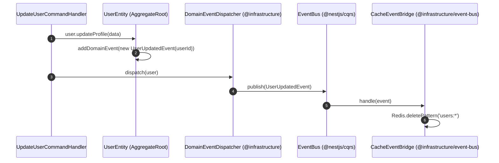

# 🏛️ Master System Architecture & Design Patterns Guide

Tài liệu này là **Cuốn Cẩm Nang Giáo Khoa Chi Tiết Về Kiến Trúc Hệ Thống (Master Architecture Guide)** của dự án Monorepo `turborepo-advanced-starter`. Tài liệu giải thích bản chất lý thuyết, nguyên lý thiết kế và minh họa trực tiếp bằng mã nguồn thực tế trong dự án cho người mới bắt đầu.

---

## 📚 MỤC LỤC
1. [Clean Architecture & Hexagonal Architecture (Ports & Adapters)](#1-clean-architecture--hexagonal-architecture-ports--adapters)
2. [Domain-Driven Design (DDD) & Shared Kernel](#2-domain-driven-design-ddd--shared-kernel)
3. [CQRS (Command Query Responsibility Segregation)](#3-cqrs-command-query-responsibility-segregation)
4. [Event-Driven Architecture (EDA) & Event Bridges](#4-event-driven-architecture-eda--event-bridges)
5. [Enterprise Security Architecture (Hybrid JWT & RBAC)](#5-enterprise-security-architecture-hybrid-jwt--rbac)
6. [Resilience & Performance (Redis Caching & BullMQ Queues)](#6-resilience--performance-redis-caching--bullmq-queues)

---

## 1. Clean Architecture & Hexagonal Architecture (Ports & Adapters)

### 🧠 Lý thuyết là gì?
**Clean Architecture** (do Robert C. Martin / Uncle Bob đề xuất) và **Hexagonal Architecture** (do Alistair Cockburn đề xuất) là các kiểu kiến trúc phần mềm chia mã nguồn thành các **lớp đồng tâm**.

**Quy tắc cốt lõi (The Dependency Rule)**: 
> *Sự phụ thuộc chỉ được phép hướng từ ngoài vào trong.* Lõi nghiệp vụ (Domain) nằm ở trung tâm và **tuyệt đối không phụ thuộc** vào bất kỳ Framework (NestJS), Database (Prisma/Postgres) hay thư viện bên ngoài nào.

```text
 ┌───────────────────────────────────────────────────────────┐
 │ PRESENTATION LAYER (Controllers, DTOs, Guards, Filters)   │
 │   ┌───────────────────────────────────────────────────┐   │
 │   │ APPLICATION LAYER (CQRS Commands, Queries)        │   │
 │   │   ┌───────────────────────────────────────────┐   │   │
 │   │   │ DOMAIN LAYER (Entities, Ports, Rules)     │   │   │
 │   │   └───────────────────────────────────────────┘   │   │
 │   └───────────────────────────────────────────────────┘   │
 └───────────────────────────────────────────────────────────┘
   ▲ Infrastructure Layer (Prisma, Redis, BullMQ) triển khai Ports
```

### 🧩 Ports & Adapters trong dự án:
- **Port (Cổng giao tiếp - Interface)**: Nằm ở tầng Domain (`shared/domain/ports/` hoặc `context/domain/ports/`). Nó là một hợp đồng Interface định nghĩa *hệ thống cần làm gì* (ví dụ: `ISessionStore`, `UserRepository`), nhưng **không biết** dữ liệu được lưu ở đâu.
- **Adapter (Bộ biến đổi - Implementation)**: Nằm ở tầng Infrastructure (`infrastructure/` hoặc `context/infrastructure/`). Nó triển khai chi tiết kỹ thuật cho Port (ví dụ: `RedisSessionStore` triển khai `ISessionStore`, `PrismaUserRepository` triển khai `UserRepository`).

#### 💻 Minh họa code thực tế:
```typescript
// 1. PORT (Domain Layer) - src/contexts/iam/auth/domain/ports/session-store.port.ts
export const SESSION_STORE = Symbol('SESSION_STORE');
export interface ISessionStore {
    saveRefreshToken(userId: string, jti: string, sessionData: SessionData, ttl: number): Promise<void>;
    isRefreshTokenValid(userId: string, jti: string): Promise<boolean>;
    revokeRefreshToken(userId: string, jti: string): Promise<void>;
}

// 2. ADAPTER (Infrastructure Layer) - src/contexts/iam/auth/infrastructure/stores/redis-session.store.ts
@Injectable()
export class RedisSessionStore implements ISessionStore {
    constructor(private readonly redisService: RedisService) {}

    async isRefreshTokenValid(userId: string, jti: string): Promise<boolean> {
        const data = await this.redisService.get(`refresh_token:${userId}:${jti}`);
        return !!data;
    }
}
```

---

## 2. Domain-Driven Design (DDD) & Shared Kernel

### 🧠 Lý thuyết là gì?
**Domain-Driven Design (DDD)** là phương pháp thiết kế phần mềm lấy **Miền nghiệp vụ (Domain)** làm trung tâm. Thay vì thiết kế cơ sở dữ liệu trước, DDD tập trung xây dựng mô hình bài toán thực tế.

### 🔑 Các khái niệm cốt lõi trong DDD:

1. **Bounded Context (Miền giới hạn)**:
   - Là một ranh giới rõ ràng nơi một mô hình nghiệp vụ có hiệu lực.
   - Trong dự án này, hệ thống được chia làm các Bounded Contexts độc lập tại `apps/server/src/contexts/`:
     - `iam/auth`: Xác thực & Quản lý phiên.
     - `iam/users`: Quản lý tài khoản & Thực thể người dùng.
     - `iam/roles`: Quản lý vai trò & Quyền hạn RBAC.
     - `audit`: Ghi nhật ký vết tuân thủ hệ thống (Độc lập với IAM).
     - `analytics`: Báo cáo chỉ số kinh doanh.

2. **Shared Kernel (Lõi dùng chung thuần khiết - `src/shared/`)**:
   - Khái niệm **Shared Kernel** là phần mã nguồn miền được chia sẻ giữa tất cả các Bounded Contexts.
   - **Quy tắc vàng**: `shared/` chỉ chứa **Pure Domain Kernel** (`Result<T, E>`, `AggregateRoot`, `DomainException`, Ports) và **0% NestJS/Framework dependency**.
   - Các thành phần liên quan đến NestJS Framework HTTP được chuyển về **`src/presentation/`**, các thành phần kĩ thuật chuyển về **`src/infrastructure/`**.

3. **Aggregate Root & Entities**:
   - **Entity**: Đơn vị nghiệp vụ có danh tính (ID) duy nhất và vòng đời.
   - **Aggregate Root**: Là Thực thể gốc đứng đầu một cụm đối tượng, chịu trách nhiệm bảo vệ **Tính toàn vẹn nghiệp vụ (Invariants)**.
   - Ví dụ: `UserEntity` (`apps/server/src/contexts/iam/users/domain/user.entity.ts`) kế thừa `AggregateRoot`. Khi đổi mật khẩu hoặc deactivate user, mọi thay đổi phải đi qua các hàm của `UserEntity`.

#### 💻 Minh họa Result Pattern & AggregateRoot:
```typescript
// src/shared/domain/base/result.ts
export class Result<T, E = Error> {
    private constructor(
        public readonly isSuccess: boolean,
        private readonly _value?: T,
        private readonly _error?: E
    ) {}

    public static ok<T, E>(value?: T): Result<T, E> {
        return new Result<T, E>(true, value, undefined);
    }

    public static fail<T, E>(error: E): Result<T, E> {
        return new Result<T, E>(false, undefined, error);
    }

    public unwrap(): T {
        if (!this.isSuccess) throw this._error;
        return this._value!;
    }
}
```

---

## 3. CQRS (Command Query Responsibility Segregation)

### 🧠 Lý thuyết là gì?
**CQRS** là mẫu kiến trúc **tách biệt hoàn toàn luồng Ghi (Command) và luồng Đọc (Query)** của ứng dụng.

```text
               ┌────────────────────────────────────────────────────────┐
               │                    CONTROLLER                          │
               └──────────────┬──────────────────────────┬──────────────┘
                              │                          │
                 (Mutation)   │                          │  (Read-only)
                              ▼                          ▼
               ┌────────────────────────┐      ┌────────────────────────┐
               │    COMMAND BUS         │      │     QUERY BUS          │
               └──────────┬─────────────┘      └─────────┬──────────────┘
                          │                              │
                          ▼                              ▼
               ┌────────────────────────┐      ┌────────────────────────┐
               │  LoginCommandHandler   │      │ GetUsersQueryHandler   │
               └──────────┬─────────────┘      └─────────┬──────────────┘
                          │                              │
                          ▼ (Write/Side-effect)          ▼ (Read Cache/DB)
                [DB / Redis Session]             [Prisma Read Only]
```

### 🎯 Phân biệt Command và Query trong dự án:
- **Command (Tác vụ Ghi/Thay đổi)**: Có Side-effect (thay đổi DB, ghi Redis, gửi mail, rotate token). Trả về `Result<T, DomainException>`.
  - Ví dụ: `RegisterCommand`, `LoginCommand` (ghi session Redis), `RefreshCommand` (rotate token), `UpdateUserCommand`.
- **Query (Tác vụ Đọc)**: Chỉ đọc dữ liệu, tuyệt đối **không được làm thay đổi trạng thái hệ thống**.
  - Ví dụ: `GetUsersQuery`, `GetActiveSessionsQuery`, `GetDashboardStatsQuery`.

#### 💻 Minh họa Controller gọi CQRS CommandBus:
```typescript
// src/contexts/iam/auth/presentation/controllers/auth.controller.ts
@Post('login')
@HttpCode(HttpStatus.OK)
async login(@Body() dto: LoginDto, @ClientInfo() client: ClientInfo) {
    // Controller gửi Command qua CommandBus, không xử lý logic trực tiếp
    const result = await this.commandBus.execute(
        new LoginCommand(dto.email, dto.password, client.ip, client.userAgent)
    );
    return result.unwrap();
}
```

---

## 4. Event-Driven Architecture (EDA) & Event Bridges

### 🧠 Lý thuyết là gì?
**Event-Driven Architecture (EDA)** là kiến trúc dựa trên sự kiện. Khi một hành động nghiệp vụ xảy ra ở một nơi, hệ thống sẽ phát ra một **Domain Event**. Các thành phần khác lắng nghe event này và xử lý độc lập mà không bị ràng buộc trực tiếp (**Decoupling**).

### 🌉 Architecture Bridges (`src/infrastructure/event-bus/bridges/`):
Để giữ cho Domain Kernel thuần khiết, dự án triển khai các **Event Bridges** ở tầng Infrastructure:
- **`cache.bridge.ts`**: Lắng nghe `CacheInvalidationEvent` ➔ Gọi `RedisService` xóa cache.
- **`queue.bridge.ts`**: Lắng nghe `QueueEvent` ➔ Đẩy công việc vào BullMQ Worker.
- **`realtime.bridge.ts`**: Lắng nghe `RealtimeEvent` ➔ Phát thông báo WebSocket qua Socket.io Gateway.



---

## 5. Enterprise Security Architecture (Hybrid JWT & RBAC)

### 🧠 Mô hình Auth Hybrid (Stateless Access + Stateful Refresh)
Dự án áp dụng mô hình bảo mật kết hợp tối ưu giữa **Hiệu năng (Performance)** và **Khả năng Kiểm soát (Control)**:

1. **Access Token (Short-lived 15m) ➔ Pure Stateless Validation**:
   - Token chứa `sub`, `email`, `roles`, `permissions`.
   - `JwtStrategy` (`src/infrastructure/strategies/jwt.strategy.ts`) kiểm tra chữ ký token bằng JWT Secret và nhả trực tiếp payload (**0 DB Query**).
   - Kiểm tra quyền truy cập API tính bằng Microsecond.

2. **Refresh Token (Long-lived 7d) ➔ Stateful Session Storage**:
   - Mỗi lần Đăng nhập tạo ra 1 `jti` (JWT ID) duy nhất.
   - Lưu trữ thông tin Session (`jti`, `ip`, `userAgent`, `createdAt`) trong Redis qua `ISessionStore`.
   - Cho phép Đăng xuất (Revoke JTI), Đăng xuất khỏi mọi thiết bị (`revokeAllUserSessions`), Quản lý danh sách phiên đang hoạt động.

### 🛡️ RBAC (Role-Based Access Control) Với Contracts:
- Danh sách quyền hạn (`PermissionType`) được định nghĩa tập trung tại gói dùng chung `@repo/contracts`.
- Các hàm tiện ích so sánh quyền (`hasAllPermissions`, `hasAnyPermission`, `hasPermission`) nằm tại `@repo/contracts/auth/permission-utils.ts`.
- `PermissionsGuard` (`src/presentation/guards/permissions.guard.ts`) lấy `permissions` từ JWT Payload và kiểm tra quyền tức thì không cần query DB.

---

## 6. Resilience & Performance (Redis Caching & BullMQ Queues)

### 🚀 Automatic Cache Invalidation
- Các truy vấn GET được cache tự động bằng `@CacheKey('users:list')`.
- Các tác vụ ghi (PUT/POST/DELETE) được gắn Decorator `@InvalidateCache('users:*')`.
- `CacheInvalidationInterceptor` (`src/infrastructure/cache/interceptors/cache-invalidation.interceptor.ts`) sẽ tự động xóa tất cả cache pattern tương ứng khi Mutation thành công.

### 📦 Async Background Jobs (BullMQ)
- Các tác vụ tốn thời gian (gửi Mail chào mừng, xử lý hình ảnh, tính toán số liệu) được đẩy vào BullMQ Queue (`QueueModule` & `BullmqQueueAdapter`).
- Worker Processors (`user-queue.processor.ts`) chạy ngầm ở Background, giúp HTTP Request trả về ngay lập tức cho Client mà không bị treo connection.

---

## 🏁 Lời Kết
Kiến trúc này đảm bảo 3 tiêu chí vàng của phần mềm Enterprise:
1. **Maintainability (Dễ bảo trì)**: Code chia theo Bounded Context & Layers rõ ràng.
2. **Testability (Dễ kiểm thử)**: Có thể viết Unit Test cho Domain & CQRS Handlers mà không cần bật Database hay Redis.
3. **Scalability (Dễ mở rộng)**: Dễ dàng tách bất kỳ Bounded Context nào thành Microservice độc lập trong tương lai.
