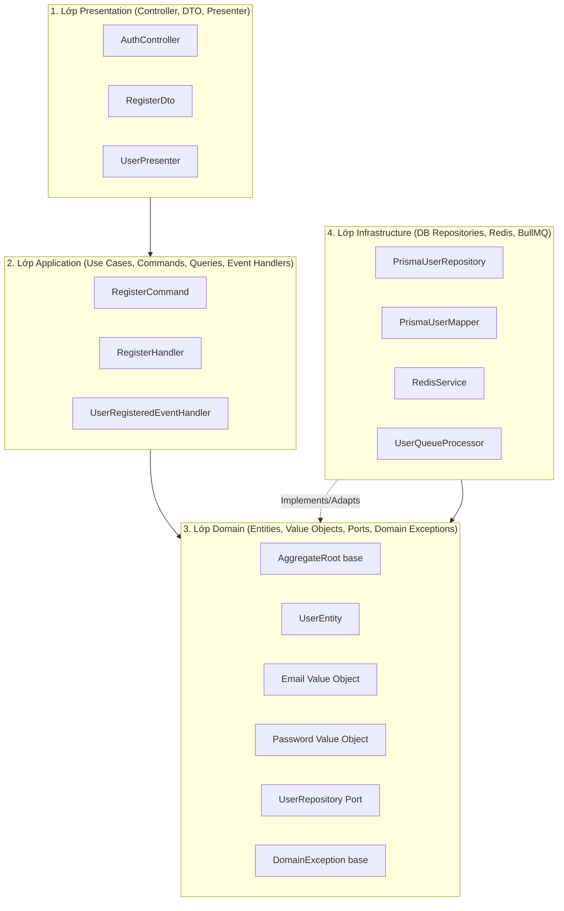

# Tài Liệu Thiết Kế Kiến Trúc Backend API Server (NestJS - Clean Architecture - DDD - EDA)

Tài liệu này trình bày chi tiết về cấu trúc mã nguồn, các quyết định thiết kế kiến trúc cao cấp và luồng chạy thực tế của dự án `apps/server`. Dự án áp dụng mô hình **Clean Architecture (Hexagonal Architecture)** kết hợp với **DDD (Domain-Driven Design)**, **CQRS (Command Query Responsibility Segregation)**, **EDA (Event-Driven Architecture)**, **Redis Caching**, và **BullMQ Async Worker**.

---

## 1. Triết Lý Thiết Kế & Cấu Trúc Lớp (Layers)

Kiến trúc Clean Architecture chia mã nguồn thành các lớp đồng tâm, với quy tắc cốt lõi: **Sự phụ thuộc chỉ hướng vào trong**. Các lớp bên ngoài biết về các lớp bên trong, nhưng các lớp bên trong hoàn toàn độc lập với công nghệ và chi tiết triển khai ở các lớp bên ngoài.



### 1.1. Lớp Domain (Lõi Nghiệp Vụ - Trọng tâm)
Là lõi của ứng dụng, hoàn toàn độc lập với NestJS, Prisma, Express hay bất kỳ thư viện nào khác. Lớp này mô tả thế giới nghiệp vụ thực tế.
*   **Aggregate Root (`AggregateRoot`)**: Thực thể gốc quản lý vòng đời và tích lũy các sự kiện miền (`DomainEvent`) phát sinh khi trạng thái thay đổi.
*   **Value Objects (`UserId`, `Email`, `Password`)**: Các kiểu dữ liệu bất biến, tự đảm nhận trách nhiệm kiểm tra tính hợp lệ của chính nó ngay khi khởi tạo (Domain Validation).
*   **Ports (Interfaces - `UserRepository`)**: Các cổng giao tiếp định nghĩa cách hệ thống lưu trữ dữ liệu nhưng không quan tâm DB cụ thể là Postgres, MongoDB hay bộ nhớ tạm.

### 1.2. Lớp Application (Use Cases)
Điều phối các nghiệp vụ của hệ thống bằng cách nhận dữ liệu thô, gọi Entity thực thi logic, lưu lại vào cơ sở dữ liệu và phát sự kiện đi. Lớp này sử dụng mô hình **CQRS**:
*   **Commands**: Các hành động thay đổi trạng thái hệ thống (ghi/sửa/xóa).
*   **Queries**: Các hành động đọc dữ liệu (không thay đổi trạng thái).

### 1.3. Lớp Presentation (Giao Tiếp Client)
Chịu trách nhiệm giao tiếp với thế giới bên ngoài qua HTTP/REST.
*   **Controllers**: Tiếp nhận request HTTP, gọi Command/Query Bus.
*   **DTOs**: Định nghĩa cấu trúc dữ liệu đầu vào và các ràng buộc validation từ client (class-validator, Swagger UI).
*   **Presenters**: Định dạng dữ liệu đầu ra trước khi gửi về client, giúp bảo mật và che giấu các trường nhạy cảm (như mật khẩu đã mã hóa).

### 1.4. Lớp Infrastructure (Chi Tiết Công Nghệ)
Nơi triển khai cụ thể các Adapter cho cổng Port của tầng Domain.
*   **Repositories (`PrismaUserRepository`)**: Sử dụng Prisma Client để kết nối với PostgreSQL thực thi lưu trữ và truy vấn.
*   **PrismaUserMapper**: Chuyển đổi dữ liệu phẳng từ database thành thực thể Domain nghiệp vụ (`UserEntity`).
*   **Redis Caching**: Triển khai `CacheInterceptor` và `RedisService` để cache dữ liệu truy vấn tốc độ cao.
*   **BullMQ Workers**: Xử lý các tác vụ nền bất đồng bộ (như gửi email, nén ảnh).

---

## 2. Chi Tiết Các Mẫu Thiết Kế Điển Hình

### 2.1. Quản Lý Sự Kiện Miền Trong Aggregate Root
Để tránh việc các Handler phải lặp đi lặp lại mảng sự kiện và gọi phát sự kiện thủ công, lớp cơ sở `AggregateRoot` đóng vai trò quản lý tập trung:
```typescript
// src/shared/domain/aggregate-root.ts
export abstract class AggregateRoot {
    private readonly _domainEvents: DomainEvent[] = [];

    protected addDomainEvent(event: DomainEvent): void {
        this._domainEvents.push(event);
    }

    public pullDomainEvents(): DomainEvent[] {
        const events = [...this._domainEvents];
        this._domainEvents.length = 0; // Xóa mảng an toàn sau khi trích xuất
        return events;
    }
}
```
Khi khởi tạo hoặc thực thi hành động, thực thể tự đăng ký sự kiện của nó:
```typescript
// Trong user.entity.ts
user.addDomainEvent(new UserRegisteredEvent(user.id, user.email));
```

### 2.2. Trung Tâm Phát Sự Kiện `DomainEventDispatcher`
Dispatcher trích xuất toàn bộ sự kiện từ thực thể Aggregate Root và phát đi qua EventBus của NestJS CQRS:
```typescript
// src/shared/application/events/domain-event-dispatcher.ts
@Injectable()
export class DomainEventDispatcher {
    constructor(private readonly eventBus: EventBus) {}

    async dispatch(entity: CanEmitEvents): Promise<void> {
        const events = entity.pullDomainEvents();
        for (const event of events) {
            this.eventBus.publish(event);
        }
    }
}
```

### 2.3. Value Objects Bảo Vệ Ranh Giới Nghiệp Vụ
Không sử dụng kiểu dữ liệu nguyên thủy (Primitive Obsession). Dữ liệu được bọc trong các lớp bất biến:
```typescript
// src/contexts/iam/users/domain/value-objects/email.value-object.ts
export class Email {
    constructor(public readonly value: string) {
        if (!value || !value.includes('@')) {
            throw new InvalidEmailException(value); // Bắn Domain Exception thay vì Error thô
        }
    }
}
```

### 2.4. Advanced Result Pattern
Thay vì ném ngoại lệ làm gián đoạn luồng chạy ở tầng nghiệp vụ (Use Case), ta sử dụng wrapper `Result<T, E>` để trả về kết quả thành công hoặc thất bại:
```typescript
// src/shared/domain/result.ts
export class Result<T, E> {
    public unwrap(): T {
        if (this.isFailure) {
            throw this._error; // Tự động ném ngoại lệ DomainException nếu thất bại
        }
        return this._value!;
    }
}
```
Nhờ đó, Controller chỉ cần gọi `.unwrap()`. Nếu có lỗi nghiệp vụ xảy ra, `DomainExceptionFilter` toàn cục sẽ tự động bắt lấy và chuyển thành mã HTTP lỗi chuẩn xác (409 Conflict, 401 Unauthorized, 400 Bad Request):
```typescript
// src/contexts/iam/auth/presentation/controllers/auth.controller.ts
@Post('register')
async register(@Body() dto: RegisterDto) {
    const result = await this.commandBus.execute(new RegisterCommand(dto.email, dto.password));
    const user = result.unwrap(); // Cực kỳ sạch, lỗi tự động trôi ra Exception Filter
    return UserPresenter.toResponse(user);
}
```

---

## 3. Sơ Đồ Luồng Hoạt Động Chi Tiết (Registration Flow)

1.  **Client** gửi request `POST /auth/register` chứa `{ email, password }`.
2.  **NestJS ValidationPipe** so khớp với `RegisterDto` (Presentation Layer) ➔ Nếu sai định dạng, trả về `400 Bad Request`.
3.  **AuthController** tiếp nhận, khởi tạo `RegisterCommand` và chuyển đi qua `CommandBus`.
4.  **RegisterHandler** (Application Layer) thực thi:
    *   Gọi `userRepository.findByEmail(email)` để kiểm tra tài khoản đã tồn tại chưa ➔ Nếu có, trả về `Result.fail(UserAlreadyExistsException)`.
    *   Gọi `passwordHasher.hash(passwordRaw)` để mã hóa mật khẩu.
    *   Gọi `UserEntity.register()` để tạo thực thể `UserEntity`:
        *   Tự động khởi tạo các Value Objects: `UserId`, `Email`, `Password`.
        *   Tự động đăng ký sự kiện `UserRegisteredEvent` bên trong thực thể.
    *   Lưu tài khoản vào cơ sở dữ liệu: `userRepository.save(user)` (PrismaUserRepository thực thi lưu trữ và tự động gọi `domainEventDispatcher.dispatch(user)` để giải phóng sự kiện miền).
5.  **EventBus** phát `UserRegisteredEvent` bất đồng bộ:
    *   **UserRegisteredEventHandler** bắt sự kiện.
    *   Sử dụng `IJobQueuePort` đẩy job `send-welcome-email` vào hàng đợi (được triển khai bởi BullmqQueueAdapter lưu trữ tạm thời trong Redis).
6.  **RegisterHandler** trả về `Result.ok(user)`.
7.  **AuthController** gọi `result.unwrap()`. Dữ liệu đi qua **`UserPresenter`** định dạng phản hồi sạch ➔ Trả về mã `201 Created` cùng dữ liệu User dạng JSON cho Client.
8.  **BullMQ Worker** (`UserQueueProcessor`) chạy ngầm trong hệ thống tự động kéo job `send-welcome-email` từ Redis ra và thực thi gửi email chào mừng (chờ 1s giả lập gửi email thực tế).

---

## 4. Hướng Dẫn Vận Hành & Kiểm Thử

### 4.1. Khởi Chạy Database & Redis (Docker Compose)
Dự án được cấu hình sẵn môi trường phát triển độc lập sử dụng Docker. Hãy đảm bảo Docker Desktop đang chạy và thực thi lệnh từ root dự án:
```bash
pnpm db:up
```
Lệnh này sẽ khởi chạy một PostgreSQL instance trên cổng `5433` và một Redis instance trên cổng `6379`.

### 4.2. Khởi Chạy Server Chế Độ Watch
Chạy lệnh sau để khởi chạy máy chủ API cục bộ (cổng `3001`):
```bash
pnpm dev
```

### 4.3. Kiểm Thử Hệ Thống (E2E Tests)
Dự án đi kèm bộ kiểm thử E2E cực kỳ nghiêm ngặt nhằm xác thực toàn bộ luồng đăng ký, đăng nhập, phân quyền, cache hit/miss, và hàng đợi BullMQ:
```bash
pnpm --filter=server test:e2e
```

### 4.4. Swagger OpenAPI UI
Tài liệu API tự động cập nhật và cho phép test trực tiếp trên trình duyệt. Truy cập:
**`http://localhost:3001/api`**
