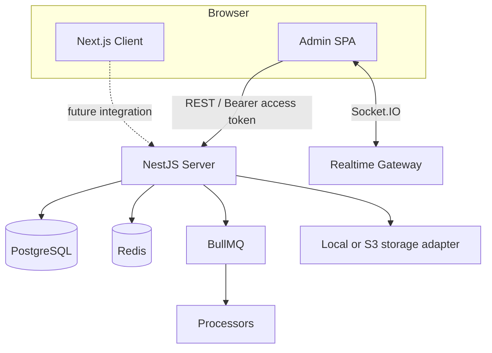
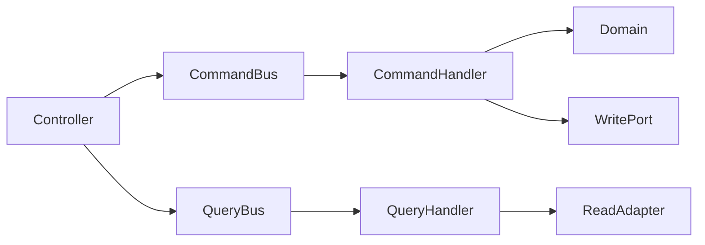
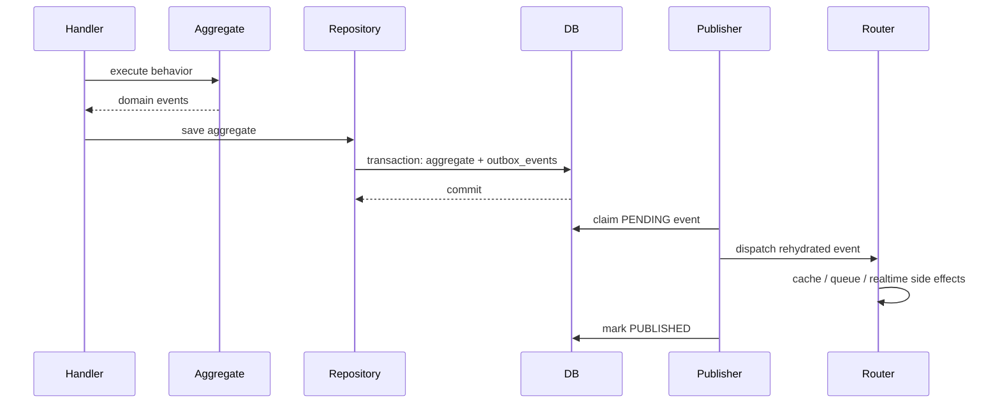
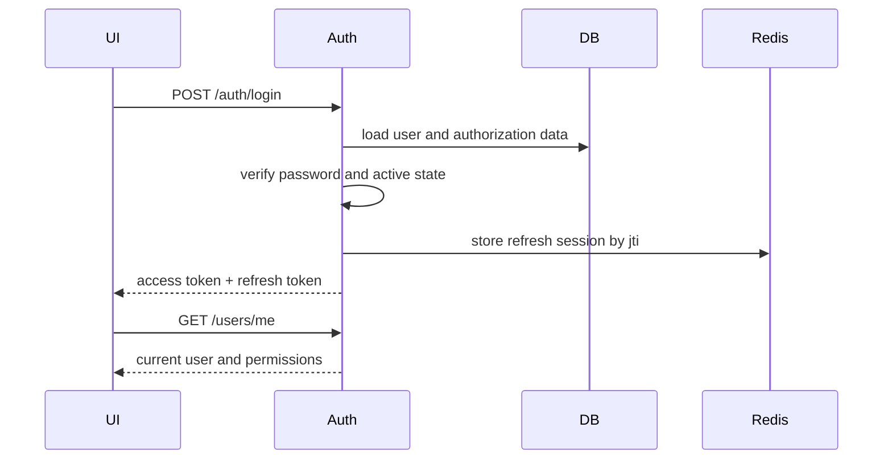

# Kiến trúc hệ thống

Tài liệu này giải thích cấu trúc đang chạy của monorepo: phần nào thuộc quyền sở hữu của ai, các tầng phụ thuộc nhau theo chiều nào, một request đi qua những bước gì, transaction được quản lý ra sao, đăng nhập/phân quyền hoạt động thế nào, frontend giữ state ở đâu, và những điểm chưa hoàn thiện. Tài liệu không dùng “Clean Architecture”, “DDD” hoặc “enterprise” như nhãn trang trí; mỗi khái niệm được gắn với file và behavior thực tế.

## 1. System context

Monorepo có ba application:

- `server` là "nguồn dữ liệu gốc" (system of record) — nơi lưu và quyết định mọi dữ liệu về danh tính người dùng, phân quyền, thông báo, audit và số liệu thống kê.
- `admin` là SPA quản trị đã tích hợp đầy đủ với API và realtime gateway.
- `client` là Next.js application dành cho end user, dùng mô hình BFF: trình duyệt chỉ gọi Next.js, còn Next.js gọi API ở phía server.


```mermaid
flowchart TB
    subgraph Browser
      Admin[Admin SPA]
      Client[Next.js Client]
    end

    Admin -->|REST / Bearer access token| Server[NestJS Server]
    Admin <-->|Socket.IO| Gateway[Realtime Gateway]
    Client -.->|future integration| Server

    Server --> DB[(PostgreSQL)]
    Server --> Redis[(Redis)]
    Server --> BullMQ[BullMQ]
    Server --> Storage[Local or S3 storage adapter]
    BullMQ --> Workers[Processors]
```

PostgreSQL lưu dữ liệu nghiệp vụ lâu dài và bảng outbox. Redis lưu các phiên refresh, cache và hạ tầng queue. Access token là JWT sống ngắn; muốn thu hồi ngay một token đã phát thì hệ thống còn phải dựa vào `tokenVersion` và cách quản lý session được mô tả trong Auth handbook.

## 2. Monorepo boundary

`apps` chứa những phần chạy được và triển khai được (executable/deployable unit). `packages` chứa code mà các app import lúc biên dịch (compile-time dependency) — tự nó không chạy độc lập.

```text
apps/server  ─┬─> @repo/database
              ├─> @repo/contracts
              └─> @repo/types

apps/admin  ──┬─> @repo/contracts
              └─> @repo/types

apps/client  ──┬─> @repo/contracts
               └─> @repo/types
```

### `@repo/contracts`

Chứa permission constants và contract ổn định cần được nhiều app hiểu giống nhau. Package này không chứa NestJS decorator, React hook hoặc persistence implementation.

### `@repo/types`

Chứa các data shape chia sẻ như `User`, `Role`, `Permission`, pagination và notification. Type dùng chung giúp trình biên dịch phát hiện khi hai app hiểu contract khác nhau (contract drift), nhưng không thay thế việc kiểm tra dữ liệu thật lúc chạy (runtime validation) ở ranh giới API.

### `@repo/database`

Sở hữu Prisma schema, migration và client được sinh ra để export. Chỉ backend được phép coi Prisma model là model lưu trữ (persistence model). Frontend không phụ thuộc package database.

### Configuration packages

`@repo/eslint-config` và `@repo/typescript-config` chuẩn hóa bộ công cụ lint và TypeScript cho toàn repo. Chúng chỉ dùng lúc phát triển, không được nạp khi ứng dụng chạy.

## 3. Backend: bounded contexts và layers

Backend nằm tại `apps/server/src`.

```text
src/
├── contexts/
│   ├── iam/
│   │   ├── auth/
│   │   ├── users/
│   │   └── roles/
│   ├── audit/
│   ├── notifications/
│   ├── analytics/dashboard/
│   ├── storage/
│   └── menu/
├── shared/
│   ├── domain/
│   └── application/
├── infrastructure/
│   ├── database/
│   ├── cache/
│   ├── queue/
│   ├── realtime/
│   ├── event-bus/
│   └── health/
├── presentation/
└── app.module.ts
```

Không phải context nào cũng cần đủ bốn layer. CRUD/read-only context nhỏ có thể chỉ có application và presentation. Layer được tạo khi có trách nhiệm thật, không để thỏa mãn cây thư mục.

### Domain

Domain chứa entity, value object, domain event, exception và các port cần thiết để giữ invariant (những quy tắc nghiệp vụ luôn phải đúng). Domain không import NestJS, Prisma hay Redis.

Ví dụ: aggregate Users quyết định user đang active hay không, profile ra sao và những sự kiện nghiệp vụ nào đã xảy ra. Nó không tự gửi WebSocket hay xếp email vào queue.

### Application

Application chứa command/query, handler và application port. Handler điều phối:

```text
load state
→ gọi domain behavior
→ persistence qua port
→ trả result
```

Command dùng cho luồng thay đổi dữ liệu; query dùng cho luồng chỉ đọc. Repository hoặc application service được inject qua token/port, nhờ đó handler chỉ biết "mình cần một chỗ lưu dữ liệu" chứ không biết cụ thể ai triển khai chỗ đó.

### Infrastructure

Infrastructure là nơi các port được triển khai thật bằng Prisma, Redis, BullMQ, Socket.IO hoặc storage SDK. Đây cũng là nơi đặt outbox publisher (bộ phát event từ bảng outbox) và event router (bộ chia event về đúng nơi xử lý).

### Presentation

Presentation chuyển HTTP/WebSocket transport sang application input:

```text
HTTP request
→ validation pipe
→ guard
→ controller
→ command/query bus
→ presenter/response
```

Controller không giữ quy tắc nghiệp vụ (invariant) và không tự mở/đóng transaction nghiệp vụ.

## 4. Dependency direction

Dependency mong muốn:

```text
Presentation ──> Application ──> Domain
Infrastructure ────────────────> Domain/Application ports
```

Module lắp ráp (composition module) là nơi duy nhất biết cả interface trừu tượng lẫn class triển khai, để nối chúng lại với nhau. Domain không biết gì về nơi lắp ráp này.

Shared domain chỉ chứa primitive thực sự dùng qua nhiều context. Một entity của Users không được chuyển vào shared chỉ vì Roles cần đọc user ID; hai context nên giao tiếp qua contract hoặc application port phù hợp.

## 5. CQRS trong dự án

CQRS ở đây chỉ có nghĩa là tách handler ghi (command) và handler đọc (query) thành hai loại riêng trong application layer — không phải tách thành hai database, cũng không phải dựng hệ thống event sourcing.


```mermaid
flowchart LR
    Controller --> CommandBus
    Controller --> QueryBus
    CommandBus --> CommandHandler
    QueryBus --> QueryHandler
    CommandHandler --> Domain
    CommandHandler --> WritePort
    QueryHandler --> ReadAdapter
```

Command có thể trả về dữ liệu mà client cần, nhưng mục đích chính của nó là thay đổi dữ liệu. Query chỉ đọc — nó không được gây ra bất kỳ thay đổi nghiệp vụ nào (side effect).

Không phải mọi endpoint đều buộc dùng CQRS nếu context rất nhỏ; quyết định phải nhất quán trong context và được ghi trong handbook của context đó.

## 6. Transactional outbox

Domain event không được phát đi ngay bên trong database transaction. Thay vào đó, repository chuyển event thành dạng lưu được (serialize) rồi ghi vào bảng outbox cùng lúc với aggregate, trong cùng một transaction Prisma — nhờ vậy hoặc cả hai cùng được lưu, hoặc không gì được lưu.


```mermaid
sequenceDiagram
    participant Handler
    participant Aggregate
    participant Repository
    participant DB
    participant Publisher
    participant Router

    Handler->>Aggregate: execute behavior
    Aggregate-->>Handler: domain events
    Handler->>Repository: save aggregate
    Repository->>DB: transaction: aggregate + outbox_events
    DB-->>Repository: commit
    Publisher->>DB: claim PENDING event
    Publisher->>Router: dispatch rehydrated event
    Router->>Router: cache / queue / realtime side effects
    Publisher->>DB: mark PUBLISHED
```

Cơ chế giao event là at-least-once — một event có thể được xử lý nhiều hơn một lần. Vì vậy bên nhận phải idempotent (xử lý lặp lại không gây hậu quả) hoặc dùng định danh cố định để nhận ra event đã xử lý rồi. Publisher "nhận việc" bằng cách đổi status của event — chỉ ai đổi được status thì người đó xử lý, nhờ vậy nhiều instance không giẫm chân nhau. Mỗi lần thử, nó tăng bộ đếm attempts; thất bại thì chờ một khoảng rồi thử lại; vượt số lần cho phép thì chuyển event sang `FAILED`.

`recoverStaleClaims` tìm những event kẹt ở trạng thái `PROCESSING` vì worker chết giữa chừng, rồi trả chúng về `PENDING` để được xử lý lại. Khi hạ tầng (database, kết nối) gặp lỗi, vòng polling giãn dần thời gian chờ (tối đa 30 giây) và chỉ ghi log ở thời điểm đổi trạng thái — hạ tầng sập không làm ngập log. Row `PUBLISHED` được dọn theo tuổi mỗi giờ (`OUTBOX_RETENTION_DAYS`, mặc định 30 ngày).

## 7. Authentication và authorization

### Token model

- Access token sống ngắn, được gửi qua header `Authorization: Bearer`.
- Refresh token đại diện cho một phiên đăng nhập (session) có bản ghi trạng thái lưu trong Redis.
- Mỗi lần refresh, hệ thống phát cặp token mới và thu hồi token của phiên cũ (refresh rotation) — token cũ không dùng lại được.
- Mỗi user có số `tokenVersion`; khi trạng thái bảo mật của user thay đổi, tăng số này sẽ vô hiệu hóa mọi access token đã phát trước đó.

Flow login:


```mermaid
sequenceDiagram
    participant UI
    participant Auth
    participant DB
    participant Redis

    UI->>Auth: POST /auth/login
    Auth->>DB: load user and authorization data
    Auth->>Auth: verify password and active state
    Auth->>Redis: store refresh session by jti
    Auth-->>UI: access token + refresh token
    UI->>Auth: GET /users/me
    Auth-->>UI: current user and permissions
```

Route guard xác minh người gọi là ai (identity); permission guard kiểm tra người đó được phép làm gì. Permission guard phía frontend chỉ giúp trải nghiệm người dùng gọn hơn — chốt chặn bảo mật thật nằm ở backend.

Admin giữ access token trong memory; refresh token nằm trong cookie `HttpOnly` giới hạn path `/auth` do server quản lý — JavaScript phía trình duyệt không đọc được, nên XSS không đánh cắp được credential sống dài. Khi client xác thực refresh bằng cookie, body response chỉ chứa access token; refresh token mới được rotate ngay trong cookie. API client/mobile không dùng cookie vẫn gửi refresh token qua `Authorization: Bearer` và nhận đủ cặp token trong body. Khi nhiều request cùng lúc bị trả về 401, API client gom tất cả về chung một lần refresh (một promise duy nhất), rồi thử lại mỗi request đúng một lần; nếu refresh thất bại thì phát tín hiệu logout cho toàn ứng dụng.

## 8. Audit

Audit là một bounded context riêng với năng lực application đầy đủ, không phải vài dòng `console.log`. Tầng application gọi audit port; adapter Prisma ghi bản ghi bền vững xuống database, gồm ai làm (actor), làm gì (action), lên đối tượng nào (target), kèm IP, user agent và chi tiết phù hợp.

Khi ghi audit thất bại, mỗi use case phải chọn rõ cách xử lý: ghi được thì tốt (best-effort), hay coi cả thao tác nghiệp vụ là thất bại. Không được lẳng lặng nuốt lỗi nếu audit là yêu cầu tuân thủ (compliance).

## 9. Admin frontend architecture

Admin dùng feature-based modular architecture:

```text
features/users/
├── api/
│   ├── user.api.ts
│   └── user.keys.ts
├── components/
├── hooks/
└── index.ts                 # khi feature cần public API
```

Flow dữ liệu:

```text
Component
→ feature hook
→ TanStack Query
→ feature API adapter
→ shared ApiClient
→ backend
```

### State ownership

| State                                | Owner           |
| ------------------------------------ | --------------- |
| API/server data                      | TanStack Query  |
| Authenticated user/session state     | Zustand         |
| Route/navigation                     | React Router    |
| Modal, filter input, local selection | React component |
| Theme                                | Theme provider  |

Query-key factory định nghĩa "địa chỉ" của từng mẩu dữ liệu trong cache. Sau mỗi mutation, cache của cả feature bị đánh dấu là cũ (invalidate root key) để dữ liệu được tải lại. Mỗi màn hình phân biệt rõ bốn trạng thái: đang tải, lỗi có thể thử lại, không có dữ liệu, và thành công.

### Module boundary

Feature khác chỉ được import qua `index.ts` công khai, không được import thẳng vào file bên trong (deep import). ESLint chặn deep import giữa các feature và chặn `components/ui` phụ thuộc vào business feature.

### Runtime composition

`main.tsx` render `App`. `App` khởi động phần auth, rồi tạo QueryClient, theme, router, toaster và error boundary cho toàn ứng dụng. Route registry chỉ tải code của trang khi người dùng mở đến trang đó (lazy-load). `ProtectedRoute` chặn người chưa đăng nhập và quản lý vòng đời kết nối WebSocket. `PermissionGuard` bảo vệ route/action theo quyền.

Chi tiết đầy đủ nằm trong [Admin handbook](../apps/admin/README.md).

## 10. Next.js client architecture

Client dùng Next.js App Router và React Server Components. Auth theo mô hình BFF: Next.js sở hữu session cookie HttpOnly, đọc access token ở phía server để gọi API, và làm mới token trong middleware (Next.js không cho ghi cookie lúc render trang). Nhờ vậy trang công khai có SEO thật và trình duyệt không bao giờ giữ token. Chi tiết và đánh đổi so với mô hình bearer của Admin: xem Client handbook.

Khi phát triển, định hướng là:

```text
app/                       # route composition, layouts, loading/error
features/                  # business UI/use cases
shared/api/                # server/client-safe API clients
shared/ui/                 # reusable presentation
shared/config/             # validated environment
```

Không sao chép kiến trúc của Admin SPA một cách máy móc. Next.js có ranh giới server/client, cách cache và cách render khác hẳn; quyết định fetch dữ liệu ở đâu phải dựa trên nơi dữ liệu được dùng và yêu cầu bảo mật.

## 11. Database và migration

Prisma schema mô tả trạng thái hiện tại mà database phải có (khai báo "nó phải trông thế này"); migrations là lịch sử từng bước thay đổi để đi đến trạng thái đó.

```text
schema change
→ prisma migrate dev
→ review migration.sql
→ commit schema + migration
→ CI/test database applies migrations
→ deployment runs migrate deploy
```

`prisma generate` chỉ sinh ra client, không đụng đến database. `db push` ép database khớp schema mà không ghi lại lịch sử migration, nên không được dùng làm cách triển khai production.

Database local đã được đánh dấu "các migration này coi như đã chạy" một cách có chủ đích (baseline bằng `prisma migrate resolve --applied` cho toàn bộ chain), và chuỗi migration đã được xác nhận là dựng lại được đầy đủ schema trên một database trống. Môi trường mới dựng bằng `prisma migrate deploy`; `db push` chỉ còn dành cho database test dùng xong bỏ.

## 12. Runtime topology

Local mặc định:

```text
Host: pnpm dev → server + admin + client
Docker: PostgreSQL + Redis + Maildev
```

Production mục tiêu:

```text
immutable API image (nhiều replica được — Socket.IO đã có Redis adapter)
immutable worker image (node dist/worker.js — cùng image với API, entry khác)
immutable Next.js image
static Admin assets/CDN
managed PostgreSQL
managed Redis
object storage
external mail provider
```

API và worker là hai process tách biệt build từ cùng một image: API nhận HTTP/WebSocket và đẩy job vào queue; worker (`src/worker.module.ts`) chỉ tiêu thụ job — email gửi chậm không chiếm event loop của API. Realtime emit theo room `user:{id}` qua `@socket.io/redis-adapter`, nên sự kiện phát từ instance này tới được socket đang nối vào instance khác.

Container dùng cho development không phải là image dùng cho production. Container production không mount source code từ máy ngoài vào (bind mount), không chạy chế độ theo dõi file (watch mode) và không cài dependency lúc khởi động.

## 13. Failure handling và observability

Hệ thống đã có:

- correlation ID (mã định danh gắn theo một request để lần theo dấu vết của nó trong log) cho luồng HTTP;
- structured logging tập trung qua `nestjs-pino`: JSON ở production/test, pino-pretty ở development, redact `authorization`/`cookie` header, mọi `Logger` của Nest đi qua cùng pipeline (`app.useLogger` + `bufferLogs`);
- Prometheus endpoint `GET /metrics` (`src/infrastructure/metrics/`): default process metrics, histogram `http_request_duration_seconds` gắn nhãn theo route template (không phải raw URL, tránh nổ cardinality), gauge `outbox_events{status}` và `outbox_oldest_pending_age_seconds` tính lúc scrape — hai tín hiệu cảnh báo outbox mà tài liệu vận hành yêu cầu;
- lỗi domain và lỗi API được chuyển thành response có cấu trúc thống nhất;
- health checks;
- audit được ghi bền vững xuống database;
- bảng outbox lưu số lần thử (attempts) và lỗi gần nhất của từng event;
- frontend có giao diện thử lại khi query lỗi, cùng error boundary ở mức toàn ứng dụng và từng route.

Hệ thống còn cần:

- giới hạn tần suất và giãn dần nhịp ghi log khi hạ tầng lỗi liên tục, để log không bị spam;
- một adapter gửi lỗi frontend về hệ thống theo dõi lỗi, thay vì chỉ `console.error`.

## 14. Kiểm thử

Backend test pyramid:

```text
domain unit
→ handler/service unit
→ adapter integration
→ HTTP E2E với database/Redis test
```

Admin hiện có unit test chống thoái lui (regression) cho luồng refresh của API client, bộ đánh giá permission và query keys. Cần bổ sung tiếp test cho route guard, tương tác component, mutation của từng feature và E2E chạy trên trình duyệt thật.

Client chưa có business tests vì chưa có business behavior.

## 15. Cách đánh giá một thay đổi kiến trúc

Một abstraction chỉ nên được thêm khi nó:

1. tạo ra một ranh giới có ý nghĩa;
2. loại bỏ sự phụ thuộc chằng chịt (coupling) hoặc sự mập mờ;
3. có tên theo đúng ngôn ngữ của hệ thống;
4. giữ đúng chiều phụ thuộc giữa các tầng;
5. có thể được kiểm thử;
6. được một luồng nghiệp vụ thực tế sử dụng.

Không tạo interface cho mọi class, mapper cho mọi object hoặc layer rỗng chỉ để cây thư mục trông “chuẩn”. Kiến trúc "enterprise" thật sự nằm ở khả năng kiểm soát thay đổi và sự cố, không phải ở số lượng pattern.
