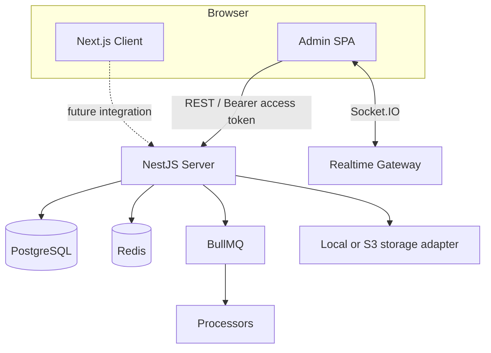
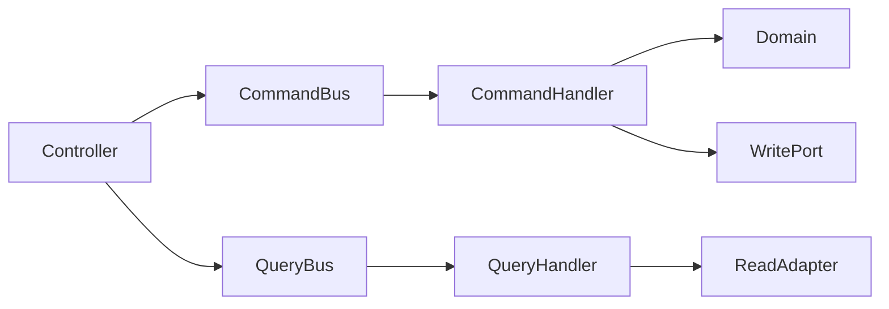
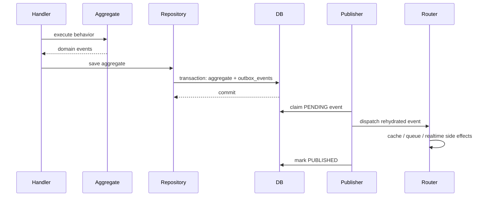
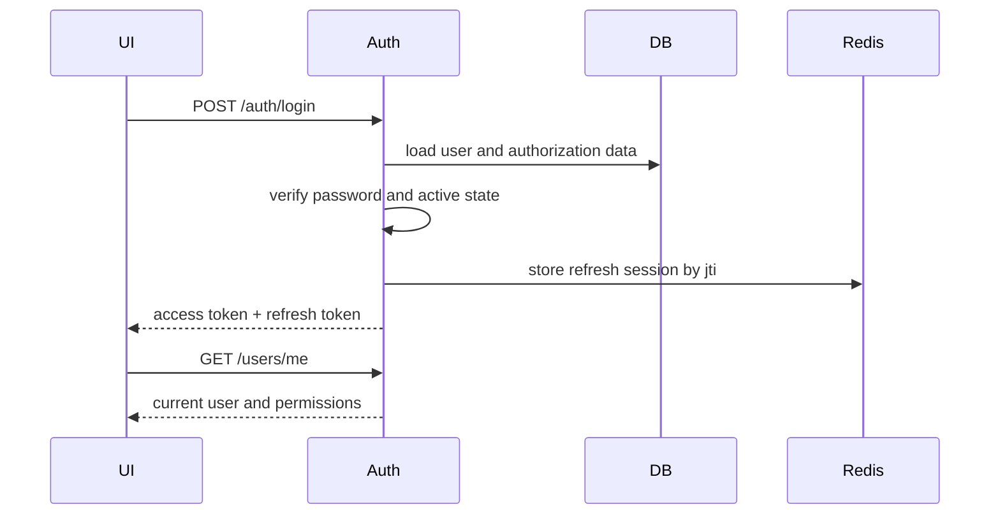

# Kiến trúc hệ thống

Tài liệu này giải thích cấu trúc đang chạy của monorepo: ranh giới sở hữu, dependency direction, flow request, transaction, authentication, frontend state và các điểm chưa hoàn thiện. Tài liệu không dùng “Clean Architecture”, “DDD” hoặc “enterprise” như nhãn trang trí; mỗi khái niệm được gắn với file và behavior thực tế.

## 1. System context

Monorepo có ba application:

- `server` là system of record cho identity, authorization, notification, audit và analytics.
- `admin` là SPA quản trị đã tích hợp đầy đủ với API và realtime gateway.
- `client` là Next.js application dành cho end user nhưng hiện mới ở trạng thái scaffold.


```mermaid
flowchart TB
    subgraph Browser
      Admin[Admin SPA]
      Client[Next.js Client]
    end

    Admin -->|REST / Bearer access token| Server[NestJS Server]
    Admin <-->|Socket.IO| Gateway[Realtime Gateway]
    Client -.->|future integration| Server

    Server --> DB[(PostgreSQL)]
    Server --> Redis[(Redis)]
    Server --> BullMQ[BullMQ]
    Server --> Storage[Local or S3 storage adapter]
    BullMQ --> Workers[Processors]
```

PostgreSQL giữ durable business data và outbox. Redis giữ refresh sessions, cache và queue infrastructure. Access token là JWT ngắn hạn, nhưng khả năng revoke tức thời còn dựa vào `tokenVersion` và session behavior được mô tả trong Auth handbook.

## 2. Monorepo boundary

`apps` là executable/deployable unit. `packages` là compile-time dependency.

```text
apps/server  ─┬─> @repo/database
              ├─> @repo/contracts
              └─> @repo/types

apps/admin  ──┬─> @repo/contracts
              └─> @repo/types

apps/client    # chưa dùng shared business packages
```

### `@repo/contracts`

Chứa permission constants và contract ổn định cần được nhiều app hiểu giống nhau. Package này không chứa NestJS decorator, React hook hoặc persistence implementation.

### `@repo/types`

Chứa các data shape chia sẻ như `User`, `Role`, `Permission`, pagination và notification. Type chia sẻ giúp phát hiện contract drift lúc compile, nhưng không thay thế runtime validation ở API boundary.

### `@repo/database`

Sở hữu Prisma schema, migration và generated client export. Chỉ backend được phép coi Prisma model là persistence model. Frontend không phụ thuộc package database.

### Configuration packages

`@repo/eslint-config` và `@repo/typescript-config` chuẩn hóa toolchain. Chúng không phải runtime dependencies.

## 3. Backend: bounded contexts và layers

Backend nằm tại `apps/server/src`.

```text
src/
├── contexts/
│   ├── iam/
│   │   ├── auth/
│   │   ├── users/
│   │   └── roles/
│   ├── audit/
│   ├── notifications/
│   ├── analytics/dashboard/
│   ├── storage/
│   └── menu/
├── shared/
│   ├── domain/
│   └── application/
├── infrastructure/
│   ├── database/
│   ├── cache/
│   ├── queue/
│   ├── realtime/
│   ├── event-bus/
│   └── health/
├── presentation/
└── app.module.ts
```

Không phải context nào cũng cần đủ bốn layer. CRUD/read-only context nhỏ có thể chỉ có application và presentation. Layer được tạo khi có trách nhiệm thật, không để thỏa mãn cây thư mục.

### Domain

Domain chứa entity, value object, domain event, exception và port cần cho invariant. Domain không import NestJS, Prisma hay Redis.

Ví dụ Users aggregate quyết định trạng thái active, profile và domain facts. Nó không gửi WebSocket hay enqueue email.

### Application

Application chứa command/query, handler và application port. Handler điều phối:

```text
load state
→ gọi domain behavior
→ persistence qua port
→ trả result
```

Command được dùng cho flow thay đổi state. Query được dùng cho read flow. Repository hoặc application service có thể được inject qua token/port để handler không phụ thuộc implementation.

### Infrastructure

Infrastructure triển khai port bằng Prisma, Redis, BullMQ, Socket.IO hoặc storage SDK. Đây cũng là nơi đặt outbox publisher và event router.

### Presentation

Presentation chuyển HTTP/WebSocket transport sang application input:

```text
HTTP request
→ validation pipe
→ guard
→ controller
→ command/query bus
→ presenter/response
```

Controller không sở hữu invariant và không tự điều khiển transaction nghiệp vụ.

## 4. Dependency direction

Dependency mong muốn:

```text
Presentation ──> Application ──> Domain
Infrastructure ────────────────> Domain/Application ports
```

Composition module biết cả abstraction lẫn implementation để bind dependency. Domain không biết composition root.

Shared domain chỉ chứa primitive thực sự dùng qua nhiều context. Một entity của Users không được chuyển vào shared chỉ vì Roles cần đọc user ID; hai context nên giao tiếp qua contract hoặc application port phù hợp.

## 5. CQRS trong dự án

CQRS ở đây là tách command/query handler trong application layer, không phải hai database hoặc event-sourced system.


```mermaid
flowchart LR
    Controller --> CommandBus
    Controller --> QueryBus
    CommandBus --> CommandHandler
    QueryBus --> QueryHandler
    CommandHandler --> Domain
    CommandHandler --> WritePort
    QueryHandler --> ReadAdapter
```

Command có thể trả representation cần thiết, nhưng mục đích chính là thay đổi state. Query không được tạo side effect nghiệp vụ.

Không phải mọi endpoint đều buộc dùng CQRS nếu context rất nhỏ; quyết định phải nhất quán trong context và được ghi trong handbook của context đó.

## 6. Transactional outbox

Domain event không được publish trực tiếp trong database transaction. Repository serialize event và ghi cùng aggregate trong một Prisma transaction.


```mermaid
sequenceDiagram
    participant Handler
    participant Aggregate
    participant Repository
    participant DB
    participant Publisher
    participant Router

    Handler->>Aggregate: execute behavior
    Aggregate-->>Handler: domain events
    Handler->>Repository: save aggregate
    Repository->>DB: transaction: aggregate + outbox_events
    DB-->>Repository: commit
    Publisher->>DB: claim PENDING event
    Publisher->>Router: dispatch rehydrated event
    Router->>Router: cache / queue / realtime side effects
    Publisher->>DB: mark PUBLISHED
```

Semantics là at-least-once. Consumer phải idempotent hoặc dùng deterministic identity. Publisher claim event bằng status transition, tăng attempts, retry với delay và chuyển sang `FAILED` khi vượt giới hạn.

`recoverStaleClaims` đưa event `PROCESSING` bị worker bỏ lại về `PENDING`. Infrastructure failure của polling hiện chưa có backoff đủ tốt; đây là technical debt đã biết.

## 7. Authentication và authorization

### Token model

- Access token ngắn hạn được gửi qua `Authorization: Bearer`.
- Refresh token đại diện cho session có state trong Redis.
- Refresh rotation phát token pair mới và thu hồi session token cũ.
- User có `tokenVersion` để vô hiệu hóa access token đã phát khi security state thay đổi.

Flow login:


```mermaid
sequenceDiagram
    participant UI
    participant Auth
    participant DB
    participant Redis

    UI->>Auth: POST /auth/login
    Auth->>DB: load user and authorization data
    Auth->>Auth: verify password and active state
    Auth->>Redis: store refresh session by jti
    Auth-->>UI: access token + refresh token
    UI->>Auth: GET /users/me
    Auth-->>UI: current user and permissions
```

Route guard xác thực identity; permission guard kiểm tra capability. Frontend permission guard chỉ cải thiện UX, không phải security boundary.

Admin hiện giữ access token trong memory và refresh token trong `localStorage`. API client gom concurrent 401 về một refresh promise, retry request đúng một lần và phát global logout nếu refresh thất bại.

## 8. Audit

Audit là bounded context/application capability riêng, không phải `console.log`. Application gọi audit port; adapter Prisma ghi durable record với actor, action, target, IP, user agent và details phù hợp.

Audit failure policy phải rõ theo use case: best-effort hay fail business operation. Không mặc định nuốt lỗi nếu audit là yêu cầu compliance.

## 9. Admin frontend architecture

Admin dùng feature-based modular architecture:

```text
features/users/
├── api/
│   ├── user.api.ts
│   └── user.keys.ts
├── components/
├── hooks/
└── index.ts                 # khi feature cần public API
```

Flow dữ liệu:

```text
Component
→ feature hook
→ TanStack Query
→ feature API adapter
→ shared ApiClient
→ backend
```

### State ownership

| State                                | Owner           |
| ------------------------------------ | --------------- |
| API/server data                      | TanStack Query  |
| Authenticated user/session state     | Zustand         |
| Route/navigation                     | React Router    |
| Modal, filter input, local selection | React component |
| Theme                                | Theme provider  |

Query-key factory định nghĩa cache identity. Mutation invalidate root key của feature. Screen phân biệt loading, retryable error, empty và success.

### Module boundary

Feature khác chỉ import public `index.ts`, không deep-import implementation. ESLint ngăn deep import giữa feature và ngăn `components/ui` phụ thuộc business feature.

### Runtime composition

`main.tsx` render `App`. `App` bootstrap auth, tạo QueryClient, theme, router, toaster và application error boundary. Route registry lazy-load page. `ProtectedRoute` giữ authentication boundary và WebSocket lifecycle. `PermissionGuard` bảo vệ route/action.

Chi tiết đầy đủ nằm trong [Admin handbook](../apps/admin/README.md).

## 10. Next.js client architecture

Client dùng Next.js App Router và React Server Components mặc định. Hiện chỉ có root layout và homepage scaffold; chưa có feature, authentication hoặc API adapter.

Khi phát triển, định hướng là:

```text
app/                       # route composition, layouts, loading/error
features/                  # business UI/use cases
shared/api/                # server/client-safe API clients
shared/ui/                 # reusable presentation
shared/config/             # validated environment
```

Không sao chép Admin SPA architecture một cách máy móc. Next.js có server/client boundary, caching và rendering model khác; quyết định fetch phải dựa trên nơi dữ liệu được dùng và security requirement.

## 11. Database và migration

Prisma schema là declarative current model; migrations là lịch sử thay đổi.

```text
schema change
→ prisma migrate dev
→ review migration.sql
→ commit schema + migration
→ CI/test database applies migrations
→ deployment runs migrate deploy
```

`prisma generate` chỉ tạo client. `db push` không tạo migration history và không phải production deployment mechanism.

Database local đã được baseline có chủ đích (`prisma migrate resolve --applied` cho toàn bộ chain) và migration chain đã được xác nhận tái tạo đầy đủ schema trên database sạch. Môi trường mới dựng bằng `prisma migrate deploy`; `db push` chỉ còn dành cho database test dùng xong bỏ.

## 12. Runtime topology

Local mặc định:

```text
Host: pnpm dev → server + admin + client
Docker: PostgreSQL + Redis + Maildev
```

Production mục tiêu:

```text
immutable API image
immutable Next.js image
static Admin assets/CDN
managed PostgreSQL
managed Redis
object storage
external mail provider
```

Development container không phải production image. Production container không bind source, không chạy watch mode và không cài dependency lúc start.

## 13. Failure handling và observability

Hệ thống đã có:

- correlation ID cho HTTP flow;
- structured domain/API error mapping;
- health checks;
- durable audit;
- outbox attempts và last error;
- frontend query retry UI và application/route error boundary.

Hệ thống còn cần:

- centralized structured logger;
- metrics cho API latency, queue và outbox lag;
- tracing qua HTTP → command → outbox → worker;
- rate-limited/backoff infrastructure error logs;
- frontend error reporting adapter thay cho chỉ `console.error`.

## 14. Kiểm thử

Backend test pyramid:

```text
domain unit
→ handler/service unit
→ adapter integration
→ HTTP E2E với database/Redis test
```

Admin hiện có unit regression cho API refresh, permission evaluator và query keys. Cần tiếp tục bằng route guard, component interaction, feature mutation và browser E2E.

Client chưa có business tests vì chưa có business behavior.

## 15. Cách đánh giá một thay đổi kiến trúc

Một abstraction chỉ nên được thêm khi nó:

1. tạo boundary có ý nghĩa;
2. loại bỏ coupling hoặc ambiguity;
3. có tên theo ngôn ngữ hệ thống;
4. giữ dependency direction;
5. có thể được kiểm thử;
6. được dùng bởi flow thực tế.

Không tạo interface cho mọi class, mapper cho mọi object hoặc layer rỗng chỉ để cây thư mục trông “chuẩn”. Enterprise architecture là khả năng kiểm soát thay đổi và failure, không phải số lượng pattern.
