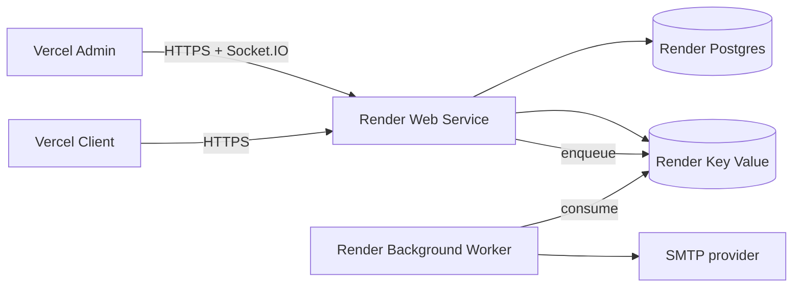

# Triển khai backend trên Render

Tài liệu này mô tả topology staging/production của backend trên Render. Nguồn sự thật có thể thực thi là [`render.yaml`](../render.yaml); dashboard dùng để cấp quyền GitHub, nhập secret được đánh dấu `sync: false`, xác nhận chi phí và quan sát deployment, không phải nơi duy trì một bản cấu hình song song.

## 1. Topology



API và worker build từ cùng `apps/server/Dockerfile`, nhưng có lifecycle riêng:

- API chạy `node dist/main.js`, nhận HTTP/WebSocket và publish job.
- Worker chạy `node dist/worker.js`, consume BullMQ job. Không ghép worker vào API để tiết kiệm service vì deploy/scale API sẽ làm gián đoạn job consumer và hai workload tranh event loop.
- PostgreSQL và Redis là managed datastore trong cùng region Singapore. Chúng không chạy trong container API và không mở public inbound.
- Redis dùng `noeviction`: session, refresh rotation và BullMQ job không được âm thầm đẩy ra để nhường chỗ cho cache. Khi hết bộ nhớ, command phải fail rõ ràng để alert và scale datastore.

Blueprint mặc định dùng paid starter services, PostgreSQL `basic-256mb` và Redis có journal/snapshot. Đây là lựa chọn có chủ đích: free Postgres hết hạn, free Redis có thể mất toàn bộ session/job sau restart, và Render không cung cấp free background worker.

## 2. Migration là release step riêng

`preDeployCommand` của API chạy:

```text
node scripts/migrate.mjs
```

Script dùng Prisma CLI và migration chain được copy vào production image, rồi thực thi `prisma migrate deploy`. Migration hoàn tất trước khi instance API mới nhận traffic. Worker không chạy migration lần nữa.

Không đưa migration vào `CMD` của API. Khi tăng số replica, startup migration sẽ biến một release step duy nhất thành nhiều process tranh cùng schema. Migration đã commit phải tiếp tục tuân theo expand/contract để code cũ còn chạy được trong thời gian zero-downtime rollout.

## 3. Tạo Blueprint lần đầu

1. Merge thay đổi deployment vào `main`; CI phải xanh.
2. Trong Render Dashboard chọn **New → Blueprint**, kết nối GitHub repository này và chọn `render.yaml`.
3. Review bốn resource trước khi xác nhận chi phí: API, worker, PostgreSQL và Key Value.
4. Nhập các biến `sync: false` khi Render hỏi:

| Biến           | Giá trị                                                                           |
| -------------- | --------------------------------------------------------------------------------- |
| `CORS_ORIGINS` | Danh sách origin Admin/Client, phân cách bằng dấu phẩy; chỉ origin, không có path |
| `MAIL_HOST`    | SMTP host của provider                                                            |
| `MAIL_PORT`    | Cổng SMTP provider hỗ trợ                                                         |
| `MAIL_FROM`    | Địa chỉ sender đã được provider cho phép                                          |

`DATABASE_URL` và `REDIS_URL` được Blueprint nối tự động bằng private connection string. Hai JWT secret được Render sinh ngẫu nhiên và worker tham chiếu đúng giá trị của API; không copy thủ công.

Nếu chưa cấu hình mail provider, có thể nhập giá trị staging hợp lệ và chấp nhận job mail fail có kiểm soát, nhưng worker vẫn phải chạy để quan sát retry behavior. Không dùng Maildev hoặc `localhost` trên Render.

## 4. Environment contract

```dotenv
NODE_ENV=production
PORT=3001
DATABASE_URL=postgresql://...
REDIS_URL=redis://...
JWT_ACCESS_SECRET=<generated>
JWT_REFRESH_SECRET=<generated>
CORS_ORIGINS=https://<admin-domain>,https://<client-domain>
REFRESH_COOKIE_SAME_SITE=none
MAIL_HOST=<provider>
MAIL_PORT=<provider-port>
MAIL_FROM=<verified-sender>
```

`REDIS_URL` nhận `redis://` hoặc `rediss://` và được ưu tiên hơn các biến `REDIS_HOST`, `REDIS_PORT`, `REDIS_USERNAME`, `REDIS_PASSWORD` dùng cho local. Không log connection string vì nó có thể chứa credential.

Refresh cookie luôn `HttpOnly`, có `Secure` ở production và lấy policy từ `REFRESH_COOKIE_SAME_SITE`. Blueprint dùng `none` để Vercel Admin có thể gọi Render API cross-site; `SameSite=None` chỉ hợp lệ cùng HTTPS. Một số browser/user policy có thể chặn hoàn toàn third-party cookie, nên topology production khuyến nghị vẫn là các subdomain cùng site, ví dụ `admin.example.com`, `app.example.com`, `api.example.com`; khi chuyển sang topology đó hãy đổi policy về `lax`.

## 5. Sau deployment

```powershell
$env:API_URL = "https://<api>.onrender.com"
$env:ADMIN_ORIGIN = "https://<admin>.vercel.app"
pnpm verify:render
```

Verifier yêu cầu `/health/live` và `/health/ready` trả 2xx, đồng thời preflight từ Admin origin trả đúng CORS credentials. Sau đó đặt trên Vercel Admin:

```dotenv
VITE_API_URL=https://<api>.onrender.com
```

Redeploy Admin rồi kiểm tra login, reload/refresh session, `/users`, `/roles`, avatar và Socket.IO. Health xanh không chứng minh auth/cookie/realtime đều đúng; browser smoke là gate cuối.

## 6. Deploy và rollback

API và worker dùng `autoDeployTrigger: checksPass`, vì vậy Render chỉ deploy commit sau khi GitHub CI hoàn tất. API pre-deploy migration phải thành công trước rollout.

Rollback application bằng deployment trước hoặc commit trước. Không chạy down migration tự động. Nếu migration mới không tương thích ngược, rollback code có thể không an toàn — schema change phải theo expand/contract.

Khi sự cố, kiểm tra theo thứ tự: API deploy log và readiness; migration pre-deploy; PostgreSQL/Redis metrics; worker log và BullMQ backlog; cuối cùng rollback application nếu schema vẫn tương thích.

Không gắn persistent disk vào API để lưu upload lâu dài. Filesystem container là ephemeral; upload production phải chuyển sang object storage qua adapter S3 hiện có.
